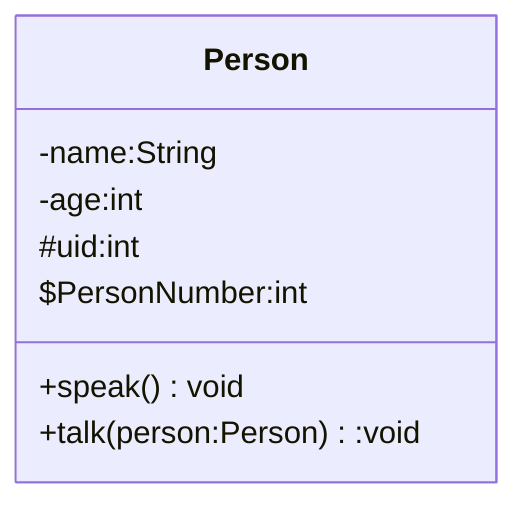
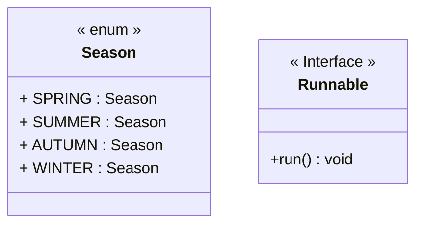
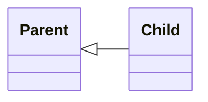
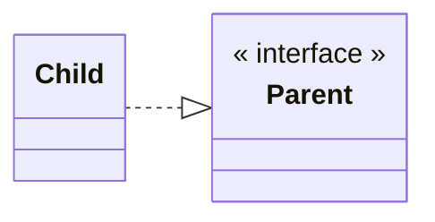
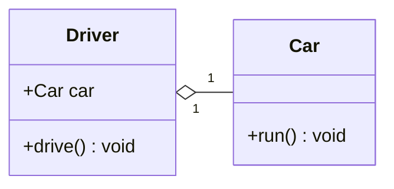
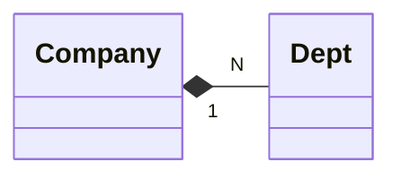
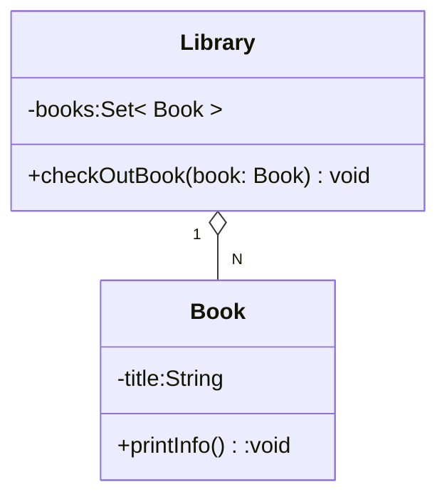

# Java笔记整理

## 001

###  访问控制符的区别
**描述Java中的访问控制符public、protected、private和默认（无修饰符）之间的主要区别，并解释它们在类成员访问权限上的作用。**

  - **public** : 表示该成员可以被任何类访问，不论是在同一个包内还是不同包中的类,**任何地方**都可以访问这个成员。
  - **protected** : 表示该成员可以被同一个包中的类访问，或者可以被不同包中的子类访问。
  - **private** : 表示该成员只能在当前类内部访问，不能在类外部直接访问，即使是子类也**不能直接访问**父类的 private 成员。
  - **默认修饰符(无修饰符)** ： 默认的访问级别是 包内访问 （Package-Private）。只有同一个包内的类能够访问该成员，其他包中的类无法访问。

---

### final关键字的用途
**解释Java中final关键字的三种主要用途，并给出每种用途的简单代码示例。**
#### `final` 用于修饰类
当 `final` 修饰一个类时，表示该类不能被继承。也就是说，不能有其他类从这个 `final` 类继承。

- **作用**：防止类被继承，可以确保类的行为不被改变。

##### 示例代码：
```java
final class MyClass {
    public void display() {
        System.out.println("`This` is a final class.");
    }
}

// 下面的代码会编译错误，因为不能继承一个 final 类
// class AnotherClass extends MyClass {
// }
```

在上面的代码中，`MyClass` 类被声明为 `final`，因此不能被继承。尝试从 `MyClass` 继承会导致编译错误。

####  `final` 用于修饰方法
当 `final` 修饰一个方法时，表示该方法不能被子类重写（Override）。即使该方法是从父类继承来的，也无法在子类中修改其实现。

- **作用**：防止方法被重写，保证方法的行为不会被改变。

##### 示例代码：
```java
class Animal {
    public final void sound() {
        System.out.println("Animal makes a sound.");
    }
}

class Dog extends Animal {
    // 下面的代码会编译错误，因为无法重写一个 final 方法
    // public void sound() {
    //     System.out.println("Dog barks.");
    // }
}
```

#### `final` 用于修饰变量
当 `final` 修饰一个变量时，表示该变量一旦赋值后就不能再修改。`final` 可以修饰局部变量、实例变量（成员变量）和类变量（静态变量）。

- **作用**：确保变量的值不可变。对于引用类型的变量，`final` 确保引用的**地址不可改变**（即指向的对象不能重新指向其他对象），但对象**本身的内容可以修改**。

##### 示例代码：

- **修饰局部变量**：
```java
public class MyClass {
    public void display() {
        final int number = 10;
        // number = 20;  // 这行会导致编译错误，因为 number 是 final 变量
        System.out.println(number);
    }
}
```

- **修饰实例变量**：
```java
class MyClass {
    final int number;

    MyClass(int num) {
        this.number = num;  // final 变量可以在构造方法中赋值一次
    }

    public void display() {
        // `this`.number = 20;  // 这行会导致编译错误，因为 number 是 final 变量
        System.out.println(number);
    }
}
```

`number` 是实例变量，使用 `final` 修饰后，可以**在构造方法中赋值一次**，但在其他地方不能改变它的值。

- **修饰类变量（静态变量）**：
```java
class MyClass {
    public static final double PI = 3.14159;  // 类变量被声明为 final

    public void display() {
        System.out.println("Value of PI: " + PI);
    }
}
```
#### 总结

| 用法              | 描述                                              | 示例                                         |
|------------------|--------------------------------------------------|---------------------------------------------|
| `final` 修饰类      | 类不能被继承                                         | `final class MyClass {}`                   |
| `final` 修饰方法     | 方法不能被子类重写                                     | `public final void sound() {}`             |
| `final` 修饰变量     | 变量值不能修改，适用于局部变量、实例变量、类变量                     | `final int x = 10;`                        |

---

### static关键字的含义

**阐述static关键字在Java中的含义，并讨论为什么一个静态方法不能访问类的实例变量或实例方法。**
**(1)**`static`关键字用于声明类的成员为**静态**成员。static作为静态成员变量和成员函数的修饰符，意味着它为该类的所有实例所**共享**，也就是说当某个类的实例修改了该静态成员变量，其修改值为该类的**其它所有实例**所见。

- `static`**修饰变量** ：即静态变量（类变量），静态变量属于类本身，而不是某个对象实例。所有的类实例**共享**同一个静态变量。
```java
class Counter {
    static int count = 0;  // 静态变量

    Counter() {
        count++;  // 每创建一个对象，静态变量count自增
    }
}

public class Test {
    public static void main(String[] args) {
        new Counter();
        new Counter();
        System.out.println(Counter.count);  // 输出 2
    }
}
```
- `static`**修饰方法** ：静态方法属于类本身，可以在**没有创建**类实例的情况下调用。静态方法**无法直接访问**类的实例变量和实例方法。
```java
class MyClass {
    static int staticVar = 10;  // 静态变量
    int instanceVar = 20;       // 实例变量

    static void staticMethod() {
        System.out.println(staticVar);  // 可以访问静态变量
        // System.out.println(instanceVar);  // 编译错误，不能访问实例变量
    }

    void instanceMethod() {
        System.out.println(staticVar);  // 可以访问静态变量
        System.out.println(instanceVar);  // 可以访问实例变量
    }
}

public class Test {
    public static void main(String[] args) {
        MyClass.staticMethod();  // 通过类名调用静态方法

        MyClass obj = new MyClass();
        obj.instanceMethod();  // 通过对象调用实例方法
    }
}
```
- 静态代码块 ：静态代码块在**类加载时执行一次**，用于初始化类的静态成员。当不同类之间具有继承关系时，将先调用父类的代码块，再调用子类的代码块。
```java
public class StaticBlockExample {

    // 静态变量
    static int staticVariable;

    // 静态代码块
    static {
        // 初始化静态变量
        staticVariable = 100;
        System.out.println("静态代码块被执行。staticVariable = " + staticVariable);
    }

    public static void main(String[] args) {
        // 访问静态变量
        System.out.println("主函数中 staticVariable = " + staticVariable);
    }
}
```

输出
 ```java
静态代码块被执行。staticVariable = 100
主函数中 staticVariable = 100
 ```
**(2)** 当调用一个静态方法时，我们并不需要创建对象，它**通过类名直接调用**。由于静态方法不与任何特定对象实例关联，它没有隐含的 `this` 引用。不含`this`引用，静态方法自然无法访问任何实例变量或实例方法。

---

### `this`和`super`关键字的区别<a id="001_4"></a>
**描述Java中`this`和`super`关键字的区别，并解释它们各自在什么场景下使用。**

- **`this`** : 用来指代这个类的这个实例对象的引用。可在如下场景使用。
    - **区分实例变量和局部变量** ：当方法或构造函数的参数名与实例变量（类成员变量）相同，`this` 可以用来区分它们。
    - **调用当前对象的其他构造函数** ：`this()`可以用来调用当前类的另一个构造函数。
    - **引用当前对象** ：`this` 也可以用来传递**当前对象**的引用给其他方法或构造函数。
```java
class Person {
    String name;
    int age;

    // 一个构造函数
    Person(String name) {
        this(name, 30);  // 调用另一个构造函数
    }

    // 另一个构造函数
    Person(String name, int age) {
        this.name = name;
        this.age = age;
    }

    void display() {
        System.out.println("Name: " + name + ", Age: " + age);
    }
}

public class Main {
    public static void main(String[] args) {
        Person person = new Person("Alice");
        person.display();  // 输出: Name: Alice, Age: 30
    }
}
```
- **`super`** : 代指父类的对象。可在如下场景使用。
    - **访问父类的成员（方法或变量）** ：当子类继承父类时，可以使用 super 来访问父类的成员，尤其是当子类和父类的成员有**相同名称**时。
    - **调用父类的构造函数** ：`super()` 用来调用**父类的构造函数**，通常是子类构造函数的第一行代码。
    - **调用父类的方法** ：如果子类重写了父类的方法，子类可以使用 `super`调用父类的版本。
```java
class Animal {
    String name = "Animal";

    void speak() {
        System.out.println("Animal is speaking");
    }
}

class Dog extends Animal {
    String name = "Dog";

    void display() {
        System.out.println("Dog's name: " + this.name);      // 使用this访问当前类的name
        System.out.println("Animal's name: " + super.name);   // 使用super访问父类的name
        super.speak();  // 调用父类的speak方法
    }
}

public class Main {
    public static void main(String[] args) {
        Dog dog = new Dog();
        dog.display();
        // 输出:
        // Dog's name: Dog
        // Animal's name: Animal
        // Animal is speaking
    }
}
```
---

### Java中的abstract和interface关键字<a id="001_5"></a>

**解释Java中的abstract关键字和interface关键字之间的主要区别，并讨论它们在面向对象编程中的作用。**

#### `abstract` 类
`abstract` 类是一个不能被实例化的类，它用于定义一些共性功能，并且可以包含抽象方法和已实现的方法。`abstract` 类的主要目的是提供一个类的模板，供子类继承和扩展。

- **定义方式**：用 `abstract` 关键字声明一个类。
- **抽象方法**：`abstract` 类可以包含抽象方法，抽象方法没有方法体，子类必须实现这些抽象方法（除非子类也是抽象类）。
- **实例方法**：`abstract` 类也可以包含具体方法（已实现的方法），子类可以继承这些方法，也可以覆盖它们。
- **构造函数**：`abstract` 类可以有构造函数，子类可以调用父类的构造函数。

##### 特点：
- 一个类**只能继承一个** `abstract` 类（Java 不支持多重继承）。
- `abstract` 类可以包含字段（成员变量）。
- `abstract` 类支持构造方法、实例方法和静态方法。
- 继承 `abstract` 类的子类必须实现所有的抽象方法（除非子类本身也是抽象类）。

##### 示例：

```java
abstract class Animal {
    String name;
    
    // 抽象方法，子类必须实现
    abstract void sound();
    
    // 已实现的方法
    void eat() {
        System.out.println(name + " is eating.");
    }
}

class Dog extends Animal {
    Dog(String name) {
        this.name = name;
    }

    // 实现抽象方法
    void sound() {
        System.out.println(name + " barks.");
    }
}

public class Main {
    public static void main(String[] args) {
        Dog dog = new Dog("Buddy");
        dog.eat();  // 输出: Buddy is eating.
        dog.sound();  // 输出: Buddy barks.
    }
}
```

####  `interface` 接口
`interface` 接口是用于定义一组行为规范的结构，它不能包含具体的实现（Java 8 引入了默认方法和静态方法，但接口中的方法一般没有实现）。接口主要用于实现**多重继承**的效果，并用于定义对象之间的合同。

- **定义方式**：用 `interface` 关键字声明一个接口。
- **方法声明**：接口中的方法默认是 `public abstract` 的，即使不显式声明为 `abstract`，方法也是抽象的。Java 8 之后，接口可以包含默认方法（`default`）和静态方法（`static`）。
- **字段**：接口中的字段默认是 `public static final` 的，必须初始化。
- **继承**：一个类可以实现多个接口，因此接口提供了一种实现多继承的机制。

##### 特点：
- 一个类可以实现多个接口。
- 接口中的方法只能声明，不能提供实现（除非是默认方法或静态方法）。
- 接口不能包含构造函数。
- 接口中的字段默认是 `public static final`，因此是常量。
- 接口提供了一种解耦合的方式，让不同类之间可以通过实现相同的接口来保持一致的行为。

##### 示例：

```java
interface Animal {
    // 抽象方法，所有实现该接口的类必须实现该方法
    void sound();
    
    // 默认方法，具有默认实现
    default void eat() {
        System.out.println("Eating...");
    }
}

class Dog implements Animal {
    public void sound() {
        System.out.println("Bark");
    }
}

public class Main {
    public static void main(String[] args) {
        Dog dog = new Dog();
        dog.sound();  // 输出: Bark
        dog.eat();    // 输出: Eating...
    }
}
```

####  `abstract` 类和 `interface` 的主要区别

| **区别点**               | **`abstract` 类**                                      | **`interface` 接口**                                  |
|--------------------------|--------------------------------------------------------|------------------------------------------------------|
| **是否支持多继承**        | 不支持（只能继承一个`abstract`类）                              | 支持（一个类可以实现多个接口，接口之间可继承）                       |
| **方法实现**             | 可以有抽象方法和已实现的方法                           | 默认情况下，所有方法都是抽象的（Java 8 之后支持默认方法） |
| **字段定义**             | 可以包含实例字段（成员变量），也可以是常量            | 只能包含常量（`public static final` 字段）            |
| **构造方法**             | 可以有构造函数                                         | 没有构造函数                                         |
| **继承方式**             | 使用 `extends` 关键字继承（单继承）                    | 使用 `implements` 关键字实现（可以实现多个接口）    |
| **访问修饰符**           | 方法和字段可以有不同的访问修饰符（如 `private`，`protected`） | 所有方法默认为 `public`，字段也是 `public static final` |
| **使用场景**             | 适合用来定义类的共性行为并共享代码实现                 | 适合用来定义行为契约，支持多重实现和解耦             |

#### 在面向对象编程中的作用：
- **`abstract` 类** 提供了继承和代码复用的能力，适用于一组类之间具有共同功能的情况。**抽象类不可被实例化。**
- **`interface` 接口** 强调的是行为规范，适用于多个类需要共享某种行为，但不关心具体实现的情况。**接口不可直接实例化**。

---

### 编写一个Java类

**包含一个private整数成员变量和一个public构造器，该构造器初始化变量，并提供一个protected方法来返回这个变量的值。**

```java
public class MyClass {
    // 私有成员变量
    private int number;

    // 公有构造器，用于初始化成员变量
    public MyClass(int number) {
        this.number = number;
    }

    // 受保护的方法，用于返回成员变量的值
    protected int getNumber() {
        return this.number;
    }

    // 测试方法，显示成员变量的值
    public static void main(String[] args) {
        MyClass myObject = new MyClass(42);
        // 通过直接调用 getNumber 方法来访问 number 的值
        System.out.println("The value of number is: " + myObject.getNumber());
    }
}
```
运行结果:
```java
The value of number is: 42
```
---

### 创建一个Java接口

**声明一个abstract方法calculateArea，然后在一个实现该接口的类中用final关键字实现这个方法。**

```java
// 定义接口
interface Shape {
    // 声明一个抽象方法
    double calculateArea();
}

// 实现接口的类
class Circle implements Shape {
    private double radius;

    // 构造器，用于初始化半径
    public Circle(double radius) {
        this.radius = radius;
    }

    // 使用final关键字实现calculateArea方法，防止进一步重写
    @Override
    public final double calculateArea() {
        return Math.PI * radius * radius; // 圆的面积公式：π * r²
    }
}

// 测试类
public class Main {
    public static void main(String[] args) {
        // 创建一个Circle对象
        Shape circle = new Circle(5.0);
        
        // 计算并输出圆的面积
        System.out.println("The area of the circle is: " + circle.calculateArea());
    }
}
```
运行结果
```java
The area of the circle is: 78.53981633974483
```
---

### 设计一个Java程序

**包含一个static方法，该方法不接受任何参数，并打印出当前类的名称。**

```java
public class MyClass {

    // 静态方法，用于打印当前类的名称
    public static void printClassName() {
        // 获取当前类的名称并打印
        System.out.println("Current class name: " + MyClass.class.getName());
    }

    // 主方法，用于测试
    public static void main(String[] args) {
        // 调用静态方法打印类的名称
        printClassName();
    }
}
```
运行结果 :
```java
Current class name: MyClass
```
---

### 实现一个Java类

**使用synchronized关键字同步一个方法，该方法内部生成一个随机数并打印。**
```java
import java.util.Random;

public class RandomNumberGenerator {

    // 使用synchronized修饰的方法，保证线程安全
    public synchronized void generateRandomNumber() {
        Random random = new Random();
        int randomNumber = random.nextInt(100); // 生成一个0到99之间的随机数
        System.out.println("Generated random number: " + randomNumber);
    }

    public static void main(String[] args) {
        RandomNumberGenerator generator = new RandomNumberGenerator();

        // 创建多个线程来模拟并发访问
        Thread t1 = new Thread(() -> generator.generateRandomNumber());
        Thread t2 = new Thread(() -> generator.generateRandomNumber());
        Thread t3 = new Thread(() -> generator.generateRandomNumber());

        // 启动线程
        t1.start();
        t2.start();
        t3.start();
    }
}
```
一个可能的输出
```java
Generated random number: 37
Generated random number: 8
Generated random number: 92
```
**ps:** `synchronized` 确保即使多个线程同时请求访问 `generateRandomNumber()` 方法，只有一个线程能够进入方法并执行，其他线程会被阻塞，直到当前线程完成方法执行。这样可以防止多个线程同时修改共享资源，避免数据竞争或其他并发问题。

---

### 编写一个Java程序

**包含一个类变量和一个实例变量，两者都使用volatile关键字修饰，并创建一个线程安全的计数器方法。**
- 在 Java 中，volatile 关键字用于修饰变量，确保该变量在多个线程中保持一致性。具体来说，volatile 关键字告诉 JVM，变量的值可能会被多个线程修改，因此每次读取该变量时，都应**直接**从主内存中读取，而不是从线程的缓存中读取，从而确保每个线程看到的是**最新**的值。
```java
public class VolatileCounter {
    // 类变量，使用 volatile 关键字修饰
    private static volatile int classCount = 0;

    // 实例变量，使用 volatile 关键字修饰
    private volatile int instanceCount = 0;

    // 线程安全的计数器方法
    public synchronized void incrementCounters() {
        // 增加实例变量和类变量的值
        instanceCount++;
        classCount++;
    }

    // 获取类变量的值
    public static int getClassCount() {
        return classCount;
    }

    // 获取实例变量的值
    public int getInstanceCount() {
        return instanceCount;
    }

    public static void main(String[] args) {
        // 创建一个 VolatileCounter 对象
        VolatileCounter counter = new VolatileCounter();

        // 创建多个线程来测试计数器方法
        Thread t1 = new Thread(() -> {
            for (int i = 0; i < 1000; i++) {
                counter.incrementCounters();
            }
        });

        Thread t2 = new Thread(() -> {
            for (int i = 0; i < 1000; i++) {
                counter.incrementCounters();
            }
        });

        // 启动线程
        t1.start();
        t2.start();

        try {
            // 等待两个线程完成
            t1.join();
            t2.join();
        } catch (InterruptedException e) {
            e.printStackTrace();
        }

        // 打印类变量和实例变量的最终值
        System.out.println("Final classCount: " + VolatileCounter.getClassCount());
        System.out.println("Final instanceCount: " + counter.getInstanceCount());
    }
}
```
运行结果：
```java
Final classCount: 2000
Final instanceCount: 2000
```
**PS:**每次运行时，由于 `incrementCounters()` 方法的线程安全性，`classCount` 和 `instanceCount` 最终的值都会是 2000（每个线程执行了 1000 次自增操作）。

---

## 002

### Java异常处理的理解
**解释Java中的try、catch和finally块的作用及其在异常处理中的重要性。**

#### 1`try` 块

- **作用**：在 `try` 块中编写可能会抛出异常的代码。如果 `try` 块中的代码抛出异常，控制权将转移到与之关联的 `catch` 块。如果没有抛出异常，`catch` 块将被跳过。

####  `catch` 块

- **作用**：用于捕获并处理在 `try` 块中发生的异常。`catch` 块必须紧随 `try` 块之后，它会捕获 `try` 中抛出的异常，并通过参数获取异常的详细信息。我们可以捕获多种类型的异常，或使用通配符 `Exception` 捕获所有异常。

#### `finally` 块
`finally` 块是一个可选的块，它无论是否抛出异常都会执行。它通常用于释放资源（如关闭文件、网络连接、数据库连接等）。无论是否发生异常，`finally` 块都会执行，即使在 `try` 或 `catch` 块中有 `return` 语句。

- **作用**：`finally` 块用于释放资源、清理操作等，它确保在异常发生后仍能执行关键的清理代码。
- **执行顺序**：无论是否抛出异常，`finally` 块都会执行；如果 `try` 和 `catch` 中有 `return` 语句，`finally` 也会在方法返回之前执行。

##### 示例：

```java
try {
    int result = 10 / 2; // 没有异常
    System.out.println("Result: " + result);
} catch (ArithmeticException e) {
    System.out.println("Caught an exception: " + e);
} finally {
    System.out.println("This will always be executed.");
}
```

##### 输出：

```
Result: 5
This will always be executed.
```

如果 `try` 块中发生异常，`finally` 仍然会被执行。

```java
try {
    int result = 10 / 0; // 这行会抛出 ArithmeticException
} catch (ArithmeticException e) {
    System.out.println("Caught an exception: " + e);
} finally {
    System.out.println("This will always be executed.");
}
```

##### 输出：

```
Caught an exception: java.lang.ArithmeticException: / by zero
This will always be executed.
```

#### 异常处理的流程

1. **`try` 块**：首先执行 `try` 块中的代码。如果代码正常执行完毕，`catch` 和 `finally` 块都不会执行，直接跳过。
2. **`catch` 块**：如果在 `try` 块中抛出异常，程序会跳转到与该异常类型匹配的 `catch` 块。异常对象会作为参数传递给 `catch` 块。如果 `try` 块没有抛出异常，`catch` 块将被跳过。
3. **`finally` 块**：`finally` 块会在 `try` 和 `catch` 块执行完后无条件地执行。如果在 `try` 或 `catch` 中有 `return` 语句，`finally` 块也会在方法返回之前执行。

#### 使用场景和重要性

1. **确保资源释放**：`finally` 块常用于确保资源（如文件、数据库连接、网络连接等）在使用后被正确关闭，无论是否发生异常。例如：

   ```java
   public void readFile() {
       FileReader fr = null;
       try {
           fr = new FileReader("file.txt");
           // 读取文件操作
       } catch (IOException e) {
           System.out.println("Error reading file: " + e);
       } finally {
           // 确保文件被关闭
           if (fr != null) {
               try {
                   fr.close();
               } catch (IOException e) {
                   System.out.println("Error closing file: " + e);
               }
           }
       }
   }
   ```

2. **提高代码的健壮性**：`try-catch` 语句帮助程序在遇到异常时不中断程序执行，可以根据业务需求处理异常。例如，可以记录日志、通知用户或采取其他恢复措施。

3. **区分异常类型**：通过多个 `catch` 块，可以区分不同类型的异常并做出不同的处理。例如，网络异常、IO异常和数据处理异常等可以有不同的处理方式。

4. **执行清理代码**：`finally` 块中的代码非常重要，因为它可以确保即使在 `try` 块或 `catch` 块中发生了异常，某些必要的清理操作仍然会被执行，如关闭文件流、释放数据库连接等。

---

### 编写一个Java程序
**尝试打开并读取一个不存在的文件，并在catch块中处理`FileNotFoundException`，在finally块中释放资源。**

```java
import java.io.*;

public class FileReadExample {
    public static void main(String[] args) {
        FileReader fileReader = null;
        BufferedReader bufferedReader = null;

        try {
            // 尝试打开一个不存在的文件
            fileReader = new FileReader("non_existent_file.txt");
            bufferedReader = new BufferedReader(fileReader);

            // 尝试读取文件内容
            String line;
            while ((line = bufferedReader.readLine()) != null) {
                System.out.println(line);
            }

        } catch (FileNotFoundException e) {
            // 处理文件未找到异常
            System.out.println("Error: File not found. " + e.getMessage());
        } catch (IOException e) {
            // 处理其他I/O异常
            System.out.println("Error reading file. " + e.getMessage());
        } finally {
            // 确保资源在最后被释放
            try {
                if (bufferedReader != null) {
                    bufferedReader.close();  // 关闭 BufferedReader
                }
                if (fileReader != null) {
                    fileReader.close();  // 关闭 FileReader
                }
            } catch (IOException e) {
                System.out.println("Error closing file resources: " + e.getMessage());
            }
        }
    }
}
```

假设尝试读取的文件 `non_existent_file.txt` 不存在，输出结果为：
```
Error: File not found. non_existent_file.txt (No such file or directory)
Error closing file resources: null
```
---

### Java Checked和Unchecked异常的区别

**描述Java中`Checked`异常和`Unchecked`异常（运行时异常）之间的区别，并给出每种异常的一个例子。**

- **Checked 异常（已检查异常）:**`Checked` 异常是指那些在编译时被检查的异常。Java 编译器会要求程序员**明确地处理**这些异常（通常是通过 `try-catch` 块，或者通过 `throws` 声明）。如果程序中抛出了一个 `Checked` 异常，而没有适当的处理或声明，编译器将报错，例如`IOException`。
- **Unchecked 异常（运行时异常）:**`Unchecked `异常是指那些在编译时不需要强制检查的异常。它们是 `RuntimeException` 类及其子类的实例。程序员非必须在代码中显式地捕获这些异常，也非必须通过 throws 声明它们。这些异常通常是由程序的逻辑错误或不可预见的情况引起的，例如`NullPointerException`、`ArrayIndexOutOfBoundsException`。
```java
import java.io.*;

public class CheckedExceptionExample {
    public static void main(String[] args) {
        try {
            // 尝试打开并读取一个文件（这可能会抛出 IOException）
            FileReader file = new FileReader("nonexistentfile.txt");
            BufferedReader reader = new BufferedReader(file);
            System.out.println(reader.readLine());
            reader.close();
        } catch (IOException e) {
            // 捕获并处理异常
            System.out.println("Checked exception caught: " + e.getMessage());
        }
        int t=10/0;//不用显式处理，属于Unchcked异常
    }
}
```
| 特性                     | **Checked 异常**                                   | **Unchecked 异常**                                      |
|------------------------|-------------------------------------------------|------------------------------------------------------|
| **继承关系**               | 继承自 `Exception`（但不继承 `RuntimeException`）  | 继承自 `RuntimeException`                             |
| **编译时检查**             | 必须在代码中处理（通过 `try-catch` 或 `throws` 声明） | 不强制要求处理，编译器不检查                            |
| **常见示例**               | `IOException`、`SQLException`、`FileNotFoundException` | `NullPointerException`、`ArrayIndexOutOfBoundsException`、`ArithmeticException` |
| **处理要求**               | 编译时强制要求处理（捕获或声明）                    | 程序员可选择是否处理                                      |
| **引发原因**               | 通常是由外部因素（如文件、网络、数据库等）引起的        | 通常是程序逻辑错误或不当操作引起的                        |

---

### 创建一个方法

**该方法接受一个整数数组并检查其中是否包含负数。如果包含，则抛出一个`IllegalArgumentException`（Checked异常），并在方法调用处进行处理。**

```java
public class NegativeNumberChecker {

    // 方法接受一个整数数组并检查其中是否包含负数
    public static void checkForNegativeNumbers(int[] numbers) throws IllegalArgumentException {
        // 遍历数组，检查是否有负数
        for (int number : numbers) {
            if (number < 0) {
                // 如果包含负数，抛出 IllegalArgumentException
                throw new IllegalArgumentException("数组中包含负数: " + number);
            }
        }
    }

    public static void main(String[] args) {
        int[] numbers = {1, 2, -3, 4};  // 示例数组，包含负数

        try {
            // 调用方法并捕获可能抛出的异常
            checkForNegativeNumbers(numbers);
            System.out.println("数组中没有负数！");
        } catch (IllegalArgumentException e) {
            // 捕获 IllegalArgumentException，并输出异常信息
            System.out.println("异常: " + e.getMessage());
        }
    }
}
```
输出：
```
异常: 数组中包含负数: -3
```
---

### Java异常链的理解

**解释什么是Java异常链，并讨论在自定义异常时保留原始异常的原因。**
Java 异常链 （Exception Chaining）是一种在捕获异常时，将原始异常（被捕获的异常）作为新的异常的“根本原因”进行抛出的机制。在 Java 中，当发生异常时，可以将原始异常附加到新的异常对象上，从而建立一个异常链。Java 的异常链机制通过在异常的构造函数中传递原始异常来实现。这使得开发人员在抛出新的异常时，可以保留原始异常的信息，帮助调试和追踪问题的根源。 
```java
public class DatabaseOperationException extends Exception {

    // 构造方法，传递消息和原始异常
    public DatabaseOperationException(String message, Throwable cause) {
        super(message, cause);
    }
}
public class DatabaseService {

    public void executeQuery(String query) throws DatabaseOperationException {
        try {
            // 可能会抛出 SQLException
            throw new SQLException("Database connection error");
        } catch (SQLException e) {
            // 捕获 SQLException 并将其封装到自定义异常中
            throw new DatabaseOperationException("Failed to execute query", e);
        }
    }

    public static void main(String[] args) {
        DatabaseService service = new DatabaseService();
        try {
            service.executeQuery("SELECT * FROM users");
        } catch (DatabaseOperationException e) {
            // 输出异常堆栈跟踪
            e.printStackTrace();
        }
    }
}
```
**输出：**
```
DatabaseOperationException: Failed to execute query
    at DatabaseService.executeQuery(DatabaseService.java:12)
    at DatabaseService.main(DatabaseService.java:18)
Caused by: java.sql.SQLException: Database connection error
    at DatabaseService.executeQuery(DatabaseService.java:8)
    ... 1 more
```
`DatabaseOperationException` 是自定义异常，它将原始的 `SQLException` 作为原因传递给了构造函数。当 `SQLException` 被捕获时，它被封装成 `DatabaseOperationException` 并抛出，调用者可以通过 `e.getCause()` 方法访问原始的 `SQLException`，从而知道更详细的错误信息。
#### 为什么需要保留原始异常

##### 帮助调试
   - **追踪问题的根源**：当捕获一个异常并抛出新的自定义异常时，保留原始异常的信息可以帮助开发人员在调试时快速找到问题的根源。例如，一个高层次的异常可能只是另一个低层次异常的“包装”，如果没有原始异常的信息，开发人员可能无法准确理解问题发生的原因。
   
   - **异常堆栈跟踪**：Java 的异常堆栈跟踪信息不仅会显示当前异常的堆栈信息，还会显示原始异常的堆栈跟踪信息。这样，开发人员可以清楚地看到异常链，从最底层的异常到最终的包装异常，帮助定位问题的具体来源。

##### 增强代码可维护性
   - 如果在抛出自定义异常时保留了原始异常，那么在以后的维护过程中，其他开发人员就能更容易地理解和处理代码。尤其是在大规模的企业级应用中，异常链帮助团队成员理解代码的执行流程，并且能够快速定位问题。

##### 便于日志记录
   - 当需要记录日志时，异常链可以提供更丰富的上下文信息。日志文件会显示异常链的完整信息（包括原始异常），这对于分析生产环境中的问题尤为重要。可以在日志中记录整个异常链，从而获得更多关于异常的上下文信息。

##### 更好地遵循设计原则
   - 在面向对象的编程中，异常处理是一个重要的设计原则。保留异常链符合 **"开放封闭原则"** 和 **"最小惊讶原则"**。即使是外部调用者无法直接处理底层的异常，它们仍然能通过异常链获取更多的背景信息，而不是直接丢失这些信息。

##### 减少异常丢失
   - 如果不保留原始异常，可能会丢失很多重要的上下文信息。例如，某个方法抛出了一个 `SQLException`，如果简单地抛出一个 `MyCustomException` 而不包含原始的 `SQLException`，就无法在上层代码中看到与数据库操作相关的具体错误信息。

---

### 编写一个自定义异常类MyCustomException

**并在其构造器中接受另一个异常作为原因，并在抛出MyCustomException时，通过异常链传递原始异常。**

```java
// 自定义异常类 MyCustomException
public class MyCustomException extends Exception {

    // 构造器，接受错误消息和另一个异常作为原因
    public MyCustomException(String message, Throwable cause) {
        super(message, cause);  // 调用父类构造器，将消息和原因传递给父类
    }
    
    // 可选：无参构造器
    public MyCustomException() {
        super();
    }

    // 可选：只接受错误消息的构造器
    public MyCustomException(String message) {
        super(message);
    }
}

import java.sql.SQLException;
// 模拟的数据库操作类
public class DatabaseService {

    // 方法执行数据库查询
    public void executeQuery(String query) throws MyCustomException {
        try {
            // 模拟抛出 SQLException
            throw new SQLException("Database connection error");
        } catch (SQLException e) {
            // 捕获 SQLException，并将其传递给 MyCustomException
            throw new MyCustomException("Failed to execute query", e);
        }
    }

    public static void main(String[] args) {
        DatabaseService service = new DatabaseService();
        try {
            service.executeQuery("SELECT * FROM users");
        } catch (MyCustomException e) {
            // 输出异常链中的所有信息
            e.printStackTrace();
        }
    }
}
```

#### 代码说明：

1. **`MyCustomException` 类**：
   - 继承自 `Exception` 类，构造器接受两个参数：错误消息 `message` 和 `Throwable` 类型的 `cause`，其中 `cause` 表示原始异常。在构造器中调用 `super(message, cause)`，将这两个信息传递给父类 `Exception`，建立异常链。
   
2. **`DatabaseService` 类**：
   - `executeQuery` 方法模拟一个数据库查询，并在发生 `SQLException` 时将其捕获。
   - 捕获到的 `SQLException` 被封装到 `MyCustomException` 中，并通过 `throw new MyCustomException("Failed to execute query", e)` 重新抛出，`e` 是原始异常 `SQLException`。

3. **`main` 方法**：
   - 在 `main` 方法中调用 `executeQuery`，并使用 `try-catch` 块捕获 `MyCustomException`，调用 `e.printStackTrace()` 打印完整的异常信息及其异常链。

异常链的输出：
```
MyCustomException: Failed to execute query
    at DatabaseService.executeQuery(DatabaseService.java:14)
    at DatabaseService.main(DatabaseService.java:22)
Caused by: java.sql.SQLException: Database connection error
    at DatabaseService.executeQuery(DatabaseService.java:10)
    ... 1 more
```

---

### Java中的throw和throws关键字

**解释Java中throw和throws关键字的区别和用途。**
在 Java 中，`throw` 和 `throws` 都与异常处理有关，但它们的作用和用途有所不同。下面将详细解释这两个关键字的区别和用途。

#### `throw` 关键字

`throw` 是一个 **语句**，用于显式地抛出一个异常。它可以在方法体内使用，抛出一个已创建的异常实例。通过 `throw`，你可以主动触发异常的发生，使得程序跳转到相应的异常处理块（即 `catch` 块）。

##### 语法：
```java
throw new ExceptionType("Error message");
```

- `ExceptionType` 可以是任何类型的异常（包括自定义异常、标准异常等）。
- 通过 `throw` 语句抛出的异常会立即中断当前方法的执行，程序会跳转到最近的异常处理器（`catch` 块）。


#### `throws` 关键字

`throws` 是一个 **关键字**，用于声明一个方法可能会抛出的异常。它出现在方法的声明中，后跟一个或多个异常类型，用逗号分隔。通过 `throws` 关键字，方法的调用者知道该方法在执行过程中可能会抛出哪些异常，并且需要相应地处理这些异常。

##### 语法：
```java
public void methodName() throws ExceptionType1, ExceptionType2 {
    // 方法体
}
```

- `throws` 关键字并不会抛出异常，而是仅仅告诉调用者该方法可能抛出的异常，调用者需要进行相应的异常处理。
- 如果一个方法声明了 `throws`，调用该方法时要么使用 `try-catch` 语句来捕获异常，要么继续声明抛出这些异常（如果它们是受检异常）。

#### 示例：

```java
public class OrderProcessor {

    // 声明该方法可能会抛出 SQLException 和 IllegalArgumentException
    public void processOrder(String orderId) throws SQLException, IllegalArgumentException {
        if (orderId == null) {
            throw new IllegalArgumentException("订单 ID 不能为空");
        }

        // 模拟数据库操作，可能会抛出 SQLException
        if (orderId.equals("123")) {
            throw new SQLException("数据库操作失败");
        }

        System.out.println("处理订单: " + orderId);
    }

    public static void main(String[] args) {
        OrderProcessor processor = new OrderProcessor();

        try {
            processor.processOrder(null); // 传入一个无效的订单 ID
        } catch (SQLException | IllegalArgumentException e) {
            System.out.println("捕获异常: " + e.getMessage());
        }

        try {
            processor.processOrder("123"); // 传入一个会引发 SQLException 的订单 ID
        } catch (SQLException | IllegalArgumentException e) {
            System.out.println("捕获异常: " + e.getMessage());
        }
    }
}
```

**输出**：
```
捕获异常: 订单 ID 不能为空
捕获异常: 数据库操作失败
```

#### `throw` 和 `throws` 的区别总结

| 特性               | `throw` 关键字                                | `throws` 关键字                              |
|------------------|------------------------------------------|-----------------------------------------|
| **功能**           | 用于显式抛出一个异常实例                        | 用于声明一个方法可能抛出的异常                    |
| **位置**           | 出现在方法体内，用于实际抛出异常               | 出现在方法声明中，用于声明异常                    |
| **抛出方式**        | 通过 `throw` 后跟一个异常实例抛出异常            | 通过方法声明 `throws` 后跟一个或多个异常类型声明 |
| **执行时机**        | 立即抛出异常，导致方法执行中断，转到 `catch` 块   | 不会抛出异常，仅用于声明方法可能抛出的异常           |
| **异常类型**        | 可以抛出任何类型的异常（包括受检异常和未受检异常） | 只能声明受检异常（`checked exceptions`）             |
| **是否必须处理**     | 不要求调用者处理，调用者可以选择捕获异常或者声明抛出 | 调用者必须处理声明的异常，要么捕获要么继续声明抛出      |

---

### 编写一个方法

**该方法接受一个字符串参数并检查是否为空。如果为空，则使用throw关键字抛出一个`NullPointerException`。**

```java
public class NullPointerExample {

    // 方法接受一个字符串参数并检查是否为空
    public static void checkString(String str) throws NullPointerException{
        // 检查字符串是否为空或为 null
        if (str == null || str.isEmpty()) {
            // 使用 throw 关键字抛出 NullPointerException
            throw new NullPointerException("字符串不能为空或 null");
        }

        // 如果字符串不为空，则打印其内容
        System.out.println("字符串内容: " + str);
    }

    public static void main(String[] args) {
        try {
            // 调用方法，传入空字符串（会抛出异常）
            checkString("");  // 可以替换为 null 来测试
        } catch (NullPointerException e) {
            // 捕获并处理 NullPointerException
            System.out.println("捕获到异常: " + e.getMessage());
        }

        try {
            // 调用方法，传入非空字符串
            checkString("Hello, World!");
        } catch (NullPointerException e) {
            // 这块代码不会被执行
            System.out.println("捕获到异常: " + e.getMessage());
        }
    }
}
```
**输出：**
```
捕获到异常: 字符串不能为空或 null
字符串内容: Hello, World!
```
---

### Java异常处理的最佳实践

**讨论在Java异常处理中应遵循的最佳实践，包括何时捕获异常以及何时传播异常。**
- **捕获最具体的异常**：应尽量捕获最具体的异常，而不是捕获更大的异常类（如 `Exception`）。这有助于更精确地处理问题。
```java
try {
    // 可能会抛出 SQLException 的代码
} catch (SQLException e) {
    // 处理 SQLException
}
```
- **不要忽略异常**:捕获异常后应进行适当的处理，而不是简单地忽略。至少应记录异常信息，以便事后分析。
```java
try {
    // 可能会抛出异常的代码
} catch (Exception e) {
    // 记录异常
    e.printStackTrace();
}
```
- **使用合适的日志记录工具**:使用如 `slf4j` `log4j` 等日志记录工具记录异常信息，而不是使用 `System.out.println`。
```java
import org.slf4j.Logger;
import org.slf4j.LoggerFactory;
 
public class Example {
    private static final Logger logger = LoggerFactory.getLogger(Example.class);
 
    public void exampleMethod() {
        try {
            // 可能会抛出异常的代码
        } catch (Exception e) {
            // 使用日志记录异常
            logger.error("An error occurred: ", e);
        }
    }
}
```
- **避免过度使用异常**：异常用于表示程序中的异常情况，而不是控制流程。过度使用异常会增加代码的复杂性和维护成本。
- **避免在`finally`块中抛出异常**:`finally` 块中的异常可能会掩盖 `try` 块中的异常，应尽量避免在 `finally` 块中抛出异常。

#### 何时捕获异常：
- 捕获那些**能够有效处理**的异常。
- 捕获并记录无法恢复的异常，以便调查和记录。
- 使用**精确**的异常类型进行捕获，并避免捕获所有异常。
#### 何时传播异常：

- 如果方法不能处理异常，应该将异常传播给调用者。
- 使用 throws 声明方法可能抛出的异常，并让调用者决定如何处理。
- 在某些情况下，可以通过自定义异常类型传递更多的上下文信息。

---

### 设计一个简单的银行账户类

**包含存款和取款方法。在取款方法中，如果账户余额不足，则抛出一个`InsufficientFundsException`，并在主方法中处理这个异常。**
**自定义异常`InsufficientFundsException`类**:

```java
// 表示账户余额不足
public class InsufficientFundsException extends Exception {
    public InsufficientFundsException(String message) {
        super(message);  // 调用父类的构造器，传递错误信息
    }
}
```
**`BankAccount` 类** :

```java

public class BankAccount {
    private double balance;  // 账户余额

    // 构造器，初始化账户余额
    public BankAccount(double initialBalance) {
        this.balance = initialBalance;
    }

    // 存款方法
    public void deposit(double amount) {
        if (amount > 0) {
            balance += amount;
            System.out.println("存款成功，当前余额: " + balance);
        } else {
            System.out.println("存款金额必须大于零");
        }
    }

    // 取款方法
    public void withdraw(double amount) throws InsufficientFundsException {
        if (amount > balance) {
            // 如果余额不足，抛出 InsufficientFundsException 异常
            throw new InsufficientFundsException("账户余额不足，无法取款");
        } else if (amount > 0) {
            balance -= amount;
            System.out.println("取款成功，当前余额: " + balance);
        } else {
            System.out.println("取款金额必须大于零");
        }
    }

    // 获取账户余额
    public double getBalance() {
        return balance;
    }
}
```
**主函数`Main`类**:
```java
public class Main {
    public static void main(String[] args) {
        // 创建一个银行账户，初始余额为 1000
        BankAccount account = new BankAccount(1000);

        // 执行存款操作
        account.deposit(500);  // 当前余额：1500

        // 执行取款操作
        try {
            account.withdraw(2000);  // 尝试取款 2000
        } catch (InsufficientFundsException e) {
            // 捕获并处理 InsufficientFundsException 异常
            System.out.println("错误: " + e.getMessage());
        }

        // 继续执行其他取款操作
        try {
            account.withdraw(500);  // 当前余额：1500，取款 500
        } catch (InsufficientFundsException e) {
            System.out.println("错误: " + e.getMessage());
        }
    }
}
```
**输出：**
```
存款成功，当前余额: 1500
错误: 账户余额不足，无法取款
取款成功，当前余额: 1000
```
---

## 003

### Java继承的概念
**解释Java中的继承是什么，并讨论它如何允许代码重用。**

继承是面向对象编程（OOP）的三大特征之一。

#### 继承的概念：
- 继承就是子类继承父类的特征和行为，使得子类对象（实例）具有父类的属性和方法，或子类从父类继承方法，使得子类具有父类相同的行为。

- 程序中的继承是指类与类之间的继承关系。Java的继承通过extends关键字来实现，实现继承的类被称为子类，被继承的类称为父类（或叫基类、超类）。

- 父类和子类的关系是一种一般与特殊（is-a）的关系。例如苹果继承了水果，苹果是水果的子类，则苹果是一种特殊的水果。

#### 代码重用
通过继承，子类可以直接使用父类的属性和方法，而无需重新编写这些代码。这避免了代码的冗余，减少了开发工作量，并且使得代码更加简洁和易于维护。
```java
// 父类：Animal
class Animal {
    void eat() {
        System.out.println("This animal is eating.");
    }

    void sleep() {
        System.out.println("This animal is sleeping.");
    }
}

// 子类：Dog
class Dog extends Animal {
    void bark() {
        System.out.println("The dog is barking.");
    }
}

// 子类：Cat
class Cat extends Animal {
    void meow() {
        System.out.println("The cat is meowing.");
    }
}

public class Main {
    public static void main(String[] args) {
        Dog dog = new Dog();
        dog.eat();  // 从 Animal 类继承的方法
        dog.bark(); // Dog 类的特有方法

        Cat cat = new Cat();
        cat.sleep(); // 从 Animal 类继承的方法
        cat.meow();  // Cat 类的特有方法
    }
}
```
**输出**：
```
This animal is eating.
The dog is barking.
This animal is sleeping.
The cat is meowing.
```
在上面的示例中，Dog 和 Cat 类都继承了 Animal 类的 eat() 和 sleep() 方法，允许了代码重用。子类也可以添加自己的特有方法（如 bark() 和 meow()），同时保留父类的通用行为。

---

### 编写一个程序

**创建一个基类Animal和两个继承自Animal的子类Dog和Cat。每个类都有makeSound方法。**

```java
// 基类 Animal
abstract class Animal {
    // 抽象方法 makeSound，子类必须实现
    public abstract void makeSound();
}

// 子类 Dog
class Dog extends Animal {
    @Override
    public void makeSound() {
        System.out.println("汪汪!");
    }
}

// 子类 Cat
class Cat extends Animal {
    @Override
    public void makeSound() {
        System.out.println("喵喵!");
    }
}

// 测试类
public class Main {
    public static void main(String[] args) {
        // 创建 Dog 和 Cat 对象
        Animal dog = new Dog();
        Animal cat = new Cat();
        
        // 调用它们的 makeSound 方法
        dog.makeSound();  // 输出: 汪汪!
        cat.makeSound();  // 输出: 喵喵!
    }
}
```
---

### Java多态性的理解

**描述Java中的多态性是什么，以及它如何影响方法调用。**
多态性（Polymorphism） 是面向对象编程（OOP）中的一个核心概念，它指的是一个对象可以通过不同的方式表现（或者说是“多种形态”）。在Java中，多态性可以分为两种类型：

#### 编译时多态
编译时多态是通过方法重载实现的。方法重载是指在同一个类中，存在多个同名的方法，但它们的参数列表不同（参数的个数、类型或顺序不同）。在编译时，Java编译器会根据实际参数的类型、个数和顺序来确定调用哪个重载方法。
```java
public class OverloadExample {
public void display(int a) {
System.out.println("Display method with integer: " + a);
}

public void display(String a) {
System.out.println("Display method with string: " + a);
}

public static void main(String[] args) {
OverloadExample obj = new OverloadExample();
obj.display(10); // 调用第一个display方法
obj.display("Hello"); // 调用第二个display方法
    }
}
```
#### 运行时多态
运行时多态是通过方法重写实现的。方法重写是指子类继承父类并重写父类中已有的方法。当父类引用指向子类对象时，调用的方法是**子类重写后**的方法，而不是父类的方法。
```java
public class Animal {
    public void run() {
        System.out.println("父类Animal的run方法");
    }
}

class Cat extends Animal {
    @Override
    public void run() {
        System.out.println("子类Cat的run方法");
    }
}

public class Test {
    public static void main(String[] args) {
        Animal a = new Cat();
        a.run(); // 输出：子类Cat的run方法
    }
}
```

---

### 拓展题目2

**创建一个Animal数组，包含Dog和Cat对象，并调用每个对象的makeSound方法。**
```java
// 定义Animal接口
interface Animal {
    void makeSound(); // 所有动物都需要实现的发出声音的方法
}

// 定义Dog类，实现Animal接口
class Dog implements Animal {
    @Override
    public void makeSound() {
        System.out.println("Woof Woof");
    }
}

// 定义Cat类，实现Animal接口
class Cat implements Animal {
    @Override
    public void makeSound() {
        System.out.println("Meow Meow");
    }
}

// 主程序
public class Main {
    public static void main(String[] args) {
        // 创建一个Animal类型的数组，包含Dog和Cat对象
        Animal[] animals = new Animal[2];
        animals[0] = new Dog();
        animals[1] = new Cat();
        
        // 遍历数组并调用每个对象的makeSound方法
        for (Animal animal : animals) {
            animal.makeSound();
        }
    }
}
```
输出
```
Woof Woof
Meow Meow
```

---

### Java方法重写与重载<a id="003_5"></a>

**区分Java中的方法重写（Override）和重载（Overload）。**
在Java中，方法重写（Override）和方法重载（Overload）是两种不同的概念，它们在编程时用于不同的目的。下面是对这两者的详细解释及区别：

#### 方法重写（Override）
方法重写是指子类重新实现父类的一个方法。重写的目的是改变或增强父类方法的行为。方法重写需要满足以下条件：

- **方法名称、返回类型和参数列表**必须与父类中被重写的方法完全相同。
- 重写的方法可以有不同的访问权限（但不能比父类方法的访问权限更严格），通常是同样的访问权限或更宽松的权限。
- 被重写的方法可以抛出比父类方法更少或相同的异常，但不能抛出比父类方法更多或不同类型的异常。
- 方法重写是**运行时多态**的核心。

```java
class Animal {
    void makeSound() {
        System.out.println("Animal makes a sound");
    }
}

class Dog extends Animal {
    @Override
    void makeSound() {
        System.out.println("Woof Woof");
    }
}

public class Main {
    public static void main(String[] args) {
        Animal myDog = new Dog();
        myDog.makeSound();  // 调用Dog类中的makeSound方法（重写）
    }
}
```

**输出：**
```
Woof Woof
```

在这个例子中，`Dog`类重写了`Animal`类中的`makeSound`方法。当调用`myDog.makeSound()`时，实际执行的是`Dog`类中的方法，而不是`Animal`类中的方法。

#### 方法重载（Overload）
方法重载是指在同一个类中，定义多个方法，它们具有相同的**方法名称**，但**参数列表不同**。重载的目的是根据不同的参数类型或参数数量来调用不同的方法。方法重载不会影响返回类型，但参数列表必须不同。

- 方法重载可以发生在同一个类中，也可以在继承关系中发生。
- 在方法重载中，**返回类型**是可以不同的，但仅凭返回类型无法区分方法重载。

```java
class Calculator {
    // 方法重载，接受一个整数参数
    int add(int a) {
        return a + a;
    }

    // 方法重载，接受两个整数参数
    int add(int a, int b) {
        return a + b;
    }

    // 方法重载，接受两个浮点数参数
    double add(double a, double b) {
        return a + b;
    }
}

public class Main {
    public static void main(String[] args) {
        Calculator calc = new Calculator();
        
        System.out.println(calc.add(5));        // 调用 int add(int a)
        System.out.println(calc.add(5, 10));   // 调用 int add(int a, int b)
        System.out.println(calc.add(5.5, 10.2)); // 调用 double add(double a, double b)
    }
}
```

**输出：**
```
10
15
15.7
```

根据调用时传入的参数，Java会选择匹配的方法来执行。

#### 方法重写（Override）与方法重载（Overload）的区别

| 特性         | 方法重写（Override）                                         | 方法重载（Overload）                                   |
| ------------ | ------------------------------------------------------------ | ------------------------------------------------------ |
| **定义**     | 子类重新实现父类的已有方法。                                 | 在同一个类中，定义多个方法，方法名相同但参数列表不同。 |
| **方法名称** | 子类方法名称与父类方法名称相同。                             | 方法名称相同。                                         |
| **参数列表** | 参数列表必须相同。                                           | 参数列表必须不同（数量或类型不同）。                   |
| **返回类型** | 返回类型必须相同，或者是父类返回类型的子类型（协变返回类型）。 | 返回类型可以不同。                                     |
| **访问权限** | 子类方法的访问权限不能低于父类方法的访问权限。               | 访问权限可以相同，也可以不同。                         |
| **异常**     | 被重写的方法可以抛出比父类方法少的异常或相同类型的异常。     | 可以抛出不同的异常（与父类方法无关）。                 |
| **多态性**   | 支持运行时多态性。                                           | 不支持运行时多态性。                                   |
| **适用场景** | 用于改变父类方法的实现。                                     | 用于同一方法名适应不同参数的场景。                     |

---

### 书接上回

**在Animal类中定义一个display方法，并在Dog和Cat类中重写这个方法。同时，在Animal类中重载display方法。**
```java
// Animal类，包含重载和重写display方法
class Animal {
    // Animal类中的重载方法：不带参数的display方法
    void display() {
        System.out.println("This is an animal.");
    }

    // Animal类中的重载方法：带一个String参数的display方法
    void display(String animalType) {
        System.out.println("This is a " + animalType + ".");
    }
}

// Dog类，继承Animal类并重写display方法
class Dog extends Animal {
    @Override
    void display() {
        System.out.println("This is a dog.");
    }
}

// Cat类，继承Animal类并重写display方法
class Cat extends Animal {
    @Override
    void display() {
        System.out.println("This is a cat.");
    }
}

public class Main {
    public static void main(String[] args) {
        // 创建Animal对象，调用不同的display方法
        Animal animal = new Animal();
        animal.display();                // 调用Animal类中的display()
        animal.display("generic animal"); // 调用Animal类中的重载display(String)

        // 创建Dog对象，调用重写的display方法
        Animal dog = new Dog();
        dog.display();                   // 调用Dog类中重写的display()

        // 创建Cat对象，调用重写的display方法
        Animal cat = new Cat();
        cat.display();                   // 调用Cat类中重写的display()
    }
}
```
**输出：**
```
This is an animal.
This is a generic animal.
This is a dog.
This is a cat.
```

---

### Java抽象类和接口

**讨论Java中抽象类和接口的区别及其用途。**
[同001 第5题](#001_5)

---

### 创建一个抽象类Shape。

**其中包含一个抽象方法draw。然后创建一个接口Colorable，包含一个方法setColor。实现这两个抽象概念的Circle类。**

```java
// 1. 定义一个抽象类Shape
abstract class Shape {
    // 抽象方法draw，必须在子类中实现
    abstract void draw();
}

// 2. 定义一个接口Colorable
interface Colorable {
    // 定义一个方法setColor
    void setColor(String color);
}

// 3. 创建一个Circle类，继承Shape并实现Colorable接口
class Circle extends Shape implements Colorable {
    private String color;

    // Circle类实现了抽象方法draw
    @Override
    void draw() {
        System.out.println("Drawing a circle.");
    }

    // Circle类实现了Colorable接口的setColor方法
    @Override
    public void setColor(String color) {
        this.color = color;
        System.out.println("Setting the circle's color to " + color);
    }

    // 可选：获取颜色的方法
    public String getColor() {
        return color;
    }
}

// 主程序类
public class Main {
    public static void main(String[] args) {
        // 创建一个Circle对象
        Circle circle = new Circle();

        // 调用draw方法
        circle.draw();  // 输出: Drawing a circle.

        // 调用setColor方法
        circle.setColor("Red");  // 输出: Setting the circle's color to Red
    }
}
```
**输出：**
```
Drawing a circle.
Setting the circle's color to Red
```
---

### Java super关键字的使用

**解释Java中super关键字的用途和它在继承中的作用。**
`super`关键字代指父类的对象。可在如下场景使用。
    - **访问父类的成员（方法或变量）** ：当子类继承父类时，可以使用 super 来访问父类的成员，尤其是当子类和父类的成员有**相同名称**时。
    - **调用父类的构造函数** ：`super()` 用来调用**父类的构造函数**，通常是子类构造函数的第一行代码。
    - **调用父类的方法** ：如果子类重写了父类的方法，子类可以使用 `super`调用父类的版本。
```java
class Animal {
    String name = "Animal";

    void speak() {
        System.out.println("Animal is speaking");
    }
}

class Dog extends Animal {
    String name = "Dog";

    void display() {
        System.out.println("Dog's name: " + this.name);      // 使用this访问当前类的name
        System.out.println("Animal's name: " + super.name);   // 使用super访问父类的name
        super.speak();  // 调用父类的speak方法
    }
}

public class Main {
    public static void main(String[] args) {
        Dog dog = new Dog();
        dog.display();
        // 输出:
        // Dog's name: Dog
        // Animal's name: Animal
        // Animal is speaking
    }
}
```
**PS：** 
- `super()` 必须是构造方法中的第一条语句，不能出现在其他代码之前。
- 如果子类的构造方法没有显式调用父类构造方法，则编译器会自动在子类构造方法的**第一行**调用父类的无参构造方法。如果**父类没有**无参构造方法，且**子类没有**显式调用父类的构造方法，则会导致编译错误。

---

### 创建一个基类Vehicle。

**包含一个startEngine方法。创建一个子类Car，它重写startEngine方法，并在其中使用`super.startEngine()`。**
```java
// 基类Vehicle
class Vehicle {
    // Vehicle类的startEngine方法
    void startEngine() {
        System.out.println("Vehicle engine is starting...");
    }
}

// 子类Car，继承自Vehicle
class Car extends Vehicle {
    // 重写startEngine方法
    @Override
    void startEngine() {
        // 调用父类的startEngine方法
        super.startEngine();
        // 子类Car特有的行为
        System.out.println("Car engine is starting with a roar!");
    }
}

// 主程序类
public class Main {
    public static void main(String[] args) {
        // 创建Car对象
        Car myCar = new Car();
        // 调用重写的startEngine方法
        myCar.startEngine();
    }
}
```
**输出：**
```
Vehicle engine is starting...
Car engine is starting with a roar!
```
---

## 004

### Java this 关键字的作用
**解释Java中this关键字的用途和它在方法中如何引用当前对象**。
参考[Part 1第4题](#001_4)

---

### 创建一个名为Person的类。

**包含name和age属性，以及一个构造器和两个方法：getInfo()和updateAge(int age)。在getInfo()方法中使用this关键字来区分局部变量和成员变量。**
```java
// Person类定义
class Person {
    // 成员变量
    String name;
    int age;

    // 构造器：初始化name和age
    Person(String name, int age) {
        this.name = name; // 使用this来区分成员变量和局部变量
        this.age = age;
    }

    // getInfo方法：返回人的基本信息
    void getInfo() {
        // 使用this关键字区分成员变量和方法参数
        System.out.println("Name: " + this.name + ", Age: " + this.age);
    }

    // updateAge方法：更新age属性
    void updateAge(int age) {
        // 使用this关键字来区分成员变量age和局部变量age
        this.age = age;
    }
}

// 主程序
public class Main {
    public static void main(String[] args) {
        // 创建一个Person对象
        Person person = new Person("Alice", 30);

        // 获取并显示人的信息
        person.getInfo();  // 输出: Name: Alice, Age: 30

        // 更新年龄
        person.updateAge(35);

        // 再次获取并显示人的信息
        person.getInfo();  // 输出: Name: Alice, Age: 35
    }
}
```
---

### 描述Java中参数传递是值传递还是引用传递，并举例说明

在 Java 中，**参数传递是值传递**，而不是引用传递。这意味着，无论传递的是基本数据类型（例如 `int`、`float`、`boolean` 等）还是对象类型（例如 `String`、`Array` 或自定义对象），Java 总是通过 **复制参数的值** 来进行传递。

#### 值传递（Pass-by-Value）

- **对于基本数据类型**，传递的是值的拷贝。即，方法接收到的是变量的副本，修改这个副本不会影响原始变量。
- **对于对象类型**，传递的是对象引用的拷贝。即，方法接收到的是对象的内存地址（引用）的副本，修改引用指向的对象的内容会影响原始对象，但重新赋值引用（让它指向其他对象）不会改变原始对象的引用。

#### 详细解释：

##### 基本数据类型（例如：int, float, char）

对于基本数据类型，传递的是变量的值的副本。如果在方法内部修改了副本的值，这不会影响原始的变量。

**示例：**

```java
public class Main {
    public static void main(String[] args) {
        int x = 10;
        System.out.println("Before: " + x); // 输出: 10
        modifyValue(x);
        System.out.println("After: " + x);  // 输出: 10
    }

    // 修改基本数据类型的值
    static void modifyValue(int a) {
        a = 20;
    }
}
```

**输出：**

```
Before: 10
After: 10
```

在这个例子中，`modifyValue(x)` 传递的是 `x` 的副本（值）。即使在 `modifyValue()` 方法内将 `a` 设置为 20，原始变量 `x` 不会受到影响。

##### 对象类型（例如：数组、对象）

对于对象类型，传递的是对象引用的副本（即引用的值）。这意味着方法内部可以修改对象的内容（因为传递的是对象的内存地址），但如果重新给引用赋值，原始对象的引用不会受到影响。

**示例：**

```java
class Person {
    String name;

    Person(String name) {
        this.name = name;
    }
}

public class Main {
    public static void main(String[] args) {
        Person p = new Person("Alice");
        System.out.println("Before: " + p.name); // 输出: Alice
        modifyObject(p);
        System.out.println("After modification: " + p.name); // 输出: Bob
        changeReference(p);
        System.out.println("After reference change: " + p.name); // 输出: Bob
    }

    // 修改对象的内容
    static void modifyObject(Person person) {
        person.name = "Bob"; // 修改对象的字段
    }

    // 修改引用
    static void changeReference(Person person) {
        person = new Person("Charlie"); // 重新赋值引用，指向一个新对象
    }
}
```

**输出：**
```
Before: Alice
After modification: Bob
After reference change: Bob
```

**PS**：

- `modifyObject(p)` 修改了对象 `p` 的 `name` 属性，将其从 `"Alice"` 改为 `"Bob"`。
- `changeReference(p)` 试图改变 `p` 引用的对象，但由于 Java 是按值传递引用，因此 `p` 的引用副本被修改，而原始 `p` 仍然指向原来的对象。所以，`p.name` 仍然是 `"Bob"`。

---

### 编写一个方法swap

**接受两个整数参数并交换它们的值，然后在主方法中测试这个方法。**
#### 方法1（swap失败版）
```java
public class Main {
    // 方法swap，交换两个整数
    static void swap(int a, int b) {
        System.out.println("Before swap: a = " + a + ", b = " + b);
        
        // 交换两个整数的值
        int temp = a;
        a = b;
        b = temp;
        
        // 输出交换后的值
        System.out.println("After swap: a = " + a + ", b = " + b);
    }

    public static void main(String[] args) {
        int x = 10;
        int y = 20;
        
        // 调用swap方法
        swap(x, y);
        
        // 注意，Java是按值传递，x和y的值没有改变
        System.out.println("In main after swap call: x = " + x + ", y = " + y);
    }
}
```
**输出**：
```
In main after swap call: x = 10 , y = 20
```
#### 方法2（swap成功版）
```java
public class TestSwap {

	public static void main(String[] args){
		int a = 3;
		int b = 5;
		System.out.println("交换前："+"a="+a+" b="+b); 
		//以数组接收后赋值，注意赋值顺序，注意对应关系
		int[] arr = swap(a,b);
		a = arr[0];
		b = arr[1];
		System.out.println("交换后："+"a="+a+" b="+b); 
	}
	
	//交换
	private static int[] swap(int x, int y){
		//以数组形式返回
		return new int[]{y,x};
	}
}
```
**输出**：
```
交换前：a= 3, b=5
交换后：a= 5, b=3
```

---

### Java方法重载

**解释Java中方法重载是什么，以及它如何根据方法签名区分不同的方法。**
参考[Part 3第5题](#003_5)

---

### 在一个类Calculator中实现三个重载的add方法

**分别接受两个整数、两个浮点数和三个整数作为参数。**

```java
class Calculator {
    // 方法重载，接受三个整数参数
    int add(int a,int b,int c) {
        return a + b + c;
    }

    // 方法重载，接受两个整数参数
    int add(int a, int b) {
        return a + b;
    }

    // 方法重载，接受两个浮点数参数
    double add(double a, double b) {
        return a + b;
    }
}

public class Main {
    public static void main(String[] args) {
        Calculator calc = new Calculator();
        
        System.out.println(calc.add(5,6,7));        // 调用 int add(int a,int b,int c)
        System.out.println(calc.add(5, 10));   // 调用 int add(int a, int b)
        System.out.println(calc.add(5.5, 10.2)); // 调用 double add(double a, double b)
    }
}
```
**输出**：
```
18
10
15.7
```

---

### Java方法重写
**描述Java中方法重写的概念，并说明它与方法重载的区别。**
参考[Part 3 第5题](#003_5)

---

### 创建一个基类Animal和一个子类Bird。

**重写Animal类中的makeSound方法**。
```java
// 基类 Animal
class Animal {
    // Animal类的makeSound方法
    void makeSound() {
        System.out.println("Animal makes a sound");
    }
}

// 子类 Bird，继承自 Animal
class Bird extends Animal {
    // 重写父类的makeSound方法
    @Override
    void makeSound() {
        System.out.println("Bird chirps");
    }
}

// 主程序类
public class Main {
    public static void main(String[] args) {
        // 创建 Animal 对象并调用 makeSound 方法
        Animal animal = new Animal();
        animal.makeSound();  // 输出: Animal makes a sound

        // 创建 Bird 对象并调用 makeSound 方法
        Animal bird = new Bird();
        bird.makeSound();    // 输出: Bird chirps
    }
}
```
**输出：**
```
Animal makes a sound
Bird chirps
```

---

### Java this 关键字与构造器

**讨论在Java构造器中使用this关键字调用另一个构造器的目的和语法**。
在 Java 中，`this` 关键字不仅可以用于指代当前对象的成员变量或方法，还可以在构造器中用来调用当前类的另一个构造器。这种用法称为 **构造器链**（Constructor Chaining）。使用 `this` 调用另一个构造器的目的是为了避免代码重复，简化构造器的实现。

#### 目的和好处


- **代码复用**：多个构造器可能有相似的初始化逻辑，使用 `this` 可以避免重复代码，确保所有的构造器都能**共享同样的初始化逻辑**。
- **提高可维护性**：当你修改构造器的实现时，改动只需要在**一个**地方进行，而不需要在多个构造器中重复。
- **简化复杂构造器**：如果一个类有多个构造器，使用 `this` 可以将相似的初始化步骤合并到一个构造器中，其他构造器通过调用这个构造器来完成初始化。

#### 语法和规则

在构造器中使用 `this` 调用另一个构造器的语法如下：

```java
this(参数);
```

- **`this(参数)`**：用于调用当前类的另一个构造器，并传递参数。它必须是构造器中的第一条语句。即，`this()` 调用必须在构造器体中的最开始位置。

#### Example:

假设我们有一个 `Person` 类，它有两个构造器：一个是无参构造器，另一个是带有 `name` 和 `age` 参数的构造器。

```java
class Person {
    String name;
    int age;

    // 无参构造器
    public Person() {
        this("Unknown", 0); // 调用另一个构造器，并传递默认值
        System.out.println("No-argument constructor called");
    }

    // 带参构造器
    public Person(String name, int age) {
        this.name = name;
        this.age = age;
        System.out.println("Constructor with name and age called");
    }

    // 方法打印对象信息
    public void displayInfo() {
        System.out.println("Name: " + name + ", Age: " + age);
    }
}

public class Main {
    public static void main(String[] args) {
        // 使用无参构造器
        Person person1 = new Person();
        person1.displayInfo();  // 输出: Name: Unknown, Age: 0

        // 使用带参构造器
        Person person2 = new Person("Alice", 30);
        person2.displayInfo();  // 输出: Name: Alice, Age: 30
    }
}
```

**输出**：

```
Constructor with name and age called
No-argument constructor called
Name: Unknown, Age: 0
Constructor with name and age called
Name: Alice, Age: 30
```

- 在 `Person` 类中，我们有两个构造器：
  - **无参构造器**：`this("Unknown", 0);` 调用了带有 `name` 和 `age` 参数的构造器，并为 `name` 和 `age` 提供了默认值 `"Unknown"` 和 `0`。
  - **带参构造器**：直接初始化 `name` 和 `age` 属性。
- 在 `main` 方法中，首先使用无参构造器创建 `person1`，然后使用带参构造器创建 `person2`。

#### 注意事项：

- **`this()` 必须是构造器中的第一条语句**：你不能在调用 `this()` 前写其他语句。如果尝试在 `this()` 调用前写其他代码，编译器将会报错。
  
  例如，以下代码是错误的：

  ```java
  public Person() {
      System.out.println("Before this()");
      this("Unknown", 0); // 错误，this() 必须是第一条语句
  }
  ```

- **`this()` 只能调用当前类的其他构造器**，不能调用父类的构造器。如果需要调用父类的构造器，可以使用 `super()`。

  ```java
  // 错误示例：this() 只能调用当前类的构造器
  public Person(String name) {
      //super(name);   super() 应该用于调用父类构造器
      this(name, 0); // 只能调用当前类的构造器
  }
  ```
---

### 设计一个Car类

**包含model、year和color属性，以及使用this关键字链式调用的多个构造器。**
```java
public class Car {
    // 定义属性
    private String model;
    private int year;
    private String color;

    // 无参构造器
    public Car() {
        // 默认值
        this("Unknown Model", 0, "Unknown Color");
    }

    // 一个参数构造器：model
    public Car(String model) {
        this(model, 0, "Unknown Color");
    }

    // 两个参数构造器：model, year
    public Car(String model, int year) {
        this(model, year, "Unknown Color");
    }

    // 三个参数构造器：model, year, color
    public Car(String model, int year, String color) {
        this.model = model;
        this.year = year;
        this.color = color;
    }
    // 打印汽车信息
    public void printCarInfo() {
        System.out.println("Car Model: " + model);
        System.out.println("Year: " + year);
        System.out.println("Color: " + color);
    }

    public static void main(String[] args) {
        // 使用不同的构造器创建对象
        Car car1 = new Car();
        Car car2 = new Car("Tesla Model S");
        Car car3 = new Car("BMW M3", 2022);
        Car car4 = new Car("Audi A6", 2020, "Black");

        // 打印各个汽车的信息
        car1.printCarInfo();
        System.out.println();
        car2.printCarInfo();
        System.out.println();
        car3.printCarInfo();
        System.out.println();
        car4.printCarInfo();
    }
}
```

---

## 005

### 抽象类和接口的区别 

**（1）文字题**：解释Java中抽象类和接口的主要区别，并讨论他们各自适用的场景

| 特性           | 抽象类                                                       | 接口                                                         |
| -------------- | ------------------------------------------------------------ | ------------------------------------------------------------ |
| **定义方式**   | 使用`abstract`关键字定义类，类中可以有抽象方法和具体方法     | 使用`interface`关键字定义，类中的方法默认是抽象的（Java 8）  |
| **继承方式**   | 一个类只能继承一个抽象类（Java不支持多重继承）               | 一个类可以实现多个接口（支持多重继承）                       |
| **成员变量**   | 可以有成员变量，可以是实例变量或静态变量，且可以定义访问修饰符（如`private`, `protected`, `public`） | 只能有`public static final`常量（默认常量），即只能定义常量，没有实例变量 |
| **方法**       | 可以有抽象方法和具体方法（方法可以有实现，也可以都是具体方法） | 只能有抽象方法（直到Java 8，接口中可以有默认方法和静态方法） |
| **构造方法**   | 可以有构造方法                                               | 不可以有构造方法                                             |
| **访问修饰符** | 抽象类的方法可以有不同的访问修饰符（如`public`、`protected`、`private`等） | 接口中的方法默认是`public abstract`的，不能有其他访问修饰符  |
| **实现方式**   | 一个类继承抽象类时，必须实现抽象类中所有的抽象方法（除非该类本身是抽象类） | 类实现接口时，必须实现接口中的所有方法（除非该类本身是抽象类） |
| **适用场景**   | 用于类之间有“is a”关系的场景，且希望提供部分实现时           | 用于表示类具有某种能力，且不关心如何实现时                   |

**【代码示例】**

**抽象类**

```java
abstract class Vehicle{
    //非抽象方法，可以由子类继承并使用，抽象类本身也可使用
    public void start(){
        System.out.println("Vehicle started");
    }

    public void stop(){
        System.out.println("Vehicle stopped");
    }

    //抽象方法，必须由子类覆写实现
    public abstract void move();
}

//继承抽象类Vehicle的子类Car
class Car extends Vehicle{
    //具体在子类中覆写实现抽象方法
    @Override
    public void move() {
        System.out.println("Car moved");
    }
}

//继承抽象类Vehicle的子类Bicycle
class Bicycle extends Vehicle{
    //具体在子类中覆写实现抽象方法
    @Override
    public void move() {
        System.out.println("Bicycle moved");
    }
}
```

**接口**

```java
//接口1：车载空调控制
interface Airconditioner{
    void turn_on_airconditioner();
    void turn_off_airconditioner();
}

//接口2：Carplay控制
interface Carplay{
    void turn_on_Carplay();
    void turn_off_Carplay();
}

//Car类调用两个接口
class Car implements Airconditioner,Carplay{
    @Override
    public void turn_on_airconditioner(){
        System.out.println("Airconditioner is turned on");
    }
    @Override
    public void turn_off_airconditioner(){
        System.out.println("Airconditioner is turned off");
    }
    @Override
    public void turn_on_Carplay(){
        System.out.println("Carplay is turned on");
    }
    @Override
    public void turn_off_Carplay(){
        System.out.println("Carplay is turned off");
    }
}
```

- 总的来说，抽象类是为子类的构成提供模板，且每一个子类只能继承一个模板；而接口是为类提供实现方法的模板，每个类可以实现多个接口。
- 抽象类和接口都不能实例化，抽象类跟c++的抽象类几乎一致，接口的定义更加严格。<a id = "interface_instance"></a>

> [!note]
>
> 抽象类和接口**不能通过`new`的方式来实例化**，但是可以通过**子类的构造方法间接实例化**，也可以通过**生成匿名类的方式**来实现。

**子类的构造方法间接实例化**

```java
abstract class AbstractFruit {
    public AbstractFruit(){
        System.out.println("我是Fruit的抽象类，我被实例化了");
    }
    public abstract void say();
}

public class Orange extends AbstractFruit {
    public Orange() {
        System.out.println("我是Orange类，我被实例化了");
    }
    @Override
    public void say() {
        System.out.println("我是一个Orange");
    }
    public static void main(String[] args) {
        Orange orange = new Orange();
    }
}

```

```shell
我是Fruit的抽象类，我被实例化了
我是Orange类，我被实例化了
```

**生成匿名类的方式**

```java
    public static void main(String[] args) {
//        Orange orange = new Orange();
        AbstractFruit abstractFruit = new AbstractFruit() {
            @Override
            public void say() {
                System.out.println("大家好我是abstractFruit");
            }
        };
        abstractFruit.say();
    }

```

```shell
我是Fruit的抽象类，我被实例化了
大家好我是abstractFruit
```


**（2）编程题**：创建一个抽象类Shape，包含一个抽象方法draw()，然后创建两个子类Circle和Rectangle实现这个抽象方法。

```java
 abstract class Shape{
    abstract void draw();
 }

 class Rectangle extends Shape{
    @Override
     void draw(){
        System.out.println("Rectagle");
    }
 }

 class Circle extends Shape{
    @Override
     void draw(){
        System.out.println("Circle");
    }
 }

class Main{
    public static void main(String[] args){
        Rectangle r=new Rectangle();
        r.draw();
        Circle c=new Circle();
        c.draw();
    }
}
```

---

### 抽象类中成员变量的访问

**（1）文字题：**讨论在抽象类中是否可以有非抽象方法和实例变量，并解释它们如何在子类中被访问。

- **非抽象方法**：抽象类是不能被实例化的类，可以包含抽象方法和非抽象方法。它的目的是为子类提供公共的行为（方法）和状态（实例变量），从而减少代码重复和强制子类实现特定的行为。子类可以直接继承这些方法，也可以重写方法来实现特定实现  

- **实例变量**：抽象类中可以定义实例变量（非静态变量）。这些实例变量可以被子类继承并访问，也可以在子类的构造方法中初始化。子类可以直接访问（继承）这些实例变量，除非它们被声明为`private`

```java
abstract class Animal {
    // 实例变量
    protected String name;

    // 构造方法
    public Animal(String name) {
        this.name = name;
    }

    // 非抽象方法
    public void eat() {
        System.out.println(name + " is eating.");
    }

    // 抽象方法
    public abstract void makeSound();
}

class Dog extends Animal {
    public Dog(String name) {
        super(name);  // 调用父类的构造方法
//super(name) 是用来调用父类带有参数的构造方法，传递相应的参数。name 参数会传递给父类的构造方法。
    }

    @Override
    public void makeSound() {
        System.out.println("Woof Woof");
    }
}

public class Main {
    public static void main(String[] args) {
        Dog dog = new Dog("Buddy");
        dog.eat();         // 调用父类的非抽象方法
        dog.makeSound();   // 调用重写的抽象方法
    }
}
```


**（2）编程题：**设计一个抽象类Vehicle，其中包含一个实例变量wheels和一个非抽象方法`startEngine()`。创建一个子类Car继承Vehicle并重写`startEngine()`方法。

```java
abstract class Vehicle{
    protected String wheels;

    public Vehicle(String wheels){
        this.wheels=wheels;
    }

    void startEngine(){
        System.out.println("engine started");
    }
}

class Car extends Vehicle{
    public Car(String wheels){
        super(wheels);
    }

    @Override
    void startEngine() {
        System.out.println("Car:engine started");
    }
}

class Main{
    public static void main(String[] args){
        Car car=new Car("01");
        car.startEngine();
    }
}
```

----


### 抽象类与构造器

**（1）文字题：**解释为什么抽象类不能被实例化，以及是否可以为抽象类提供构造器。

- **为什么抽象类不能被实例化？**[跳转](#interface_instance)

首先抽象类的设计目的就是为了作为其他类的基础父类，用于提供共同的行为和属性，不应该单独存在，就好比你可以实例化一个苹果，但你不能实例化一个水果，因此作为设计的理念，这是一种规定。

其次，抽象类包含抽象方法，这意味着该抽象方法不会在抽象类中实现，抽象类并不具备完整功能的实现。因此如果我们试图实例化一个抽象类的对象，`JVM`会报错，**因为当关键字new申请访问内存时，抽象类中没有具体的成员变量或成员方法，没办法准确分配内存。**

- **是否可以为抽象类提供构造容器？**

是的，抽象类是可以有构造器的。虽然抽象类不能被直接实例化，但它可以包含构造方法。构造方法用于初始化抽象类的状态（即成员变量），并且在子类实例化时可以被调用。


**（2）编程题：**编写一个抽象类Animal，包含一个构造器和一个抽象方法`makeSound()`。创建一个子类Dog继承Animal并实现`makeSound()`方法。

```java
abstract class Aninmal{
    protected String name;

    public Aninmal(String name){
        this.name=name;
        System.out.println("Aninmal: "+name);
    }

    abstract void makeSound();
}

class Dog extends Aninmal{
    public Dog(String name){
        super(name);
    }

    @Override
    void makeSound(){
        System.out.println("The dog: " +name+" barks");
    }
}

class Main{
    public static void main(String[] args) {
        Dog dog=new Dog("BaoZi");
        dog.makeSound();
    }
}
```

---


### 抽象类与多态

**（1）文字题：**描述如何通过抽象类实现多态，并讨论它在设计模式中的应用。

- **如何通过抽象类实现多态？**

**多态**是面向对象编程中的一个重要概念，指的是“**同一个方法调用在不同情况下产生不同的行为**”。

**1.** **定义一个抽象类**，其中包含抽象方法或非抽象方法，这些方法在不同的子类中可以有不同的实现。

**2. 创建多个子类**，继承抽象类，并实现其中的抽象方法，子类可以提供自己的具体实现。

**3. 通过父类引用指向子类对象**，从而实现多态。父类的引用可以指向任何一个子类的对象，而调用方法时会执行对应子类的方法实现。

```java
// 定义一个抽象类 Animal
abstract class Animal {
    public abstract void sound();
}

// Dog 类继承 Animal 类，并实现 sound 方法
class Dog extends Animal {
    @Override
    public void sound() {
        System.out.println("Woof Woof");
    }
}

// Cat 类继承 Animal 类，并实现 sound 方法
class Cat extends Animal {
    @Override
    public void sound() {
        System.out.println("Meow");
    }
}

public class Main {
    public static void main(String[] args) {
        // 创建 Animal 类型的引用，可以指向 Dog 或 Cat 对象
        Animal myDog = new Dog();  // 父类引用指向子类对象
        Animal myCat = new Cat();  // 父类引用指向子类对象

        // 调用不同子类的 sound 方法，展示多态效果
        myDog.sound();  // 输出: Woof Woof
        myCat.sound();  // 输出: Meow
    }
}
```

- **多态在设计模式中的应用？**

多态是设计模式中非常重要的一个概念，它能够让我们编写更灵活、可扩展的代码。许多常见的设计模式都依赖于多态来解耦代码，提高代码的复用性和灵活性。

以下是几种常见设计模式中多态的应用：

**1.策略模式**

策略模式是一种行为型设计模式，它允许在运行时改变一个类的行为。通过定义一系列算法（策略），并将这些算法封装成独立的类，客户端可以根据需要选择使用不同的算法。

策略模式通过多态来选择不同的算法实现，并将它们作为策略对象传递给上下文类。

```java
// 定义一个策略接口
interface PaymentStrategy {
    void pay(int amount);
}

// 具体策略类：信用卡支付
class CreditCardPayment implements PaymentStrategy {
    @Override
    public void pay(int amount) {
        System.out.println("Paid " + amount + " using Credit Card.");
    }
}

// 具体策略类：支付宝支付
class AlipayPayment implements PaymentStrategy {
    @Override
    public void pay(int amount) {
        System.out.println("Paid " + amount + " using Alipay.");
    }
}

// 上下文类
class PaymentContext {
    private PaymentStrategy strategy;
    
    public PaymentContext(PaymentStrategy strategy) {
        this.strategy = strategy;
    }
    
    public void executePayment(int amount) {
        strategy.pay(amount);  // 根据不同的策略调用不同的实现
    }
}

public class Main {
    public static void main(String[] args) {
        PaymentContext context = new PaymentContext(new CreditCardPayment());
        context.executePayment(100);  // 使用 CreditCardPayment

        context = new PaymentContext(new AlipayPayment());
        context.executePayment(200);  // 使用 AlipayPayment
    }
}
```

**输出：**

```shell
Paid 100 using Credit Card.
Paid 200 using Alipay.
```

**2.工厂方法模式**

工厂方法模式是一种创建型设计模式，它定义了一个创建对象的接口，让子类决定实例化哪个类。通过工厂方法，客户端可以通过抽象接口创建具体的对象，避免直接依赖具体的类。

工厂方法模式利用多态，允许工厂方法返回不同类型的对象，而客户端只依赖于抽象类型。

```java
// 抽象产品
abstract class Product {
    public abstract void doSomething();
}

// 具体产品 A
class ProductA extends Product {
    @Override
    public void doSomething() {
        System.out.println("Product A is doing something.");
    }
}

// 具体产品 B
class ProductB extends Product {
    @Override
    public void doSomething() {
        System.out.println("Product B is doing something.");
    }
}

// 抽象工厂
abstract class Factory {
    public abstract Product createProduct();
}

// 具体工厂 A
class FactoryA extends Factory {
    @Override
    public Product createProduct() {
        return new ProductA();  // 创建 ProductA 对象
    }
}

// 具体工厂 B
class FactoryB extends Factory {
    @Override
    public Product createProduct() {
        return new ProductB();  // 创建 ProductB 对象
    }
}

public class Main {
    public static void main(String[] args) {
        Factory factoryA = new FactoryA();
        Product productA = factoryA.createProduct();
        productA.doSomething();  // 输出: Product A is doing something.

        Factory factoryB = new FactoryB();
        Product productB = factoryB.createProduct();
        productB.doSomething();  // 输出: Product B is doing something.
    }
}
```


**（2）编程题：**创建一个抽象类Painter，包含一个抽象方法paint()。创建两个子类`HousePainter`和`CarPainter`实现paint()方法。编写一个方法`paintObject(Painter painter)`，接受Painter对象并调用paint()方法。

```c++
abstract class Painter {
    // 抽象方法 paint()
    public abstract void paint();
}

class HousePainter extends Painter {
    @Override
    public void paint() {
        System.out.println("Painting a house.");
    }
}

class CarPainter extends Painter {
    @Override
    public void paint() {
        System.out.println("Painting a car.");
    }
}

public class Main {
    public static void main(String[] args) {
        Painter housePainter = new HousePainter();
        Painter carPainter = new CarPainter();

        paintObject(housePainter);  // 输出: Painting a house.
        paintObject(carPainter);    // 输出: Painting a car.
    }

    // 定义一个方法，接受 Painter 类型的对象并调用 paint() 方法
    public static void paintObject(Painter painter) {
        painter.paint();
    }
}
```

---


### 抽象类与方法重写

**（1）文字题：**讨论在抽象类中重写方法与在普通类中重写方法的区别和注意事项。

- **重写方法的区别：**

抽象类的方法不提供实现，子类必须重写抽象方法（除非子类是抽象类）；普通类的方法有实现，子类可以选择重写父类的普通方法

- **注意事项：**

    - 在**抽象类**中重写方法时，子类必须重写所有的抽象方法。
    - 父类中的方法在子类中必须可见。对于父类中的`private`方法，子类虽能继承，但无法访问和覆盖；对于父类中`final`的方法，子类继承但不能重写
    - 子类和父类的**方法名、参数列表必须相同（定义）**，并且子类的返回值与父类相同或者是父类返回类型的子类型（`jdk1.5 `之后，否则会报错）。如果方法名称相同而参数列表不同，那么只是**方法的重载，而非重写。**
    - 子类方法的访问权限**不能小于**父类方法的访问权限。访问权限由高到低：`public`、`protected`、包访问权限、`private`.
    - 子类方法**不能比父类方法抛出更多的编译时异常**（不是运行时异常），即子类方法抛出的编译时异常或者和父类相同或者是父类异常的子类。

**（2）编程题：**设计一个抽象类`MusicPlayer`，包含一个抽象方法play()。创建一个子类`MP3Player`重写play()方法，并在主方法中创建`MP3Player`对象并调用play()方法。

```java
abstract class MusicPlayer{
    abstract void play();
}

class MP3Player extends MusicPlayer{
    @Override
    void play() {
        System.out.println("Playing MP3!");
    }
}

class Main{
    public static void main(String[] args) {
        MP3Player mp3 = new MP3Player();
        mp3.play();
    }
}
```

---


## 006

### Java局部变量的作用域

**（1）文字题：**描述Java中局部变量的作用域是什么，并说明它们何时被初始化。

在 Java 中，**局部变量**是指在方法、构造器或代码块中声明的变量。

- **局部变量的作用域**

局部变量只能在它被声明的**方法**、**构造器**或**代码块**内部访问。也就是说，局部变量只能在其所在的方法、构造器或代码块中有效，在方法调用外部是无法访问的。

```java
// 1：方法内部
public void Method(){
    ...
}

// 2：代码块内部
if(true){
    ...
}
```

- **局部变量何时被初始化**

局部变量**必须显式初始化后才能使用**，即其必须在其作用域中被使用其值之前初始化，**编译器不会为局部变量分配默认值**

**（2）编程题：**编写一个方法，该方法接受两个整数参数并返回它们的和。讨论局部变量a和b的作用域。

```java
public class Main {
    
    public static int sum(int a, int b) {
        // a 和 b 是方法的局部变量，它们的作用域只限于该方法内部
        return a + b;
    }

    public static void main(String[] args) {
        int result = sum(5, 3);  // 调用 sum 方法，传入 5 和 3
        System.out.println("The sum is: " + result);  
    }
}

```

---


### Java实例变量和类变量的作用域

**（1）文字题：**区分Java中的实例变量和类变量，并解释它们各自的作用域。

- **实例变量与类变量的比较**

| 特性         | 实例变量                           | 类变量                                                       |
| ------------ | ---------------------------------- | ------------------------------------------------------------ |
| **定义方式** | 在类中声明时不使用 `static` 关键字 | 使用 `static` 关键字定义                                     |
| **存储位置** | 每个对象有自己的一份副本           | 所有对象共享同一个副本                                       |
| **访问方式** | 通过对象来访问                     | 可以通过<span style="color:#CC0000; font-weight:bold;">类名</span>或对象来访问 |
| **生命周期** | 由对象的创建和销毁控制             | 在类加载时创建，类卸载时销毁                                 |
| **作用域**   | 类的实例，方法中访问               | 类的所有实例，整个类内都可访问                               |
| **是否共享** | 不共享，每个对象有独立的实例变量   | 共享，所有实例共用一个类变量                                 |

- **各自的作用域**

**实例变量：**实例变量的作用域是类的整个实例，在类的所有方法中都可以访问（前提是这些方法能访问到该实例变量）。它们的作用范围是类的实例，不同对象的实例变量互相独立。

**类变量：**类变量的作用域是整个类，在类的所有方法中都可以访问（前提是这些方法能访问到该类变量）。类变量在整个应用程序中是唯一的，所有对象共享同一个类变量。


**（2）编程题：**创建一个类Counter，包含一个实例变量count和一个类变量total。编写方法来增加count和total的值，并在主方法中演示它们的作用域。

```java
public class Counter {
    private int count = 0;
    public static int total = 0;

    public void incrementCount() {
        count++;      // 每个对象的 count 增加
    }

    public static void incrementTotal() {
        total++;      // 类变量 total 增加
    }

    public void display() {
        System.out.println("Count: " + count);    // 显示实例变量 count
        System.out.println("Total: " + total);    // 显示类变量 total
    }

    public static void main(String[] args) {
        Counter counter1 = new Counter();
        Counter counter2 = new Counter();

        counter1.incrementCount();  // counter1 的 count 增加
        counter1.incrementTotal();  // total 增加

        counter2.incrementCount();  // counter2 的 count 增加
        counter2.incrementTotal();  // total 增加

        System.out.println("Counter 1:");
        counter1.display();  // 输出：1 2
        System.out.println("Counter 2:");
        counter2.display();  // 输出：1 2

        // 显示类变量 total 直接通过类名访问
        System.out.println("Total (from class): " + Counter.total);  // 通过类名访问类变量
    }
}
```

---


### Java代码块作用域

**（1）文字题：**解释Java中代码块作用域是什么，并给出一个代码块作用域的例子。

在 Java 中，**代码块的作用域**是指代码块中定义的变量仅在该代码块内部有效。在不同的代码块（如 `if` 语句、`for` 循环、`try-catch` 块等）中定义的局部变量的作用域是有限的，它们只在该块内部存在，不能在外部访问。

```java
public class BlockScopeExample {
    public static void main(String[] args) {
        int x = 10; // 在 main 方法的作用域内声明

        // 第一个代码块
        {
            int y = 20;  // y 只在这个代码块内有效
            System.out.println("Inside first block:");
            System.out.println("x = " + x);  // 可以访问外部的 x
            System.out.println("y = " + y);  // 可以访问 y，因为 y 在此代码块内声明
        }

        // 第二个代码块
        {
            // int y = 30;  // 错误！此处的 y 已在前一个代码块中声明过
            int z = 40;  // z 只在这个代码块内有效
            System.out.println("Inside second block:");
            System.out.println("x = " + x);  // 可以访问外部的 x
            // System.out.println("y = " + y);  // 错误！y 不在此作用域内
            System.out.println("z = " + z);  // 可以访问 z，因为 z 在此代码块内声明
        }

        // System.out.println("y = " + y);  // 错误！y 不在 main 方法的作用域内
        // System.out.println("z = " + z);  // 错误！z 不在 main 方法的作用域内

        System.out.println("Outside all blocks:");
        System.out.println("x = " + x);  // x 依然有效，因为它在 main 方法的作用域内
    }
}
```


**（2）编程题：**在一个类中创建一个静态代码块和一个实例代码块，并在其中初始化类变量和实例变量。讨论这些变量的作用域。

```java
public class BlockExample {
    static int classVariable;

    int instanceVariable;

    // 静态代码块:静态代码块只执行一次
    static {
        System.out.println("Static block executed.");
        classVariable = 100;  // 初始化类变量
    }

    // 实例代码块
    {
        System.out.println("Instance block executed.");
        instanceVariable = 50;  // 初始化实例变量
    }

    // 构造器
    public BlockExample() {
        System.out.println("Constructor executed.");
    }

    public void display() {
        System.out.println("classVariable = " + classVariable);  // 类变量
        System.out.println("instanceVariable = " + instanceVariable);  // 实例变量
    }

    public static void main(String[] args) {
        System.out.println("Main method started.");

        BlockExample obj1 = new BlockExample();
        obj1.display();  

        System.out.println();

        BlockExample obj2 = new BlockExample();
        obj2.display();  
        System.out.println("Main method ended.");
    }
}
```

**输出:**

```shell
Main method started.
Static block executed.
Instance block executed.
Constructor executed.
classVariable = 100
instanceVariable = 50

Instance block executed.
Constructor executed.
classVariable = 100
instanceVariable = 50
Main method ended.
```

**作用域分析：**

**静态变量 `classVariable`**：

- `classVariable` 是类变量，属于整个类的所有实例。它的作用域是整个类，所有对象共享这一个静态变量。在静态代码块中被初始化为 `100`，并且可以通过任何对象访问，也可以通过类名访问。例如：`BlockExample.classVariable`。
- 静态代码块中的 `classVariable` 在类加载时初始化，一旦类加载完成，它就可以在整个类的作用域中访问。

**实例变量 `instanceVariable`**：

- `instanceVariable` 是实例变量，属于每个对象的独立副本。它的作用域是该对象的生命周期。在每个对象创建时，都会通过实例代码块对它进行初始化，且每个对象的 `instanceVariable` 独立于其他对象。
- `instanceVariable` 在每次创建对象时初始化，每个对象都有自己的副本，互不干扰。

---


### Java方法参数的作用域

**（1）文字题：**描述Java中方法参数的作用域，并讨论它们与局部变量的关系。

**方法参数**是指在方法定义时声明的变量，它们用于接收调用方法时传递的实际参数值。方法参数在方法的作用域内有效，方法执行时它们会被初始化，并且只能在该方法的作用域内访问。

- **与局部变量的关系**

| **特点**     | **方法参数**                                         | **局部变量**                           |
| ------------ | ---------------------------------------------------- | -------------------------------------- |
| **声明位置** | 方法的参数列表中                                     | 在方法体或代码块中声明                 |
| **作用域**   | 方法体内                                             | 方法体或所在代码块内                   |
| **初始化**   | 方法调用时自动初始化                                 | 必须显式初始化                         |
| **生命周期** | 方法调用时创建，方法结束时销毁                       | 方法调用时创建，方法或代码块结束时销毁 |
| **命名冲突** | 方法参数和局部变量可以同名，但局部变量会隐藏方法参数 | 可以与方法参数同名，但会隐藏方法参数   |

**（2）编程题：**编写一个方法，该方法接受一个字符串参数，并在方法内部创建一个同名的局部变量。讨论参数和局部变量的作用域和关系。

```java
public class VariableShadowingExample {

    public static void printMessage(String message) {
        // 创建一个同名的局部变量
        String message = "Local variable message";//编译器会直接报错):

        System.out.println("Parameter message: " + message);  // 尝试访问参数 message
        System.out.println("Local variable message: " + message);  // 访问局部变量 message
    }

    public static void main(String[] args) {
        String message = "Method parameter message";

        // 调用方法
        printMessage(message);
    }
}
```

---


### Java中this和super关键字与作用域   <a name="super"></a>

**（1）文字题：**解释Java中this和super关键字如何影响成员变量和方法的作用域。

`this` 关键字指代当前对象的引用。在实例方法或构造器中，`this` 代表当前方法所属的对象，可以用它来访问当前对象的实例变量、调用当前对象的实例方法。

- 访问当前对象的实例变量。
- 调用当前对象的实例方法。
- 区分成员变量和局部变量（尤其是当它们同名时）。

```java
public class Person {
    private String name;  // 实例变量

    public Person(String name) {
        // 使用 this 来区分局部变量 name 和实例变量 name
        this.name = name;
    }

    public void printName() {
        System.out.println("Name: " + this.name);  // 通过 this 访问实例变量
    }

    public static void main(String[] args) {
        Person person = new Person("Alice");
        person.printName();  // 输出 Name: Alice
    }
}
```

**作用域影响：**

- `this` 关键字总是指向当前对象，因此它的作用域是当前对象的成员变量和方法。
- `this` 仅在实例方法和构造方法中有效，无法在静态方法中使用，因为静态方法属于类而不是对象。


`super` 关键字指代当前对象的父类对象。在子类中，`super` 用来访问父类的实例变量和实例方法，或者调用父类的构造方法。

- 访问父类的实例变量（如果子类没有覆盖父类的成员变量）。
- 调用父类的实例方法（如果子类没有覆盖父类的方法）。
- 在子类构造器中调用父类的构造器。

```java
class Animal {
    String name;  // 父类成员变量

    public Animal(String name) {
        this.name = name;  // 使用 this 访问父类的成员变量
    }

    public void speak() {
        System.out.println("Animal speaks");
    }
}

class Dog extends Animal {
    String name;  // 子类成员变量

    public Dog(String name) {
        super(name);  // 使用 super 调用父类的构造器
        this.name = "Dog: " + name;  // 子类的成员变量
    }

    public void speak() {
        super.speak();  // 使用 super 调用父类的 speak 方法
        System.out.println("Dog barks");
    }

    public void printName() {
        System.out.println("Dog's name: " + this.name);  // 使用 this 访问子类的成员变量
        System.out.println("Animal's name: " + super.name);  // 使用 super 访问父类的成员变量
    }

    public static void main(String[] args) {
        Dog dog = new Dog("Buddy");
        dog.speak();  // 输出 Animal speaks \n Dog barks
        dog.printName();  // 输出 Dog's name: Dog: Buddy \n Animal's name: Buddy
    }
}
```

**作用域影响：**

- `super` 用于指代父类，因此它的作用域限于父类的成员变量和方法。
- `super` 只能在子类中使用，用于访问父类的成员（变量、方法等），不能在父类中使用。
- `super` 也可以用来调用父类的构造器，通常是在子类构造器的第一行。


**（2）编程题：**创建一个基类Person和一个子类Employee。在Person类中定义一个`getName()`方法，在Employee类中重写这个方法，并使用`super.getName()`来调用基类方法。讨论this和super如何影响方法调用。

```java
class Person {
    private String name;

    // 构造方法
    public Person(String name) {
        this.name = name;  // 使用 this 来访问当前对象的实例变量
    }

    public String getName() {
        return name;  
    }
}

class Employee extends Person {
    private String name;  

    // 构造方法
    public Employee(String name) {
        super(name);  // 使用 super 调用父类构造器
        this.name = "Employee: " + name;  // 子类的 name 被重写
    }

    @Override
    public String getName() {
        return super.getName() + " (from Employee)";
    }

    public static void main(String[] args) {
        Employee emp = new Employee("John Doe");
        System.out.println(emp.getName());  // 调用重写后的 getName 方法
    }
}
```

| **关键字** | **含义**       | **作用**                                         |
| ---------- | -------------- | ------------------------------------------------ |
| `this`     | 当前对象的引用 | 访问当前类的实例变量、实例方法或调用当前类的方法 |
| `super`    | 父类对象的引用 | 访问父类的实例变量、实例方法或调用父类的构造器   |


## 007

### Java接口的多实现

**（1）文字题：**解释为什么一个Java接口可以被多个类实现，并讨论这种设计的好处。

- **为什么一个接口可以被多个类实现？**

Java 支持一个接口被多个类实现的原因是接口与类之间存在松耦合关系，同时接口定义了类应该具有的一组行为规范，而不限制具体的实现。

**1. 接口只定义方法签名**：接口中的方法没有具体实现（除非是 `default` 方法），它们只是行为的声明。这意味着类在实现接口时，必须提供方法的具体实现，或者直接继承抽象类来实现这些方法。

**2. 类与接口的实现是松耦合的**：类通过实现接口，声明自己符合某个行为规范，而不关心接口的具体实现细节。接口仅仅是行为的契约，而不是实现的细节。因此，多个类可以实现相同的接口，且每个类都可以提供自己的具体实现。

- **这种设计的好处？**

**1. 多态性：**由于多个类实现同一个接口，接口类型可以作为统一的引用类型处理不同的实现类对象。这种多态性使得可以通过接口引用来调用不同对象的相同方法，而不需要关心它们的具体实现。

```java
Animal animal1 = new Dog();
Animal animal2 = new Cat();
animal1.makeSound();  // 输出 "Bark"
animal2.makeSound();  // 输出 "Meow"
```

**2. 解耦：**接口帮助类与类之间建立松耦合的关系。类实现接口时，只需关注接口中定义的行为，而不关心接口的具体实现。这使得系统中的各个部分可以独立开发、修改或替换，而不影响其他部分。

**3. 扩展性：**接口为系统提供了很好的扩展性。如果未来需要添加更多的类，只需让新的类实现现有的接口，而不需要修改原有类的代码。这遵循了**开闭原则**：对扩展开放，对修改封闭。


**（2）编程题：**定义一个接口Flyable，包含一个方法fly()。创建两个类Bird和Airplane实现这个接口，并在主方法中创建它们的实例，调用fly()方法。

```java
interface Flyable{
    void fly();
}

class Bird implements Flyable{
    public void fly(){
        System.out.println("Bird fly");
    }
}

class Airplane implements Flyable{
    public void fly(){
        System.out.println("Airplane fly");
    }
}

public class Main {
    public static void main(String[] args) {
        Flyable bird = new Bird();
        Flyable airplane = new Airplane();
        bird.fly();
        airplane.fly();
    }
}
```

---


### Java默认方法

**（1）文字题：**描述Java 8中引入的默认方法是什么，以及它们如何影响接口的实现。

- **引入的默认方法是什么？**

Java 8 引入了**默认方法（default methods）**的概念，这一特性允许接口中提供方法的实现，而不仅仅是方法的声明。默认方法通过 `default` 关键字进行定义，可以在接口中为某些方法提供具体实现，而不需要强制要求接口的实现类进行覆盖。默认方法使得接口的设计更加灵活，尤其是在接口演化和向后兼容性方面。

```java
public interface MyInterface {
    // 普通的抽象方法
    void abstractMethod();

    // 默认方法
    default void defaultMethod() {
        System.out.println("This is a default method");
    }
}
```

- **如何影响接口的实现？**

**1. 向接口添加新方法而不破坏现有实现**

默认方法的最大优势是，允许在接口中添加新的方法而不影响已有的实现类。这解决了传统的接口版本更新问题，因为如果我们向接口添加一个新的抽象方法，所有实现该接口的类都必须重新实现这个方法，而默认方法则避免了这种情况。

**2. 接口可以有实现方法**

在 Java 8 之前，接口只能包含抽象方法，所有实现类必须提供这些方法的实现。而在 Java 8 引入默认方法后，接口不仅可以定义方法签名，还可以提供方法的默认实现。这样，接口就变得更加灵活，不再要求实现类覆盖每个方法。

**3. 实现类选择是否覆盖默认方法**

实现类可以选择是否覆盖接口中的默认方法。如果实现类没有覆盖默认方法，默认方法的实现将被继承。如果实现类需要提供自己的实现，可以覆盖默认方法。默认方法为实现类提供了选择和扩展的灵活性。

**4. 多个接口的冲突**

如果一个类实现了多个接口，并且这些接口中都定义了相同的默认方法，那么该类必须显式地覆盖该方法并提供一个自己的实现。否则，编译器会提示错误，因为无法确定使用哪个接口的默认方法。


**（2）编程题：**在一个接口Chargeable中定义一个默认方法charge()。实现这个接口，并在实现类中覆盖这个方法。

```java
interface Chargeable{
    default public void charge() {
        System.out.println("Charging chargeable");
    }
}

class Car implements Chargeable{
    @Override
    public void charge() {
        System.out.println("Car chargeable");
    }
}

public class Main{
    public static void main(String[] args) {
        Car car = new Car();
        car.charge();
    }
}
```

---


### Java接口与抽象类的区别

**（1）文字题：**讨论Java接口和抽象类的主要区别，并给出使用场景的例子。

见 **[005-题目1](#interface)**

**（2）编程题：**创建一个接口Printable，包含一个方法print()。创建一个抽象类Document也包含一个方法print()。实现Printable接口和继承Document的两个不同类。

```java
interface  Printable{
    void print();
}

abstract class Docunment{
    abstract void print();
}

class Report implements Printable{
    @Override
    public void print(){
        System.out.println("Printing report....");
    }
}

class Invoice extends Docunment{
    @Override
    public void print(){
        System.out.println("Printing Invoice...");
    }
}
public class Main {
    public static void main(String[] args) {
        Report report = new Report();
        Invoice invoice = new Invoice();
        report.print();
        invoice.print();
    }
}
```

---


### Java接口中的静态方法

**（1）文字题：**解释Java接口中可以包含静态方法，并讨论它们如何被调用。

在 Java 8 中，接口不仅可以包含抽象方法和默认方法（`default` 方法），还可以包含 **静态方法**。接口中的静态方法与类中的静态方法类似，它们属于接口本身，而不是接口的实例。接口中的静态方法可以提供与接口相关的工具方法或辅助功能，但不能被接口的实现类继承或覆盖。

```java
public interface MyInterface {
    // 静态方法
    static void staticMethod() {
        System.out.println("This is a static method in an interface.");
    }
}
```

- **如何被调用？**

接口中的静态方法只能通过接口名来调用，而不能通过接口的实例或实现类来调用。

```java
public interface MyInterface {
    // 静态方法
    static void staticMethod() {
        System.out.println("This is a static method in MyInterface.");
    }
}

public class Main {
    public static void main(String[] args) {
        // 调用接口的静态方法
        MyInterface.staticMethod();  // 输出 "This is a static method in MyInterface."
    }
}
```


**（2）编程题：**在一个接口Calculator中定义一个静态方法add(int a, int b)。在主方法中调用这个静态方法。

```java
interface Caculator{
    static void add(int a, int b){
        System.out.println(a+b);
    }
}

public class Main {
    public static void main(String[] args) {
        Caculator.add(2,1);
    }
}
```

---


### Java接口作为参数传递

**（1）文字题：**讨论将接口作为参数传递的好处，并给出一个实际的应用场景。

- **作为参数传递的好处：**

**1. 解耦合：**使用接口作为参数可以让代码更加解耦。接口定义了行为的规范，而不关心实现细节。通过接口传递参数，代码不依赖于具体的类实现，而依赖于行为的抽象。这样，当实现类发生变化时，调用者不需要修改自己的代码，只需要确保实现接口即可。

**2. 多态性：**接口作为参数能够充分利用多态性，允许我们将不同的实现传递给方法。这样，方法可以在不改变其代码的情况下处理不同类型的对象，实现灵活的代码复用。

**3. 可扩展性：**接口为代码提供了高度的扩展性和灵活性。因为接口可以由多个类实现，所以我们可以轻松地扩展系统的功能，而不需要修改现有的代码。例如，在接口的基础上新增新的实现类，并将这些类作为参数传递给现有方法，完全不影响原有的系统功能。

- **实际应用场景：**（排序）

```java
public interface SortStrategy {
    void sort(int[] array);//接口里面的类由具体的实现类实现
}

// 实现快速排序策略类
public class QuickSortStrategy implements SortStrategy {
    @Override
    public void sort(int[] array) {
        System.out.println("QuickSort: Sorting array");
        // 快速排序的具体实现
        quickSort(array, 0, array.length - 1);
    }

    private void quickSort(int[] array, int low, int high) {
        if (low < high) {
            int pi = partition(array, low, high);
            quickSort(array, low, pi - 1);
            quickSort(array, pi + 1, high);
        }
    }

    private int partition(int[] array, int low, int high) {
        int pivot = array[high];
        int i = (low - 1);
        for (int j = low; j < high; j++) {
            if (array[j] < pivot) {
                i++;
                int temp = array[i];
                array[i] = array[j];
                array[j] = temp;
            }
        }
        int temp = array[i + 1];
        array[i + 1] = array[high];
        array[high] = temp;
        return i + 1;
    }
}

// 实现插入排序策略类
public class InsertionSortStrategy implements SortStrategy {
    @Override
    public void sort(int[] array) {
        System.out.println("InsertionSort: Sorting array");
        // 插入排序的具体实现
        for (int i = 1; i < array.length; i++) {
            int key = array[i];
            int j = i - 1;
            while (j >= 0 && array[j] > key) {
                array[j + 1] = array[j];
                j--;
            }
            array[j + 1] = key;
        }
    }
}

// 排序上下文
public class Sorter {
    private SortStrategy sortStrategy;

    // 构造函数接受一个 SortStrategy 接口的实现
    public Sorter(SortStrategy sortStrategy) {
        this.sortStrategy = sortStrategy;
    }

    // 排序方法，根据策略进行排序
    public void sortArray(int[] array) {
        sortStrategy.sort(array);
    }
}

// 测试
public class Main {
    public static void main(String[] args) {
        int[] array = {5, 2, 9, 1, 5, 6};

        // 使用快速排序策略
        Sorter quickSorter = new Sorter(new QuickSortStrategy());
        quickSorter.sortArray(array);  // 输出 "QuickSort: Sorting array"

        // 使用插入排序策略
        Sorter insertionSorter = new Sorter(new InsertionSortStrategy());
        insertionSorter.sortArray(array);  // 输出 "InsertionSort: Sorting array"
    }
}

```


**（2）编程题：**定义一个接口`RunnableTask`，包含一个方法`run()`。实现这个接口，并创建一个方法`executeTask(RunnableTask task)`，它接受`RunnableTask`接口作为参数并执行run()方法。

```java
interface RunnableTask{
    void run();
}

//实现类
class PrintTask implements RunnableTask{
    private String message;
    public PrintTask(String message){
        this.message = message;
    }
    public void run(){
        System.out.println("Running task:"+message);
    }
}

//执行类
class TaskExecutor{
    public void excute(RunnableTask runnableTask){
        runnableTask.run();
    }
}

public class Main {
    public static void main(String[] args) {
        TaskExecutor taskExecutor = new TaskExecutor();
        RunnableTask runnableTask = new PrintTask("Hello World");
        taskExecutor.excute(runnableTask);
    }
}
```

---


## 008

### Java中子类的构造方法如何调用父类的构造方法

**（1）文字题：**解释Java中子类的构造方法如何调用父类的构造方法，以及super关键字的作用。

这题见**[super与this](#super)**

**（2）编程题：**创建一个基类Vehicle和一个子类Car。Vehicle有一个构造器，接受一个品牌参数。Car也有一个构造器，接受一个品牌和一个型号参数。在Car的构造器中调用Vehicle的构造器。

```java
abstract class Vehicle{
    private String brand;

    public Vehicle(String brand){
        this.brand = brand;
    }

    // 获取品牌的 getter 方法
    public String getBrand() {
        return brand;
    }
}

class Car extends Vehicle{
    private String model;
    public Car(String brand, String model){
        super(brand);
        this.model = model;
    }

    public String getModel() {
        return model;
    }

    public void display(){
        System.out.println("Car Brand: " + super.getBrand());
        System.out.println("Car model: " + this.getModel());
    }
}

class Main {
    public static void main(String[] args) {
        Car car = new Car("Mercedes", "Ford");
        car.display();
    }
}
```

---


### Java中子类构造方法和父类成员变量的初始化顺序

**（1）文字题：**描述Java中子类构造方法执行时，父类成员变量和子类成员变量的初始化顺序。

- 在类加载时，如果父类有静态变量或静态代码块，它们会先于任何实例化的代码执行。
- 子类构造方法调用之前，父类的实例变量和实例代码块会被初始化。初始化顺序是：
    - 首先，父类的实例变量会被初始化（如果有默认值或显式初始化）。
    - 然后，父类中的实例初始化块（如果有）会执行。
- 在子类构造方法执行之前，父类的构造方法会被调用。父类构造器的调用顺序：
    - 如果子类构造器没有显式调用父类构造器（即没有使用 `super()`），则默认调用父类的无参构造器（如果存在）。
    - 如果子类构造器显式调用了父类构造器（如 `super(param)`），则会先调用父类的构造器。
- 父类构造器执行完毕后，接着执行子类的实例变量初始化和实例初始化块。
- 最后，子类的构造方法执行。

```java
class Animal {
    // 父类实例变量
    private String name;
    
    // 父类实例初始化块
    {
        System.out.println("父类实例初始化块执行");
        name = "Animal";
    }

    // 父类构造器
    public Animal() {
        System.out.println("父类构造器执行");
    }

    public String getName() {
        return name;
    }
}

class Dog extends Animal {
    // 子类实例变量
    private String breed;

    // 子类实例初始化块
    {
        System.out.println("子类实例初始化块执行");
        breed = "Labrador";
    }

    // 子类构造器
    public Dog() {
        // 显式调用父类构造器
        super();
        System.out.println("子类构造器执行");
    }
}

public class Main {
    public static void main(String[] args) {
        Dog dog = new Dog();
        System.out.println("犬种: " + dog.getName() + ", 品种: " + dog.breed);
    }
}
```


**（2）编程题：**创建一个基类`Animal`和一个子类`Dog`。`Animal`有一个成员变量`name`和一个构造器。`Dog`也有一个成员变量`breed`和一个构造器。展示在创建`Dog`对象时成员变量的初始化顺序。

```java
abstract class Animal{
    private String name;
    public Animal(String name){
        this.name = name;
        System.out.println("Animal created");
    }
}

class Dog extends Animal{
    private String breed;
    public Dog(String name, String breed){
        super(name);
        System.out.println(name + " created");
        this.breed = breed;
        System.out.println(breed + " created");
    }
}

public class Main {
    public static void main(String[] args) {
        Dog dog = new Dog("Dog", "Bob");
    }
}
```

**输出结果**

```java
Animal created
Dog created
Bob created
```

---


### Java中无参构造方法的调用

**（1）文字题：**讨论Java中子类构造方法如果不显式调用父类构造方法，将会发生什么。

- **父类有无参构造方法时**：如果子类构造方法没有显式调用父类构造方法，Java 会自动插入 `super()` 调用父类的无参构造方法。

- **父类没有无参构造方法时**：如果子类构造方法没有显式调用父类的构造方法，编译器会报错，提示子类必须要显式调用父类的某个构造方法。


**（2）编程题：**创建一个基类Shape和一个子类Circle。Shape有一个无参构造方法，打印一条消息。Circle有一个构造器，不显式调用Shape的构造器。创建Circle对象并观察输出。

```java
abstract class Shape{
    public String name;
    public Shape(){
        System.out.println("Creating a Shape");
    }
}

class Circle extends Shape{
    public String size;
    public Circle(String size){
        this.size = size;
        System.out.println("Size: " + size);
    }
}

public class Main{
    static public void main(String[] args){
        Circle circle = new Circle("Big");
    }
}

//输出：
//Creating a Shape
//Size: Big
```

---


### Java中构造方法和this关键字的使用

**（1）文字题：**解释Java中this关键字在构造方法中的作用，以及如何使用它调用当前类的其他构造方法。

这题见 **[this](#super)**

**（2）编程题：**创建一个类Book，包含两个构造器。一个接受书名和作者，另一个接受书名、作者和出版年份。使用this关键字在这两个构造器之间进行调用。

```java
public class Book {
    private String title;
    private String author;
    private int publicationYear;

    // 构造器1：接受书名和作者
    public Book(String title, String author) {
        this.title = title;
        this.author = author;
        // 默认出版年份为0
        this.publicationYear = 0;
    }

    // 构造器2：接受书名、作者和出版年份
    public Book(String title, String author, int publicationYear) {
        // 调用第一个构造器
        this(title, author);
        this.publicationYear = publicationYear;
    }

    // 获取书名
    public String getTitle() {
        return title;
    }

    // 获取作者
    public String getAuthor() {
        return author;
    }

    // 获取出版年份
    public int getPublicationYear() {
        return publicationYear;
    }

    // 打印书籍信息
    public void printBookInfo() {
        System.out.println("Book title: " + title);
        System.out.println("Author: " + author);
        System.out.println("Publication year: " + (publicationYear == 0 ? "Not specified" : publicationYear));
    }

    public static void main(String[] args) {
        // 使用第一个构造器
        Book book1 = new Book("1984", "George Orwell");
        book1.printBookInfo();
        
        // 使用第二个构造器
        Book book2 = new Book("To Kill a Mockingbird", "Harper Lee", 1960);
        book2.printBookInfo();
    }
}
```

---


### Java中父类构造方法的调用时机

**（1）文字题：**讨论在Java中父类的构造方法在子类构造过程中何时被调用。

这题见 **本组题题目2**

**（2）编程题：**创建一个基类Person和一个子类Employee。Person有一个构造器，接受一个名字参数。Employee有一个构造器，接受一个名字和一个员工ID参数。在Employee的构造器中调用Person的构造器，并讨论调用时机。

> 这个题跟4.2的编程题没区别

---

## 009

### Java静态方法和非静态方法的区别


解释Java中静态方法和非静态方法的主要区别，包括它们在调用和使用上的差异。


#### 定义


- **静态方法** ：用`static`关键字定义的方法。它属于类本身，而不是类的某个实例。

- **非静态方法** ：没有`static`关键字的方法。它属于类的实例（对象），需要通过对象来调用。


#### 调用方式


 **静态方法的调用：** 

- 可以通过类名直接调用，例如：`ClassName.staticMethod()`

- 也可以通过对象调用，但不推荐，因为静态方法与对象无关，例如：`objectName.staticMethod()`


 **非静态方法的调用：**

- 必须通过对象来调用，例如：`objectName.nonStaticMethod()`

- 不能通过类名直接调用。


#### 访问权限


- **静态方法** ：只能直接访问静态变量和静态方法，不能直接访问非静态变量和非静态方法。如果需要访问非静态成员，必须先创建对象。

- **非静态方法** ：可以直接访问类中的所有成员，包括静态变量、静态方法、非静态变量和非静态方法。


#### 作用域和生命周期

- **静态方法** ：与类的生命周期相同，类加载时就存在，程序运行期间只会有一个静态方法的副本。

- **非静态方法** ：其存在依赖于对象的生命周期，创建对象时方法才会存在，多个对象可以有各自的非静态方法副本（虽然方法本身是共享的）。


**编程题**：创建一个类`MathUtils`，包含一个静态方法`add(int a, int b)`和一个非静态方法`subtract(int a, int b)`。在主方法中调用这两个方法，并解释调用方式的不同。

```java
public class MathUtils {
    
    // 静态方法
    public static int add(int a, int b) {
        return a + b;
    }

    // 非静态方法
    public int subtract(int a, int b) {
        return a - b;
    }

    public static void main(String[] args) {
        // 调用静态方法
        int sum = MathUtils.add(5, 3);
        System.out.println("Sum: " + sum); // 输出：Sum: 8

        // 创建 MathUtils 的实例以调用非静态方法
        MathUtils mathUtils = new MathUtils();
        int difference = mathUtils.subtract(5, 3);
        System.out.println("Difference: " + difference); // 输出：Difference: 2
    }
}

```

- **静态方法调用** : 静态方法 add(int a, int b) 是通过类名 MathUtils 直接调用的。因为静态方法属于类本身，而不是任何特定的对象，所以不需要创建 MathUtils 类的实例。

- **非静态方法调用** ：非静态方法 subtract(int a, int b) 必须通过 MathUtils 类的实例来调用。在调用之前，我们需要创建一个 MathUtils 的对象（即 mathUtils）。


---

### 静态方法访问类成员


讨论为什么静态方法不能直接访问类的非静态成员变量和非静态方法。


- **类与实例的区别：** 静态方法属于类本身，而非静态方法和非静态成员变量属于类的实例（对象）。当你调用静态方法时，不需要创建类的实例，直接通过类名就可以调用。因此，静态方法没有对任何特定实例的引用。

- **没有this引用：** 在非静态方法中，可以使用this关键字来引用调用该方法的实例。而在静态方法中并不存在this，因为静态方法并不依赖于任何特定的实例。因此，静态方法无法直接访问非静态成员变量和方法，因为它们需要通过实例来访问。

- **内存分配：** 非静态成员变量在每个实例中都有独立的存储空间，而静态成员变量只有一份存储空间，属于类本身。如果静态方法可以直接访问非静态成员变量，那么就会引发对特定实例状态的不确定性，导致静态方法可能在没有实例的情况下被调用。


**编程题**：创建一个类`Person`，包含一个非静态成员变量`name`和一个静态方法`printName(String name)`。展示如何在静态方法中访问非静态成员变量。

```java
public class Person {
    // 非静态成员变量
    private String name;

    // 构造器
    public Person(String name) {
        this.name = name;
    }

    // 静态方法
    public static void printName(String name) {
        // 创建 Person 类的实例
        Person person = new Person(name);
        // 通过实例访问非静态成员变量
        System.out.println("Person's name is: " + person.name);
    }

    public static void main(String[] args) {
        // 调用静态方法
        Person.printName("Alice");
    }
}

```

---


### 静态方法与构造器


解释Java中静态方法是否可以调用构造器，以及构造器是否可以调用静态方法。


- **静态方法不能直接调用构造器** 构造器是用来创建对象的，而静态方法属于类本身，而不是任何特定的对象。静态方法可以创建类的实例，并通过该实例调用构造器，但这种情况下是间接调用。

- **构造器可以调用静态方法** 由于静态方法是属于类的，因此在构造器中，可以直接调用静态方法。


**编程题**：创建一个类`Product`，包含一个静态方法`loadConfig()`和一个构造器。在构造器中调用`loadConfig()`方法，并在静态方法中创建`Product`对象。

```java
public class Product {
    // 构造器
    public Product() {
        // 在构造器中调用静态方法
        loadConfig();
    }

    // 静态方法
    public static void loadConfig() {
        System.out.println("Loading product configuration...");
        // 可以在这里加载配置或其他相关操作
    }

    // 静态方法用于创建 Product 对象
    public static Product createProduct() {
        // 在静态方法中创建 Product 对象
        return new Product();
    }

    public static void main(String[] args) {
        // 调用静态方法以创建 Product 对象
        Product product = Product.createProduct();
    }
}

```

---

### 静态方法与类变量


描述静态方法如何访问和操作类变量，并讨论它们在单例模式中的应用。


#### 静态方法访问和操作类变量


在Java中，静态方法可以直接访问和操作类变量（静态变量）。类变量是属于类本身的，而不是属于某个特定的实例，因此静态方法可以直接通过变量名访问静态变量，而无需创建类的实例。下面是一个简单的示例：


```java
public class Counter {
    // 类变量（静态变量）
    private static int count = 0;

    // 静态方法
    public static void increment() {
        count++; // 操作类变量
    }

    public static int getCount() {
        return count; // 访问类变量
    }

    public static void main(String[] args) {
        Counter.increment();
        System.out.println("Count: " + Counter.getCount()); // 输出 Count: 2
    }
}
```


#### 静态方法在单例模式中的应用


单例模式是一种设计模式，确保一个类只有一个实例，并提供全局访问点。静态方法在实现单例模式时非常重要，因为它们可以控制实例的创建。
以下是单例模式的一个经典实现：

```java
public class Singleton {
    // 静态变量，持有唯一实例
    private static Singleton instance;

    // 私有构造器，防止外部实例化
    private Singleton() {
        // 初始化代码
    }

    // 静态方法，提供全局访问点
    public static Singleton getInstance() {
        if (instance == null) {
            instance = new Singleton(); // 创建唯一实例
        }
        return instance; // 返回唯一实例
    }
}
```


**编程题**：设计一个单例类`DatabaseConnection`，包含一个类变量`instance`和一个静态方法`getInstance()`。确保`getInstance()`方法返回类的唯一实例。


```java
public class DatabaseConnection {
    // 类变量，用于存储唯一实例
    private static DatabaseConnection instance;

    // 私有构造函数，防止外部实例化
    private DatabaseConnection() {
        // 在这里可以添加初始化代码
    }

    // 静态方法，返回唯一实例
    public static DatabaseConnection getInstance() {
        if (instance == null) {
            instance = new DatabaseConnection();
        }
        return instance;
    }

    // 示例方法
    public void connect() {
        System.out.println("Connecting to the database...");
    }

    public void disconnect() {
        System.out.println("Disconnecting from the database...");
    }

    // 测试代码
    public static void main(String[] args) {
        DatabaseConnection db1 = DatabaseConnection.getInstance();
        DatabaseConnection db2 = DatabaseConnection.getInstance();

        // 验证db1和db2是同一个实例
        System.out.println(db1 == db2); // 输出: true

        db1.connect();
        db2.disconnect();
    }
}
```

---

### 静态方法的继承和重写


讨论Java中静态方法是否可以被继承和重写，并解释为什么。


#### 静态方法的继承


 **可以被继承** : 静态方法可以被子类继承。也就是说，子类可以使用从父类继承的静态方法。例如，如果一个父类定义了一个静态方法，子类可以直接调用这个静态方法。

```java
class Parent {
    static void staticMethod() {
        System.out.println("Static method in Parent");
    }
}

class Child extends Parent {
}

public class Main {
    public static void main(String[] args) {
        Child.staticMethod(); // 输出: Static method in Parent
    }
}
```


#### 静态方法的重写


**不能被重写** : 静态方法不能被重写。虽然子类可以定义一个与父类同名的静态方法，但这并不是重写，而是隐藏（hiding）。在这种情况下，父类和子类各自都有自己的静态方法。

```java
class Parent {
    static void staticMethod() {
        System.out.println("Static method in Parent");
    }
}

class Child extends Parent {
    static void staticMethod() {
        System.out.println("Static method in Child");
    }
}

public class Main {
    public static void main(String[] args) {
        Parent.staticMethod(); // 输出: Static method in Parent
        Child.staticMethod(); // 输出: Static method in Child

        Parent obj = new Child();
        obj.staticMethod(); // 输出: Static method in Parent //如果是继承那么输出的是child的函数
    }
}
```


**编程题**：创建一个基类`Shape`和一个子类`Circle`。`Shape`类包含一个静态方法`calculateArea()`。在`Circle`类中重写这个方法，并在主方法中调用这两个方法。

```java
// 基类 Shape
class Shape {
    // 静态方法，用于计算面积
    static void calculateArea() {
        System.out.println("Calculating area in Shape class");
    }
    //非静态方法
    void calculateArea1() {
        System.out.println("Calculating area in Shape class");
    }
}

// 子类 Circle
class Circle extends Shape {
    // 静态方法，隐藏父类的 calculateArea 方法
    static void calculateArea() {
        System.out.println("Calculating area in Circle class");
    }
    //非静态方法
    void calculateArea1() {
        System.out.println("Calculating area in Circle class");
    }
}

public class Main {
    public static void main(String[] args) {
        // 调用基类的静态方法
        Shape.calculateArea(); // 输出: Calculating area in Shape class

        // 调用子类的静态方法
        Circle.calculateArea(); // 输出: Calculating area in Circle class

        // 使用父类引用指向子类
        Shape shape = new Circle();
        shape.calculateArea(); // 输出: Calculating area in Shape class
        shape.calculateArea1();// 输出: Calculating area in Circle class
    }
}
```


**易错点（记住静态方法与非静态方法在重写后的区别）**

- 最后使用父类 `Shape` 的引用指向子类 `Circle` 的实例，调用 `shape.calculateArea()` 时，仍然调用的是**父类的静态方法** `Shape.calculateArea()`，并不是子类的 `Circle.calculateArea()`。

---

## 010


### Java异常层次结构


描述Java异常层次结构的根类是什么，并解释检查型异常和非检查型异常的区别。


#### Java异常层次结构的根类


在Java中，异常层次结构的根类是**Throwable**。`Throwable` 类是所有错误和异常的超类。它有两个主要的子类：

- `Error`：表示严重的错误，通常是由`JVM`引发的，例如 `OutOfMemoryError`。这些错误通常不应被程序捕获和处理，因为它们表示系统级的问题。

- `Exception`：表示程序中的异常情况，可以被程序捕获和处理。`Exception` 进一步分为两种类型：检查型异常（`Checked Exception`）和非检查型异常（`Unchecked Exception`）。


#### 检查型异常


检查型异常是指在编译时被检查的异常。Java编译器要求开发者在代码中处理这些异常，**通常通过 try-catch 块或者在方法签名中使用 throws 声明**。这意味着，若方法可能抛出检查型异常，调用该方法的代码必须处理这些异常。常见的检查型异常有 `IOException`、`SQLException` 等。如:

```java
public void readFile(String filePath) throws IOException {
    try(scanner sc=new scanner(new file(filepath))){
        //...
    }
    catch(IOException e){
        //...
    }
}
```


#### 非检查型异常


非检查型异常是指在运行时被检查的异常，编译器不会强制要求处理这些异常。**这类异常通常是程序逻辑错误、运行时错误，或者不合理的操作导致的**，例如 `NullPointerException`、`ArrayIndexOutOfBoundsException` 等。开发者可以选择捕获这些异常，但不需要强制处理。

```java
public void divide(int a, int b) {
    int result = a / b; // 如果 b 为 0，将抛出 ArithmeticException
}
```


**编程题** 编写一个Java程序，尝试打开一个不存在的文件，并捕获并处理`FileNotFoundException`（检查型异常）。


```java
import java.io.File;
import java.io.FileNotFoundException;
import java.io.FileReader;

public class FileNotFoundExample {

    public static void main(String[] args) {
        // 指定一个不存在的文件路径
        String filePath = "non_existent_file.txt";
        File file = new File(filePath);
        
        // 尝试打开文件并处理异常
        try {
            FileReader fileReader = new FileReader(file);
            System.out.println("文件成功打开！");
            // 这里可以添加文件读取的代码
            
            // 关闭文件读取器
            fileReader.close();
        } catch (FileNotFoundException e) {
            System.out.println("文件未找到异常: " + e.getMessage());
        } catch (Exception e) {
            System.out.println("发生了其他异常: " + e.getMessage());
        }
    }
}

```

---

### Java RuntimeException


解释Java中`RuntimeException`是什么，并给出几个继承自它的常见异常的例子。

`RuntimeException` 是 Java 中的一个异常类，属于检查型异常（Unchecked Exception）的一种。与检查型异常（如 `IOException`、`SQLException` 等）不同，运行时异常不需要在方法签名中声明，也不需要在代码中显式地捕获或处理。这意味着在运行时，如果发生运行时异常，程序会终止执行，而不需要在编译时处理这些异常。


**特点**


- **不需要强制捕获**：与检查型异常不同，`RuntimeException` 及其子类不需要在方法签名中声明，也不需要强制捕获。

- **通常指示程序中的错误**：运行时异常通常表示编程错误，比如逻辑错误、无效的参数等，通常是程序员可以避免的错误。

- **运行时发生**：这些异常通常在程序运行时发生，且不可预测。


#### 常见的 RuntimeException 子类


- **NullPointerException**：当程序尝试访问或修改一个为 `null` 的对象时抛出此异常。例如，调用一个 `null` 对象的方法或访问它的属性时会抛出此异常。

```java
String str = null;
int length = str.length(); // 将抛出 NullPointerException

```


- **ArrayIndexOutOfBoundsException**：当程序尝试访问数组中不存在的索引时抛出此异常。例如，访问负索引或超出数组大小的索引。

```java
int[] arr = {1, 2, 3};
int value = arr[5]; // 将抛出 ArrayIndexOutOfBoundsException

```


- **ClassCastException**：当程序尝试将一个对象强制转换为不兼容的类型时抛出此异常。例如，将一个对象强制转换为它并不是的类型。

```java
Object obj = new String("Hello");
Integer num = (Integer) obj; // 将抛出 ClassCastException

```


- **ArithmeticException**：当发生算术运算错误时抛出此异常，例如在整数除法中除以零。

```java
int result = 10 / 0; // 将抛出 ArithmeticException

```


**编程题**：编写一个方法，当传入的整数数组包含负数时，抛出`IllegalArgumentException`，并在主方法中测试这个行为。

```java
public class NegativeNumberExceptionExample {

    // 方法：检查数组是否包含负数
    public static void checkForNegativeNumbers(int[] numbers) {
        for (int number : numbers) {
            if (number < 0) {
                throw new IllegalArgumentException("数组中包含负数: " + number);
            }
        }
        System.out.println("数组中不包含负数。");
    }

    public static void main(String[] args) {
        // 测试数组
        int[] validArray = {1, 2, 3, 4, 5}; // 不包含负数
        int[] invalidArray = {1, -2, 3, 4, 5}; // 包含负数

        // 测试有效数组
        try {
            checkForNegativeNumbers(validArray);
        } catch (IllegalArgumentException e) {
            System.out.println("捕获到异常: " + e.getMessage());
        }

        // 测试无效数组
        try {
            checkForNegativeNumbers(invalidArray);
        } catch (IllegalArgumentException e) {
            System.out.println("捕获到异常: " + e.getMessage());
        }
    }
}


```

---

### Java finally块的作用


讨论Java中`finally`块的重要性以及它在异常处理中的作用。


#### Java中finally块的重要性


**确保代码执行：**

- `finally` 块中的代码无论是否发生异常，都会被执行。这使得它非常适合用于执行清理操作，例如关闭文件、释放资源、关闭数据库连接等。

**资源管理：**

- 在 Java 中，许多操作可能会占用外部资源（如文件、网络连接、数据库连接等）。使用 `finally`块可以确保在完成操作后，无论操作是成功还是失败，都会正确释放这些资源，防止资源泄漏。


#### finally 块的工作机制


- `finally` 块是在 `try` 块中的代码结束后执行的。如果` try `块中没有抛出异常，`finally `块会在 try 块正常结束后执行。

- 如果` try` 块中抛出了异常并且被` catch `块捕获，finally 块仍然会执行。

- 如果` try` 块中抛出了异常但没有被捕获，finally 块仍然会执行，然后异常将继续传播。

- 即使在 `try` 或 `catch` 中执行了 `System.exit()`，`finally` 块也可能不执行。通常情况下，`finally` 块会在正常执行或发生异常时执行，但在 `JVM` 关闭的情况下，`finally `块可能不会执行。


**编程题**：编写一个Java程序，演示在`try-catch`块中打开一个资源，并在`finally`块中确保资源被关闭。

```java
import java.io.FileReader;
import java.io.IOException;

public class Main {
    public static void main(String[] args) {
        FileReader fileReader = null;
        try {
            fileReader = new FileReader("somefile.txt");
            // 进行文件读取操作，可能会抛出 IOException
        } catch (IOException e) {
            System.out.println("捕获到异常: " + e.getMessage());
        } finally {
            // 在这里确保文件流被关闭
            System.out.println("这是里finally 块");
            if (fileReader != null) {
                try {
                    fileReader.close();
                    System.out.println("文件读取器已关闭。");
                } catch (IOException e) {
                    System.out.println("关闭文件读取器时发生异常: " + e.getMessage());
                }
            }
        }
    }
}

```

---

### Java自定义异常


解释何时应该创建自定义异常，并讨论自定义异常的命名约定。


#### 何时应该创建自定义异常


- **特定业务逻辑：** 当标准异常（如 `IllegalArgumentException`、`IOException` 等）不足以描述特定的业务逻辑错误时，可以考虑创建自定义异常。例如，如果在某个业务上下文中需要表示“用户未找到”或“订单已过期”，可以定义相应的自定义异常。

- **增强可读性：** 自定义异常可以提高代码的可读性和可维护性。通过使用描述性名称的自定义异常，其他开发者能够更清晰地理解代码的意图。例如，使用 `UserNotFoundException` 明确表明这是与用户相关的异常。

- **异常分类：** 如果需要对异常进行更细致的分类以便于处理，创建自定义异常是一种好的做法。例如，在处理不同类型的数据库错误时，可以创建多个自定义异常，如 `DatabaseConnectionException`、`DataNotFoundException` 等。

- **提供更多上下文信息：** 自定义异常可以扩展默认异常，添加更多上下文信息。例如，您可以创建一个异常类，除了异常消息外，还包含错误代码、请求ID等信息，以便于调试和日志记录。

- **与外部库集成：** 当与外部库或框架集成时，如果库的异常处理不符合特定需求，可以创建自定义异常，以便将外部异常转换为应用程序的特定异常类型。


#### 自定义异常的命名约定


- **后缀使用**：自定义异常类的名称通常应该以 Exception 作为后缀，以便与 Java 内置异常区分开来。例如`UserNotFoundException`、`InsufficientBalanceException`。

- **描述性命名**：自定义异常的名称应尽量描述其目的和上下文，避免模糊或不明确的名称。例如，`InvalidInputException` 比 `MyException` 更具描述性。

- **使用驼峰命名法**：遵循 Java 的命名约定，使用驼峰命名法（`CamelCase`）来命名自定义异常类。例如，`DataAccessException`。

- **避免过于通用的名称**：不要使用过于通用的名称，如 `ErrorException` 或 `CustomException`，因为这会使异常的意义不明确，导致代码可读性下降。


**编程题**：创建一个自定义异常`InvalidAgeException`，并在处理用户年龄输入时抛出这个异常。

```java
// 自定义异常类
class InvalidAgeException extends Exception {
    public InvalidAgeException(String message) {
        super(message);
    }
}

// 主类
public class AgeValidator {

    // 方法：检查年龄
    public static void validateAge(int age) throws InvalidAgeException {
        if (age < 0 || age > 120) { // 假设合法年龄范围是 0 到 120
            throw new InvalidAgeException("无效年龄: " + age + ". 年龄必须在 0 到 120 之间。");
        }
        System.out.println("年龄有效: " + age);
    }

    public static void main(String[] args) {
        // 测试输入
        int[] testAges = {25, -5, 130, 50};

        for (int age : testAges) {
            try {
                validateAge(age);
            } catch (InvalidAgeException e) {
                System.out.println("捕获到异常: " + e.getMessage());
            }
        }
    }
}


```

---

### Java异常链


解释Java异常链的概念，并讨论它在调试异常时的好处。


#### java异常链的概念


- java 异常链（Exception Chaining）是指在一个异常的处理过程中，捕获一个异常并将其包装在另一个异常中，从而形成一个异常的“链”。这种机制允许开发者在抛出新异常时，保留原始异常的详细信息和上下文。这对于调试和排查问题非常有帮助。

- 构造函数：大多数异常类都有一个构造函数，接受一个 `Throwable` 类型的参数，这个参数通常是另一个异常对象。这允许你在新的异常中包含原始异常的信息。

- 使用 `cause` 方法：每个异常类都可以通过 `getCause() `方法获取导致当前异常的原始异常。这使得在捕获和处理异常时，可以追踪到问题的根源。（案例可见编程题）


#### 异常链的好处


- **保留上下文信息**：通过异常链，可以在新的异常中保留原始异常的信息，从而帮助开发者理解发生了什么错误。这样在调试时，可以更容易地追踪到问题的根源。

- **提高可读性**：将不同层次的异常信息结合在一起，能够提高代码的可读性。开发者可以从最外层的异常信息中快速获取上下文，同时还可以深入查看原始异常。

- **简化错误处理**：在复杂的应用程序中，异常链使得错误处理更加灵活。开发者可以根据不同的异常类型采取不同的处理措施，而不必在每一层都处理原始异常。

- **调试时的便利**：在调试时，异常链可以帮助开发者快速找到导致问题的具体原因。原始异常的堆栈跟踪信息可以提供有关错误发生位置的详细信息，使调试过程更加高效。

- **维护性**：使用异常链可以使代码更易于维护。当代码逻辑发生变化时，原始异常的信息仍然可以被保留，从而减少了对现有异常处理代码的修改。


**编程题**：编写一个方法，该方法接受一个文件路径作为参数，并在尝试打开文件时捕获`IOException`，同时将原始异常作为新异常的`cause`抛出

```java
import java.io.File;
import java.io.FileReader;
import java.io.IOException;

// 自定义异常类
class FileProcessingException extends Exception {
    public FileProcessingException(String message, Throwable cause) {
        super(message, cause);
    }
}

public class FileHandler {

    // 方法：尝试打开文件并处理异常
    public static void openFile(String filePath) throws FileProcessingException {
        File file = new File(filePath);
        FileReader fileReader = null;

        try {
            fileReader = new FileReader(file);
            // 这里可以添加文件读取的逻辑
            System.out.println("文件成功打开: " + filePath);
        } catch (IOException e) {
            // 将 IOException 包装成自定义异常，并将原始异常作为 cause
            throw new FileProcessingException("无法打开文件: " + filePath, e);
        } finally {
            // 关闭 FileReader
            if (fileReader != null) {
                try {
                    fileReader.close();
                } catch (IOException e) {
                    // 处理关闭文件时的异常
                    System.out.println("关闭文件时发生异常: " + e.getMessage());
                }
            }
        }
    }

    public static void main(String[] args) {
        String filePath = "non_existent_file.txt"; // 指定一个不存在的文件路径

        try {
            openFile(filePath);
        } catch (FileProcessingException e) {
            // 捕获自定义异常并打印相关信息
            System.out.println("捕获到异常: " + e.getMessage());
            // 打印原始异常信息
            System.out.println("原始异常: " + e.getCause());
        }
    }
}


```


可以看到以下输出:

```java
捕获到异常: 无法打开文件: non_existent_file.txt
原始异常: java.io.FileNotFoundException: non_existent_file.txt (系统找不到指定的文件。)

```

---

## 011

### 方法重写与方法签名


阐述在Java中方法重写需要满足哪些条件，并解释方法签名的含义。


#### 方法重写


在Java中，方法重写（Overriding）是指子类重新定义父类中已经存在的方法，以提供特定的实现。要成功重写一个方法，需要满足以下条件：

- **方法名称相同**：子类的方法名称必须与父类被重写的方法名称完全一致。

- **参数列表相同**：子类的方法参数类型、参数数量和参数顺序必须与父类的方法完全一致。这一点非常重要，因为Java使用方法签名来确定方法的唯一性。

- **返回类型兼容**：子类重写的方法的返回类型必须与父类的方法的返回类型相同，或者是其返回类型的子类（即实现协变返回类型）。

- **访问修饰符**：子类重写的方法的访问修饰符不能比父类的方法更严格。例如，如果父类的方法是public，那么子类的方法不能是private，可以是public或protected。

- **异常抛出**：子类重写的方法不能抛出比父类方法更多的检查异常（checked exceptions）。也就是说，如果父类方法抛出了某个检查异常，子类可以选择不抛出该异常，或者抛出相同的异常或其子类，但不能抛出父类方法未抛出的其他检查异常。


#### 方法签名的含义


在Java中，方法签名是指方法的名称和参数类型的组合。具体来说，方法签名包括以下内容：

- 方法名称

- 参数的数量和类型（不包括返回类型）


方法签名是确定方法唯一性的关键因素。在重载（Overloading）中，方法签名的不同使得同一个类中可以定义多个同名的方法，而在重写中，方法签名的相同使得子类的方法可以替代父类的方法。

例如，以下两个方法在同一个类中是重载的，因为它们的参数列表不同：

```java
public void exampleMethod(int a) { ... }     // 只有一个 int 参数
public void exampleMethod(double a) { ... }  // 只有一个 double 参数

```

而以下两个方法在不同的类中是重写的，因为它们的方法签名相同：

```java
class Parent {
    public void exampleMethod(int a) { ... }
}

class Child extends Parent {
    @Override
    public void exampleMethod(int a) { ... }  // 重写了父类的方法
}

```


**编程题** 定义一个基类`Animal`和一个子类`Dog`。在`Animal`类中定义一个方法`makeSound()`，然后在`Dog`类中重写这个方法。

```java
// 定义基类 Animal
class Animal {
    // 定义一个方法 makeSound()
    public String makeSound() {
        return "Some generic animal sound";
    }
}

// 定义子类 Dog，继承自 Animal
class Dog extends Animal {
    // 重写 makeSound() 方法
    @Override
    public String makeSound() {
        return "Bark";
    }
}

// 主类
public class Main {
    public static void main(String[] args) {
        // 创建 Animal 对象
        Animal animal = new Animal();
        System.out.println(animal.makeSound());  // 输出: Some generic animal sound

        // 创建 Dog 对象
        Dog dog = new Dog();
        System.out.println(dog.makeSound());  // 输出: Bark
    }
}

```

---

### 重写与访问控制


讨论在子类中重写父类方法时，如何通过访问控制符影响方法的可见性。


#### Java中常用的访问控制符：


- `public`：该方法对所有类可见，包括不同包中的类。

- `protected`：该方法只能被同一包中的类以及所有子类访问，不论子类是否在同一包中。

- `default`（包私有，未指定访问修饰符）：该方法只能被同一包中的类访问。

- `private`：该方法只能在定义它的类内部访问，不能被子类重写。


#### 影响方法可见性


**重写时的可见性要求：**


- 当子类重写父类的方法时，子类的方法的访问级别必须与父类的方法相同或更宽松。例如：

- 如果父类的方法是 `public`，子类可以将其重写为 `public` 或` protected`，但不能将其重写为 `private`。

- 如果父类的方法是 `protected`，子类可以将其重写为 `protected` 或 `public`，但不能将其重写为 `private` 或默认（包私有）。

- 如果父类的方法是默认（包私有），子类可以将其重写为默认或 `protected`，但不能将其重写为 `public `或 `private`。


**影响父类方法访问：**


- 如果父类的方法是**private**，则子类**无法重写**该方法，因为它对子类是不可见的。这意味着子类不能改变父类的实现。

- 使用 **protected** 或 **public** 访问修饰符**可以**使方法在子类中可见，并允许子类重写它们。


**编程题**：创建一个基类`Vehicle`，其中包含一个`startEngine()`方法。然后创建一个子类`Car`，重写`startEngine()`方法，并尝试降低访问级别。

```java
// 基类 Vehicle
class Vehicle {
    // public 方法，允许任何类访问
    public void startEngine() {
        System.out.println("Vehicle engine started");
    }
}

// 子类 Car
class Car extends Vehicle {
    // 尝试降低访问级别会导致编译错误
    /*
    @Override
    private void startEngine() { // 编译错误：Cannot reduce the visibility of the inherited method from Vehicle
        System.out.println("Car engine started");
    }
    */

    // 正确的重写方法，保持访问级别
    @Override
    public void startEngine() {
        System.out.println("Car engine started");
    }
}

// 主类
public class Main {
    public static void main(String[] args) {
        Vehicle myVehicle = new Vehicle();
        myVehicle.startEngine(); // 输出: Vehicle engine started

        Car myCar = new Car();
        myCar.startEngine(); // 输出: Car engine started
    }
}


```

在Java中，重写方法时不能降低访问级别，必须保持父类方法的可见性或提高可见性。尝试降低访问级别会导致编译错误。

---


### 重写与协变返回类型


解释Java中的协变返回类型是什么，并讨论它与方法重写的关系。


**协变返回类型**（Covariant Return Type）是Java中的一个特性，它**允许重写的方法返回一个更具体的子类类型**，而不仅仅是父类类型。这种特性使得在方法重写时，返回类型可以是父类返回类型的子类。


#### 协变返回类型的特性

- 返回类型的灵活性：在子类中重写父类的方法时，返回类型可以是父类方法的返回类型的子类。这样，子类可以提供更具体的返回值，而不必始终返回父类类型。

- 增强可读性和可用性：通过使用协变返回类型，代码可以更清晰，因为它允许方法提供更具体的信息。例如，子类可以返回它自己的实例，而不是父类实例，从而使调用者能够直接使用子类特有的方法。


```java
// 基类 Animal
class Animal {
    public Animal makeSound() {
        System.out.println("Some generic animal sound");
        return new Animal();
    }
}

// 子类 Dog
class Dog extends Animal {
    @Override
    public Dog makeSound() { // 返回类型为 Dog，子类类型
        System.out.println("Bark");
        return new Dog();
    }
}

// 主类
public class Main {
    public static void main(String[] args) {
        Animal myAnimal = new Animal();
        myAnimal.makeSound(); // 输出: Some generic animal sound

        Dog myDog = new Dog();
        myDog.makeSound(); // 输出: Bark

        // 使用协变返回类型
        Animal dogAsAnimal = myDog.makeSound(); // 返回类型为 Dog，但可以被赋值给 Animal
    }
}


```


#### 与方法重写的关系


- 方法重写：当子类提供了父类方法的具体实现时，称为方法重写。协变返回类型是方法重写的一种扩展，允许重写方法的返回类型更具体。

- 类型安全：协变返回类型在编译时保持类型安全，因为Java会检查返回类型是否是父类类型的子类。这意味着调用者可以安全地将返回的对象视为子类类型。

- 增强继承结构的灵活性：协变返回类型使得继承和多态的使用更加灵活，允许开发者设计更具可扩展性和可维护性的类结构。


**编程题**：定义一个基类`Shape`和一个子类`Circle`。`Shape`类包含一个返回`Shape`类型的方法`clone()`。在`Circle`类中重写这个方法，使其返回`Circle`类型。

```java
// 基类 Shape
class Shape {
    // clone 方法返回 Shape 类型
    public Shape clone() {
        System.out.println("Cloning a Shape");
        return new Shape();
    }
}

// 子类 Circle
class Circle extends Shape {
    // 重写 clone 方法，返回 Circle 类型
    @Override
    public Circle clone() {
        System.out.println("Cloning a Circle");
        return new Circle();
    }
}

// 主类
public class Main {
    public static void main(String[] args) {
        Shape myShape = new Shape();
        Shape clonedShape = myShape.clone(); // 输出: Cloning a Shape

        Circle myCircle = new Circle();
        Circle clonedCircle = myCircle.clone(); // 输出: Cloning a Circle

        // 可以将 Circle 类型的实例赋值给 Shape 类型的变量
        Shape anotherShape = myCircle.clone(); // 仍然可以赋值为 Shape 类型
    }
}


```

---

### 重写与静态方法


讨论为什么静态方法不能被重写，并解释它们在继承中的行为。


#### 静态方法不能被重写的原因


静态方法在Java中是与类本身而不是与类的实例关联的。这意味着静态方法是属于类的，而不是属于某个对象。由于这一特性，静态方法的行为和实例方法有很大的不同。以下是静态方法不能被重写的主要原因：

- **静态绑定**：静态方法是在编译时进行绑定的。这意味着在编译时，Java编译器会根据引用类型（即声明类型）来决定调用哪个静态方法，而不是根据对象的实际类型。这与实例方法不同，后者是在运行时进行动态绑定。

- **类级别的性质**：静态方法是与类本身相关联的，不依赖于任何对象的状态。这使得静态方法不能被子类重写，因为重写涉及到多态性，而多态性是基于对象的实际类型（即对象的实例）而不是类的类型。

- **隐藏**：当子类定义一个与父类同名的静态方法时，这实际上是方法隐藏，而不是重写。子类的方法并不覆盖父类的静态方法，而是隐藏了父类的方法。这意味着如果你通过父类引用调用静态方法，调用的是父类的方法；如果通过子类引用调用，则调用的是子类的方法。


#### 静态方法在继承中的行为


- **不可重写**：正如前面所述，静态方法不能被重写。子类可以定义一个与父类静态方法同名的方法，但这只是隐藏了父类的静态方法，而不是重写。

- **调用方式**：静态方法可以通过类名直接调用，而不需要创建类的实例。例如，`ClassName.staticMethod()`。这与实例方法不同，实例方法需要通过对象来调用。

- **访问限制**：如果父类的静态方法是 `private`，则子类无法访问和调用这个方法，即使子类定义了一个同名的静态方法。


```java
class Parent {
    static void staticMethod() {
        System.out.println("Static method in Parent");
    }

    void instanceMethod() {
        System.out.println("Instance method in Parent");
    }
}

class Child extends Parent {
    static void staticMethod() {
        System.out.println("Static method in Child");
    }

    @Override
    void instanceMethod() {
        System.out.println("Instance method in Child");
    }
}

public class Main {
    public static void main(String[] args) {
        Parent parent = new Parent();
        parent.staticMethod();  // 输出: Static method in Parent
        parent.instanceMethod(); // 输出: Instance method in Parent

        Child child = new Child();
        child.staticMethod();    // 输出: Static method in Child
        child.instanceMethod();   // 输出: Instance method in Child

        Parent parentRefToChild = new Child();
        parentRefToChild.staticMethod(); // 输出: Static method in Parent (静态绑定)
        parentRefToChild.instanceMethod(); // 输出: Instance method in Child (动态绑定)
    }
}


```

---

### 重写与构造方法


#### 为什么构造方法不能被重写


构造方法在Java中用于初始化新创建的对象。与普通方法不同，构造方法具有以下特性，使得它们不能被重写：


- **构造方法没有返回类型**：构造方法不需要声明返回类型，包括 void，而且它的名称必须与类名相同。这使得构造方法本身不被视为一种可重写的方法，因为没有返回值来进行重写的关联。

- **构造方法是专门用于对象初始化的**：构造方法用于创建类的实例，并且在实例被创建时被自动调用。它的主要目的是初始化对象的状态，而不是执行其他逻辑。因此，构造方法的行为与普通方法不同。

- **构造方法在类的实例化过程中被调用**：当一个对象被创建时，构造方法会被调用来分配内存和初始化对象的属性。由于构造方法是与对象的实例化过程紧密相关的，所以它不支持重写。


#### 子类构造方法与父类构造方法的关系


**调用父类构造方法：**

- 在创建子类对象时，子类的构造方法会隐式或显式地调用父类的构造方法。Java会首先执行父类的构造方法，以确保父类的部分被正确初始化。默认情况下，如果**没有显式调用**，Java会调用父类的**无参构造方法**。

- 如果父类没有无参构造方法，则子类必须显式调用父类的某个构造方法，使用 `super()` 语句。


**构造方法链：**

- 在子类构造方法中，可以使用 `super() `关键字来调用父类的构造方法。这样可以确保在子类构造之前，父类的状态得到正确初始化。
    这种构造方法链确保了对象的完整性，从父类到子类的初始化顺序。


**访问控制：**

- 子类构造方法可以访问父类的公有和受保护的构造方法，但不能访问父类的私有构造方法。


**编程题**：创建一个基类`Person`和一个子类`Student`。`Person`类有一个接受名字的构造方法。在`Student`类中提供一个构造方法，它除了接受名字外还接受一个学号，并在`Student`的构造方法中调用`Person`的构造方法。


```java
// 基类 Person
class Person {
    private String name;

    // 接受名字的构造方法
    public Person(String name) {
        this.name = name;
        System.out.println("Person constructor called: " + name);
    }

    // 获取名字的方法
    public String getName() {
        return name;
    }
}

// 子类 Student
class Student extends Person {
    private String studentId;

    // 接受名字和学号的构造方法
    public Student(String name, String studentId) {
        super(name); // 调用父类的构造方法
        this.studentId = studentId;
        System.out.println("Student constructor called: " + name + ", Student ID: " + studentId);
    }

    // 获取学号的方法
    public String getStudentId() {
        return studentId;
    }
}

// 主类
public class Main {
    public static void main(String[] args) {
        // 创建 Student 对象
        Student student = new Student("Alice", "S12345");
        
        // 输出学生的名字和学号
        System.out.println("Student Name: " + student.getName());
        System.out.println("Student ID: " + student.getStudentId());
    }
}


```

---

## 012


### 基本类型与包装类的转换


解释Java中基本数据类型和它们的包装类之间如何进行自动装箱和拆箱。


在Java中，基本数据类型（primitive types）和它们的包装类（wrapper classes）之间的转换称为**自动装箱（autoboxing）和拆箱（unboxing）**。这两个过程使得基本数据类型和对象之间的转换变得更加简单和直观。


#### 基本数据类型和包装类

Java中的基本数据类型包括：

- `int`：整数类型

- `double`：双精度浮点类型

- `float`：单精度浮点类型

- `char`：字符类型

- `boolean`：布尔类型

- `byte`：字节类型

- `short`：短整型

- `long`：长整型


对应的包装类如下：

- `Integer`：包装类，表示 int

- `Double`：包装类，表示 double

- `Float`：包装类，表示 float

- `Character`：包装类，表示 char

- `Boolean`：包装类，表示 boolean

- `Byte`：包装类，表示 byte

- `Short`：包装类，表示 short

- `Long`：包装类，表示 long


#### 自动装箱（Autoboxing）

自动装箱是指将基本数据类型转换为对应的包装类的过程。在某些上下文中（如将基本数据类型赋值给一个对象类型），Java会自动完成这种转换。


示例：

```java
int primitiveInt = 5;
Integer wrappedInt = primitiveInt; // 自动装箱
System.out.println(wrappedInt); // 输出: 5

```

在这个例子中，`int` 类型的 `primitiveInt` 被自动转换为 Integer 类型的 wrappedInt。


#### 拆箱（Unboxing）

拆箱是指将包装类转换为对应的基本数据类型的过程。当需要使用基本数据类型时，Java会自动完成这种转换。


示例：

```java
Integer wrappedInt = 10; // 自动装箱
int primitiveInt = wrappedInt; // 拆箱
System.out.println(primitiveInt); // 输出: 10


```

在这个例子中，`Integer` 类型的 `wrappedInt` 被自动转换为 int 类型的 `primitiveInt`。


**编程题** 编写一个Java程序，将`Integer`对象转换为int基本类型，并演示自动拆箱的过程。


```java
public class AutoUnboxingExample {
    public static void main(String[] args) {
        // 创建一个 Integer 对象
        Integer wrappedInteger = 42; // 自动装箱

        // 自动拆箱，将 Integer 转换为 int
        int primitiveInt = wrappedInteger; // 自动拆箱

        // 输出结果
        System.out.println("Wrapped Integer: " + wrappedInteger); // 输出: Wrapped Integer: 42
        System.out.println("Primitive int: " + primitiveInt); // 输出: Primitive int: 42

        // 进一步演示自动拆箱的使用
        Integer anotherWrappedInteger = 100; // 自动装箱
        int result = wrappedInteger + anotherWrappedInteger; // 拆箱后进行加法

        // 输出加法结果
        System.out.println("Result of addition: " + result); // 输出: Result of addition: 142
    }
}


```

---

### 对象的向上转型和向下转型


讨论Java中对象的向上转型和向下转型的区别，并解释何时需要强制类型转换。


#### 向上转型（Upcasting）


##### 定义：

- 向上转型是指将子类对象引用赋值给父类变量。这种转型是安全的，因为子类对象是父类对象的一种特化形式。


##### 特点：


- 向上转型是隐式转换，不需要强制类型转换。

- 通常用于多态性，允许通过父类引用调用子类实现的方法。

- 在向上转型后，**无法访问子类特有的方法和属性**。


**示例**：

```java
class Animal {
    void makeSound() {
        System.out.println("Animal sound");
    }
}

class Dog extends Animal {
    void makeSound() {
        System.out.println("Bark");
    }

    void fetch() {
        System.out.println("Dog fetching");
    }
}

public class UpcastingExample {
    public static void main(String[] args) {
        Animal animal = new Dog(); // 向上转型
        animal.makeSound(); // 输出: Bark

        // animal.fetch(); // 编译错误，无法访问 Dog 类的 fetch 方法
    }
}


```


#### 向下转型（Downcasting）

##### 定义：

- 向下转型是将父类对象引用赋值给子类变量。这种转型需要显式地进行，因为它可能会导致运行时错误。


##### 特点：


- 向下转型是显式转换，需要使用强制类型转换。

- 在进行向下转型时，**必须确保对象的实际类型是子类类型**，否则会抛出 ClassCastException。

- 可以访问子类特有的方法和属性。


**示例**：

```java
public class DowncastingExample {
    public static void main(String[] args) {
        Animal animal = new Dog(); // 向上转型
        Dog dog = (Dog) animal; // 向下转型，强制类型转换
        dog.fetch(); // 输出: Dog fetching

        // 如果尝试将一个 Animal 对象转型为 Dog 对象，会抛出异常
        Animal anotherAnimal = new Animal();
        // Dog anotherDog = (Dog) anotherAnimal; // 编译器不会报错，但会在运行时抛出 ClassCastException
    }
}


```


#### 何时需要强制类型转换


**访问子类特有方法**：

- 当需要访问子类中特有的方法或属性时，需要进行向下转型。例如，当你有一个父类的引用指向一个子类对象，并且想要调用子类的方法时，必须进行向下转型。


**多态行为的实现**：

- 在某些情况下，可能需要根据对象的具体类型执行不同的操作。可以通过 `instanceof `关键字检查对象类型，然后进行安全的向下转型。


**编程题**：创建一个基类`Animal`和两个子类`Dog`和`Cat`。编写代码演示如何将`Animal`类型的对象向下转型为`Dog`类型。


```java
// 基类 Animal
class Animal {
    void makeSound() {
        System.out.println("Animal sound");
    }
}

// 子类 Dog
class Dog extends Animal {
    @Override
    void makeSound() {
        System.out.println("Bark");
    }

    void fetch() {
        System.out.println("Dog fetching the ball");
    }
}

// 子类 Cat
class Cat extends Animal {
    @Override
    void makeSound() {
        System.out.println("Meow");
    }

    void scratch() {
        System.out.println("Cat scratching the furniture");
    }
}

// 主类
public class DowncastingExample {
    public static void main(String[] args) {
        // 创建一个 Animal 类型的对象，实际是 Dog 类型的实例
        Animal animal = new Dog(); // 向上转型
        animal.makeSound(); // 输出: Bark
        
        // 向下转型，安全地将 Animal 引用转换为 Dog 类型
        if (animal instanceof Dog) { // 检查类型
            Dog dog = (Dog) animal; // 向下转型
            dog.fetch(); // 调用 Dog 类特有的方法
        } else {
            System.out.println("The animal is not a Dog.");
        }

        // 尝试向下转型为 Cat 类型（这是不安全的示例）
        try {
            Cat cat = (Cat) animal; // 这里会抛出 ClassCastException
            cat.scratch(); // 不会执行，因为会抛出异常
        } catch (ClassCastException e) {
            System.out.println("Cannot cast Animal to Cat: " + e.getMessage());
        }
    }
}


```

---

### 多态与类型转换


解释在多态的情况下，为什么可能需要进行强制类型转换，并讨论其安全性。


#### 强制类型转换的必要性


- **访问子类特有的方法**：

 当你使用父类引用（如 `Animal`）来指向一个子类对象（如 `Dog`），你只能访问父类中定义的方法。如果你想调用子类中特有的方法（如 `fetch()`），就需要将父类引用强制转换为子类类型。

```java
Animal animal = new Dog();
animal.makeSound(); // 调用父类方法

// 需要强制类型转换来调用 Dog 类特有的方法
Dog dog = (Dog) animal; // 强制转换
dog.fetch(); // 调用 Dog 类特有的方法

```


- **多态行为的实现**：

 在一些情况下，基于对象的具体类型执行特定的操作是有必要的。通过强制类型转换，可以根据实例的真实类型进行不同的处理。

```java
if (animal instanceof Dog) {
    Dog dog = (Dog) animal;
    dog.fetch();
}

```


#### 安全性问题


强制类型转换虽然在某些情况下是必要的，但同时也带来了安全性问题。主要包括：

- **ClassCastException**：

 如果你试图将一个对象向下转型为一个不兼容的类型，程序将抛出 `ClassCastException`。例如，如果你有一个 `Animal` 引用指向一个 `Cat` 对象，但你尝试将它转换为 `Dog` 类型，就会导致异常。

```java
Animal animal = new Cat();
Dog dog = (Dog) animal; // 抛出 ClassCastException

```


- **使用 instanceof 检查**：

为了确保安全性，通常在进行强制类型转换之前，使用 `instanceof` 关键字检查对象的实际类型。这可以避免在运行时发生 `ClassCastException`。

```java
if (animal instanceof Dog) {
    Dog dog = (Dog) animal; // 安全的强制类型转换
    dog.fetch();
} else {
    System.out.println("The animal is not a Dog.");
}

 
```


**编程题**：创建一个方法，接受`Animal`类型的参数并调用一个`makeSound`方法。在子类中重写这个方法，并在主方法中演示如何调用子类的特定实现。

```java
// 基类 Animal
class Animal {
    void makeSound() {
        System.out.println("Animal sound");
    }
}

// 子类 Dog
class Dog extends Animal {
    @Override
    void makeSound() {
        System.out.println("Bark");
    }
}

// 子类 Cat
class Cat extends Animal {
    @Override
    void makeSound() {
        System.out.println("Meow");
    }
}

// 主类
public class AnimalSoundDemo {
    // 接受 Animal 类型参数的方法
    public static void showAnimalSound(Animal animal) {
        animal.makeSound(); // 调用 makeSound 方法
    }

    public static void main(String[] args) {
        Animal dog = new Dog(); // 向上转型
        Animal cat = new Cat(); // 向上转型

        // 调用方法，展示子类特定实现
        showAnimalSound(dog); // 输出: Bark
        showAnimalSound(cat); // 输出: Meow
    }
}


```

---

### 数组与泛型的类型转换


讨论Java中数组的协变返回类型，并解释为什么数组不能进行泛型的协变。


#### 数组的协变返回类型

在Java中，数组是协变的，这意味着一个数组的子类型可以被赋值给父类型的数组变量。例如，`Dog `是 `Animal `的子类，因此` Dog[] `是 `Animal[]` 的子类。这使得我们可以创建一个 `Dog` 类型的数组，并将其赋值给一个 `Animal` 类型的数组变量。


**示例**：

```java
class Animal {
    void makeSound() {
        System.out.println("Some animal sound");
    }
}

class Dog extends Animal {
    @Override
    void makeSound() {
        System.out.println("Bark");
    }
}

public class ArrayCovarianceExample {
    public static void main(String[] args) {
        Dog[] dogs = new Dog[2]; // 创建 Dog 类型的数组
        dogs[0] = new Dog();
        dogs[1] = new Dog();

        Animal[] animals = dogs; // 协变，Dog[] 转换为 Animal[]
        animals[0].makeSound(); // 输出: Bark
    }
}


```


在这个例子中，Dog[] 被赋值给 Animal[]，这是一种协变行为。当我们调用 makeSound() 方法时，仍然会执行 Dog 类中重写的实现。


#### 为什么数组不能进行泛型的协变

尽管数组支持协变，但Java中的泛型不支持协变。这是由于以下原因：


- **类型擦除**：Java中的泛型使用类型擦除机制来实现。在编译时，泛型类型信息被擦除，转换为原始类型（raw types）。这意味着在运行时，泛型信息不可用，导致类型安全问题。

- **类型不安全**：如果允许泛型的协变，可能会导致类型不安全的问题。例如，如果 `List<Dog>` 可以被赋值给 `List<Animal>`，那么我们可以在 `List<Animal>` 中添加 `Animal `类型的对象，从而破坏 `List<Dog>` 的类型安全性。


```java
List<Dog> dogs = new ArrayList<Dog>();
List<Animal> animals = dogs; // 编译时允许，但不安全
animals.add(new Animal()); // 添加一个 Animal 对象

Dog dog = dogs.get(0); // 运行时错误，ClassCastException


```


**编程题**：编写一个泛型方法，返回一个泛型类型的数组，并尝试将返回值转换为特定类型的数组。


```java
import java.lang.reflect.Array;

public class GenericArrayExample {

    // 泛型方法，创建并返回一个泛型类型的数组
    public static <T> T[] createArray(Class<T> clazz, int size) {
        // 使用反射创建数组
        T[] array = (T[]) Array.newInstance(clazz, size);
        return array;
    }

    public static void main(String[] args) {
        // 创建一个 Integer 类型的数组
        Integer[] intArray = createArray(Integer.class, 5);
        for (int i = 0; i < intArray.length; i++) {
            intArray[i] = i + 1; // 填充数组
        }
        
        System.out.println("Integer Array:");
        for (Integer num : intArray) {
            System.out.println(num); // 输出: 1, 2, 3, 4, 5
        }

        // 创建一个 String 类型的数组
        String[] strArray = createArray(String.class, 3);
        strArray[0] = "Hello";
        strArray[1] = "Generic";
        strArray[2] = "Array";

        System.out.println("\nString Array:");
        for (String str : strArray) {
            System.out.println(str); // 输出: Hello, Generic, Array
        }
    }
}


```

---

### 强制类型转换与异常


解释在Java中进行强制类型转换时可能抛出的异常，并讨论如何安全地进行类型转换。


在Java中，进行强制类型转换时可能会抛出 **ClassCastException**。这种异常发生在尝试将一个对象转换为不兼容的类型时。

#### ClassCastException 异常

- **定义**：`ClassCastException` 是一种运行时异常，表示在强制类型转换时，目标类型与实际类型不兼容。例如，如果你有一个 `Animal `类的对象，但试图将其转换为 `Dog `类型，而该对象实际上是 `Cat` 类型的实例，Java将抛出` ClassCastException`。

```java
class Animal {}
class Dog extends Animal {}
class Cat extends Animal {}

public class Main {
    public static void main(String[] args) {
        Animal animal = new Cat(); // animal 是 Cat 类型的对象

        // 尝试将 animal 转换为 Dog 类型
        Dog dog = (Dog) animal; // 抛出 ClassCastException
    }
}

```


#### 如何安全地进行类型转换


##### 使用 instanceof 检查

在进行强制类型转换之前，使用` instanceof` 关键字检查对象的实际类型。这可以确保在转换之前确认对象的类型，从而避免抛出异常。

```java
public class Main {
    public static void main(String[] args) {
        Animal animal = new Cat(); // animal 是 Cat 类型的对象

        // 使用 instanceof 检查类型
        if (animal instanceof Dog) {
            Dog dog = (Dog) animal; // 安全的转换
            // 进行 Dog 类型特有的操作
        } else {
            System.out.println("animal is not a Dog.");
        }
    }
}


```


##### 使用多态

在设计类时，可以利用多态来避免强制类型转换。通过父类引用调用子类重写的方法，这样可以避免直接进行类型转换。

```java
class Animal {
    void makeSound() {
        System.out.println("Animal sound");
    }
}

class Dog extends Animal {
    @Override
    void makeSound() {
        System.out.println("Bark");
    }
}

public class Main {
    public static void main(String[] args) {
        Animal animal = new Dog(); // 向上转型
        animal.makeSound(); // 调用 Dog 的 makeSound 方法，输出: Bark
    }
}


```


**编程题**：编写一个程序，尝试将一个`Object`类型的变量强制类型转换为`String`，并处理可能出现的`ClassCastException`。


```java
public class ClassCastExceptionExample {
    public static void main(String[] args) {
        // 创建一个 Object 类型的变量，并赋值为一个 String
        Object obj = "Hello, World!"; // 这是一个合法的 String 对象

        // 尝试将 Object 转换为 String
        try {
            String str = (String) obj; // 强制类型转换
            System.out.println("Converted String: " + str);
        } catch (ClassCastException e) {
            System.out.println("ClassCastException: Cannot cast to String - " + e.getMessage());
        }

        // 创建另一个 Object 类型的变量，并赋值为一个 Integer
        obj = 42; // 这是一个 Integer 对象

        // 尝试将 Object 转换为 String
        try {
            String str = (String) obj; // 强制类型转换
            System.out.println("Converted String: " + str);
        } catch (ClassCastException e) {
            System.out.println("ClassCastException: Cannot cast to String - " + e.getMessage());
        }

        // 使用 instanceof 检查类型并安全转换
        if (obj instanceof String) {
            String safeStr = (String) obj; // 安全的强制转换
            System.out.println("Safely converted String: " + safeStr);
        } else {
            System.out.println("The object is not a String.");
        }
    }
}


```


输出结果为:

```java
Converted String: Hello, World!
ClassCastException: Cannot cast to String - Cannot cast java.lang.Integer to java.lang.String
The object is not a String.

```

---


## 013

> 本节前置知识：需要了解启动线程的方法。

### 题目1：线程间通信

#### 解释Java中线程间如何进行通信。

在 Java 中，线程间通信通常依赖于共享资源和同步机制。可以通过暂停一个线程，让其他的线程完成共享数据的处理以后再激活它实现线程间的同步。

#### synchronized介绍

- `synchronized` 是 Java 中的一种关键字，用于实现线程同步。它可以确保多个线程在同一时刻只能有一个线程访问某些代码块或方法，从而避免并发冲突，保证共享资源的安全性。

- 该关键词相当于设置了共享对象，每一个共享对象有一个对象锁，该对象锁每一次只能锁住一个线程，只有当该线程释放了对象锁后其他的线程才能执行该对象的其他`synchronized`方法。同时，每一个共享对象有一个等待队列，在`wait()`方法和`notify()`方法中会起到作用。注意，`wait()`方法和`notify()`方法只有在`synchronized`的代码块中才有意义。

- 用法:

    - **同步实例方法：**

        锁定某个对象的同步方法，当一个线程调用该对象的某一个同步方法时，其他的线程无法调用该对象的任何同步方法。

        ```java
        public class Counter {
            private int count = 0;
        
            public synchronized void increment() {
                count++;
            }
        
            public synchronized int getCount() {
                return count;
            }
        }
        ```

        - **同步静态方法**：

            锁定当前类的 `Class` 对象。当一个线程调用该类的某一个静态同步方法时，其他的线程无法调用该类的任何静态同步方法。

            ```java
            public class Counter {
                private static int count = 0;
            
                public static synchronized void increment() {
                    count++;
                }
            
                public static synchronized int getCount() {
                    return count;
                }
            }
            ```

        - **同步代码块**：

            锁定一个特定对象，可以精确控制加锁范围，提高性能。

            ```java
            public class Counter {
                private int count = 0;
            
                public void increment() {
                    synchronized (this) {
                        count++;
                    }
                }
            
                public int getCount() {
                    synchronized (this) {
                        return count;
                    }
                }
            }
            ```

#### 通讯方法

Java 提供了 **`wait()`**、**`notify()`** 和 **`notifyAll()`** 方法来实现线程间通信。这些方法是 `Object` 类的一部分，而不是 `Thread` 类，因为它们作用于共享的对象上，而不是线程本身。

#####  **`wait()` 方法**

- 作用：
    - 使调用该方法的线程进入等待状态（挂起），直到另一个线程调用同一对象的 `notify()` 或 `notifyAll()` 方法。
    - 调用 `wait()` 时，线程会释放当前持有的对象锁。
- 使用场景：
    - 常用于线程等待某个条件的满足。
- 注意：
    - 必须在同步块（`synchronized`）中调用，否则会抛出 `IllegalMonitorStateException`。对于在同一个`synchronized`的对象中,调用了`wait()`方法后，会进入该共享对象的等待队列中，只有在该共享对象的其他方法中调用了notify(),才会开始释放队列中的线程。
    - 线程进入等待状态后，必须重新获得对象的锁才能继续执行。

##### **`notify()` 方法**

- 作用：
    - 唤醒一个正在等待对象锁的线程。
    - 被唤醒的线程不会立即执行，必须等调用 `notify()` 的线程释放锁后，等待线程才能获得锁并继续执行。
- 使用场景：
    - 通知某个等待中的线程可以继续执行。
- 注意：
    - 如果有多个线程在等待，具体唤醒哪个线程是不确定的（取决于 JVM 的实现）。

##### `notifyAll()` 方法

**作用**：

- 唤醒所有正在等待对象锁的线程。
- 被唤醒的线程依次竞争锁，只有一个线程会获得锁并执行，其余线程会继续等待。

**使用场景**：

- 需要通知所有等待线程以重新检查条件。

**注意**：

- 如果没有合理的条件检查，可能会引发资源争用。


#### 创建两个线程，一个生产者线程和一个消费者线程，使用一个共享资源（如一个整数）。生产者线程增加共享资源的值，消费者线程减少它的值。确保线程间正确通信，避免数据不一致。

```java
package HomeWork;

class SharedResource {
    private int data;

    public synchronized void product(){
        data++;
        System.out.println(Thread.currentThread().getName() + " product " + data);
        notify();   //通知消费者
    }
    public synchronized void consume() throws InterruptedException {
        if(data == 0){
            wait();
        }
        data--;
        System.out.println(Thread.currentThread().getName() + " consume " + data);
    }

}

public class ThreadDemo {
    public static void main(String[] args) {
        SharedResource sharedResource = new SharedResource();


        Thread producer = new Thread("producer"){
            @Override
            public void run() {
                for(int i = 0; i < 999; i++){
                    sharedResource.product();
                }
            }
        };
        Thread consumer = new Thread("consumer"){
            @Override
            public void run() {
                try {	//注意这里消费者要多一个，所以最后肯定线程会暂停
                    for(int i = 0; i < 1000; i++){
                        sharedResource.consume();
                    }
                } catch (InterruptedException e) {
                    throw new RuntimeException(e);
                }
            }
        };
        consumer.start();
        producer.start();


    }
}

```

---

### 死锁

#### 死锁概念

死锁是一种程序在多线程环境中可能出现的情况，它指的是两个或多个线程因为相互等待对方释放资源而陷入永久阻塞的状态。简单来说，死锁会导致线程无法继续执行，也无法退出，最终程序挂起。

死锁出现需要满足下面的条件：

**互斥条件**：

- 至少有一个资源只能被一个线程占用。

**占用且等待条件**：

- 一个线程持有一个资源的同时，还在等待另一个资源，而该资源被其他线程占用。

**不可抢占条件**：

- 已经分配给线程的资源不能被强行抢占，只能由持有它的线程释放。

**循环等待条件**：

- 存在一个线程循环等待链，例如线程 A 等待线程 B 持有的资源，而线程 B 又等待线程 A 持有的资源。

#### 死锁示例

```java
class SharedResource {
    public static final Object lock1 = new Object();
    public static final Object lock2 = new Object();
}

public class ThreadDemo {
    public static void main(String[] args) {
        Thread t1 = new Thread("Thead1"){
            @Override
            public void run(){
                System.out.println(Thread.currentThread().getName() + "尝试获取锁1");
                synchronized (SharedResource.lock1){
                    System.out.println(Thread.currentThread().getName() + "获取锁1");
                    try {
                        Thread.sleep(100);
                    } catch (InterruptedException e) {
                        throw new RuntimeException(e);
                    }
                    System.out.println(Thread.currentThread().getName() + "尝试获取锁2");
                    synchronized (SharedResource.lock2){
                        System.out.println(Thread.currentThread().getName() + "获取锁2");
                    }
                }
            }
        };
        Thread t2 = new Thread("Thead2"){
            @Override
            public void run(){
                System.out.println(Thread.currentThread().getName() + "尝试获取锁2");
                synchronized (SharedResource.lock2){
                    System.out.println(Thread.currentThread().getName() + "获取锁2");
                    try {
                        Thread.sleep(100);
                    } catch (InterruptedException e) {
                        throw new RuntimeException(e);
                    }
                    System.out.println(Thread.currentThread().getName() + "尝试获取锁1");
                    synchronized (SharedResource.lock1){
                        System.out.println(Thread.currentThread().getName() + "获取锁2");
                    }
                }
            }
        };
        t1.start();
        t2.start();


    }
}
```

#### 如何避免死锁

##### **按顺序获取锁**

确保所有线程以相同的顺序获取资源锁。例如在上例中将锁的获取顺序都设置为先lock1再lock2。

##### 使用 `tryLock()`

Java 的 `ReentrantLock` 提供了 `tryLock()` 方法，可以尝试获取锁，而不是无限期等待。`tryLock()`返回`boolean`类型，可以作为判断条件出现在`if`语句中，如果获取失败则返回`false`。

##### 限制锁的使用范围

尽量缩小锁的作用范围，减少线程持有锁的时间，从而降低发生死锁的概率。

##### 避免嵌套锁

尽量避免嵌套同步块（一个 `synchronized` 块中再嵌套另一个 `synchronized` 块），减少锁依赖的复杂性。

- 如果获取不到锁，可以选择退出或尝试其他操作，避免死锁。

---

### 线程池

#### 简述

线程池（`ThreadPool`）是一个多线程管理工具，维护了一组固定数量的线程，用于执行任务。线程池允许程序将任务提交到线程队列中，线程池中的工作线程会依次处理这些任务，从而避免频繁创建和销毁线程的开销。线程池有很多的优点。

**提高性能**：

- 重用线程池中的线程，避免了频繁创建和销毁线程的开销。
- 减少线程的启动时间，从而加快任务执行速度。

**资源管理**：

- 线程池可以限制线程的数量，避免过多线程竞争系统资源，从而提高系统的稳定性。

**任务管理**：

- 可以控制任务的执行顺序（如 FIFO）。
- 支持任务的调度和执行。

**简化并发管理**：

- 提供了统一的接口来管理线程（如任务提交、取消、监控等），简化多线程开发。

#### 一个简单的线程池实现。

Java中我们可以自己构建线程池，也可以使用一些框架下的线程池，例如：

>Java 提供了多种线程池实现，主要通过 `Executor` 框架实现：
>
>- **`newFixedThreadPool()`**：创建一个固定大小的线程池。
>- **`newCachedThreadPool()`**：创建一个可缓存的线程池，线程数可动态增长。
>- **`newSingleThreadExecutor()`**：创建一个单线程池。
>- **`newScheduledThreadPool()`**：创建一个支持定时任务的线程池。
>- 上面的都没什么用，因为我们不会用(bushi)。
>- 现在懂点概念就行了，这玩意考代码得要老命

以下是一个简单实现的线程池，它使用固定数量的工作线程来执行提交的任务。

```java
package HomeWork;

import java.util.LinkedList;
import java.util.Queue;
class SimpleThreadPool {
    private final int poolSize; // 线程池大小
    private final WorkerThread[] workers; // 工作线程数组
    private final Queue<Runnable> taskQueue; // 任务队列
    private boolean isShutdown = false; // 是否关闭线程池

    // 构造方法，初始化线程池
    public SimpleThreadPool(int poolSize) {
        this.poolSize = poolSize;
        this.taskQueue = new LinkedList<>();
        this.workers = new WorkerThread[poolSize];

        // 创建并启动工作线程
        for (int i = 0; i < poolSize; i++) {
            workers[i] = new WorkerThread();
            workers[i].start();
        }
    }

    // 提交任务到线程池
    public synchronized void submit(Runnable task) {
        if (isShutdown) {
            throw new IllegalStateException("ThreadPool is shutdown");
        }
        taskQueue.offer(task); // 将任务加入队列
        notify(); // 通知工作线程
    }

    // 关闭线程池
    public synchronized void shutdown() {
        isShutdown = true;
        for (WorkerThread worker : workers) {
            worker.interrupt(); // 中断所有工作线程
        }
    }

    // 工作线程类
    private class WorkerThread extends Thread {
        @Override
        public void run() {
            while (true) {
                Runnable task;
                synchronized (SimpleThreadPool.this) {
                    while (taskQueue.isEmpty() && !isShutdown) {
                        try {
                            SimpleThreadPool.this.wait(); // 等待任务
                        } catch (InterruptedException e) {
                            return; // 线程被中断，退出
                        }
                    }
                    if (isShutdown && taskQueue.isEmpty()) {
                        return; // 如果线程池关闭且没有任务，退出
                    }
                    task = taskQueue.poll(); // 获取任务
                }
                try {
                    if (task != null) {
                        task.run(); // 执行任务
                    }
                } catch (Exception e) {
                    e.printStackTrace();
                }
            }
        }
    }
}

public class ThreadDemo {
    public static void main(String[] args) {
        // 创建线程池
        SimpleThreadPool threadPool = new SimpleThreadPool(5);

        // 提交任务
        for (int i = 1; i <= 10; i++) {
            int taskNumber = i;
            threadPool.submit(new Runnable() {
                @Override
                public void run() {
                    System.out.println(Thread.currentThread().getName() + " is executing task " + taskNumber);
                    int sum = 34242113;
                    for(int i = 0; i < 123122023; i++){
                        sum ^= i;
                    }
                    System.out.println(taskNumber+ ": " + sum);
                };
            });

        }

        // 关闭线程池
        threadPool.shutdown();
    }
}

```

---

### Callable和Future

#### 讨论Java中Callable接口与Runnable接口的区别

##### ** `Callable` 和 `Runnable` 的定义**

- `Runnable`

    ：

    - 是 Java 提供的一个函数式接口，用于定义一个任务，任务执行时不会返回结果，也不会抛出检查异常。

    - 方法签名：

        ```
        public void run();
        ```

- `Callable`：

    - 是 Java 提供的一个泛型接口，用于定义一个任务，任务执行后会返回一个结果，并且可以抛出检查异常。

    - 方法签名：

        ```
        public V call() throws Exception;
        ```

#### **主要区别**

| 特性         | `Runnable`                                                  | `Callable`                                         |
| ------------ | ----------------------------------------------------------- | -------------------------------------------------- |
| **返回值**   | 无返回值。                                                  | 有返回值，可以通过 `Future` 获取。                 |
| **异常处理** | 不允许抛出检查异常（`Checked Exception`），只能捕获和处理。 | 可以抛出检查异常，由调用者捕获。                   |
| **方法名称** | `run()`                                                     | `call()`                                           |
| **适用场景** | 用于执行简单任务，不需要返回结果或处理异常的场景。          | 用于需要返回结果或处理异常的任务。                 |
| **使用方式** | 可以直接通过 `Thread` 或 `ExecutorService` 执行。           | 必须通过 `ExecutorService` 执行，并结合 `Future`。 |

#### Futurn对象

`Future` 是一个接口，用于表示一个任务的异步计算结果。通过 `Future` 对象，主线程可以获取任务的执行状态和结果。

**`Future` 的常用方法**

| 方法                                    | 描述                                                         |
| --------------------------------------- | ------------------------------------------------------------ |
| `get()`                                 | 获取任务执行的结果，如果任务尚未完成，则阻塞当前线程。       |
| `get(long timeout, TimeUnit unit)`      | 带超时的 `get()` 方法，如果任务未在指定时间内完成，会抛出 `TimeoutException`。 |
| `isDone()`                              | 检查任务是否已经完成，返回 `true` 或 `false`。               |
| `isCancelled()`                         | 检查任务是否被取消。                                         |
| `cancel(boolean mayInterruptIfRunning)` | 取消任务，如果任务已经完成或无法取消，则返回 `false`。       |

---

### 原子变量和可见性

#### 解释Java中原子变量的作用，并讨论它们如何保证线程间操作的原子性和可见性。

Java 中的原子变量是 `java.util.concurrent.atomic` 包提供的一组类，由于底层差别，可以保证这些操作中不需要带锁。

原子变量通过底层的无锁机制（CAS），在多线程环境中保证：

1. **操作的原子性**：保证变量的更新操作（如加法、减法等）是不可分割的，多个线程同时更新变量时不会引发竞争问题。
2. **操作的可见性**：保证一个线程修改变量后，其他线程能够立即看到最新值。

##### 原子性

**CAS（Compare-And-Swap）**是一种硬件级别的原子操作，包含以下三个步骤：

1. 比较内存中的变量值和预期值是否相等。
2. 如果相等，将变量值更新为新值。
3. 如果不相等，返回当前值，不进行更新。

##### 可见性

在 Java 中，线程通常会在自己的工作内存中缓存变量，线程对变量的修改可能不会立即同步到主内存，而其他线程可能无法看到最新值。

**解决可见性**

原子变量内部使用了 **volatile 修饰** 的变量，`volatile` 保证了以下两点：

1. 可见性：
    - 一个线程修改了 `volatile` 变量的值，其他线程能立即看到该修改。
2. 禁止指令重排：
    - 确保对 `volatile` 变量的读写顺序不会被编译器或 CPU 重排序优化。

#### 编程题：创建一个多线程程序，其中一个线程更新一个共享计数器，而另一个线程读取这个计数器。使用AtomicInteger来确保更新对所有线程都是可见的，并且是原子操作。

```java
package HomeWork;

import java.util.concurrent.atomic.AtomicInteger;

public class ThreadDemo{
    public static void main(String[] args) {
        // 共享计数器
        AtomicInteger counter = new AtomicInteger(0);
        Thread adder = new Thread("Adder"){
          @Override
          public void run(){
              for(int i = 0; i < 10; i++){
                  int value = counter.incrementAndGet();
                  System.out.println(Thread.currentThread().getName() + " " +value);
                  try {
                      sleep(100);
                  } catch (InterruptedException e) {
                      throw new RuntimeException(e);
                  }
              }
          }
        };

        Thread reader = new Thread("Reader"){
            @Override
            public void run(){
                for(int i = 0; i < 10; i++){
                    int value = counter.get();
                    System.out.println("Reader " + value);
                    try {
                        sleep(100);
                    } catch (InterruptedException e) {
                        throw new RuntimeException(e);
                    }
                }
            }
        };
        reader.start();
        adder.start();

    }
}
```

---

## 014

### Java异常处理基础

异常处理（Exception Handling）是确保程序健壮性和稳定性的重要机制。通过异常处理，开发者能够有效地应对程序运行过程中可能出现的各种错误和异常情况，避免程序意外终止，并提供友好的错误提示或恢复措施。

#### 基本使用方法

```java	
try{
    // 在此处throw Exception 
}catch(Exception e){
    // 捕获Excetion后的处理
}finally{ 	// 可选
    // 无论是否捕获异常 都将执行 
}
```

1. **`try`块**： `try`块用于包围可能会抛出异常的代码。当程序执行到`try`块中的代码时，如果发生异常，控制权将转移到相应的`catch`块进行处理。

2. **`catch`块**： `catch`块用于捕捉并处理`try`块中抛出的特定类型的异常。可以有多个`catch`块来处理不同类型的异常。可以使用多个catch来捕获同一try块的内容，或者将多个Exception捕获进入同一catch块。一般按照从具体到一般的顺序排列。

    ```java
    try {
    	int num = 10 / 0;
    }catch (ArithmeticException | NullPointerException e){ // 处理多个异常
    	System.out.println("Catch1");
     }catch (Exception e) {
     	System.out.println("Catch2" + e.getMessage());
     }
    ```

3. **`finally`块**： `finally`块中的代码无论是否发生异常，都会被执行。通常用于释放资源、关闭文件流、释放数据库连接等操作，确保资源得到正确的释放。finally块为可选的。

    ```java
    Scanner sc = null;
        try{
            File file = new File("in.txt");
            sc = new Scanner(file);
        } catch (FileNotFoundException e) {
            throw new RuntimeException(e);
        } finally {
            if (sc != null) {
                sc.close();
            }
        }
    ```

#### 编写一个Java程序，尝试解析用户输入的整数，并处理可能发生的`NumberFormatException`

> 注意,`NumberFormatException`属于`RuntimeException`，所以抛出时并不一定需要try块。

```java
try{
    int num = Integer.parseInt("Hello World");
}catch (NumberFormatException e){
    System.out.println(e.getMessage());
}
```

---

###  Java自定义异常

#### 解释何时需要创建自定义异常，并讨论自定义异常与标准异常的区别。

##### 创建自定义异常的情况

- Java自带的异常无法满足开发需求。
- 自定义更加清晰的异常，可以使代码易读性提高。
- 自定义异常可以隐藏具体的实现细节，提供一致的错误接口。由于子类异常可以使用其父类异常捕获，自定义异常可以更加方便管理。

##### 区别对比

| **方面**     | **标准异常**                               | **自定义异常**                        |
| ------------ | ------------------------------------------ | ------------------------------------- |
| **定义来源** | Java标准库预定义，如`NullPointerException` | 开发者根据需求自行定义                |
| **用途**     | 处理通用错误，如空指针、IO错误             | 处理特定业务或应用场景下的错误        |
| **继承体系** | 通常继承自`Exception`或`RuntimeException`  | 继承自`Exception`或`RuntimeException` |
| **信息表达** | 表达通用错误信息                           | 提供更具体、语义化的错误信息          |
| **可读性**   | 适用于广泛场景                             | 提高代码可读性和维护性                |

#### 创建一个自定义异常`InvalidDataException`，并在处理特定业务逻辑时抛出此异常。

```java	
public class ExceptionDemo {
    public static void main(String[] args) {
        Scanner sc = new Scanner(System.in);
        try{
            int age = sc.nextInt();
            if(age<18){
                throw new InvalidDataException("Can't reach");
            }
        }catch (InvalidDataException e){
            System.out.println(e.getMessage());
        }
    }
}

class InvalidDataException extends Exception {
    public InvalidDataException(String message) {
        super(message);
    }
}

```

---

### Java Checked和Unchecked异常

#### 异常分类解释

Java中的异常分为两大类：**检查型异常（Checked Exceptions**和 **非查型异常（Unchecked Exceptions）**。

##### 检查型异常（Checked Exceptions）

- **定义**：检查型异常是指在编译时被强制检查的异常。Java编译器要求程序员必须对这些异常进行处理，否则代码将无法通过编译。直接继承于`java.lang.Exception`。

- **使用：**使用Checked Exceptions的时候，要求使用`try-catch`块捕获异常或者在方法签名中使用`throws`声明抛出异常。检查型异常通常用于表示**可预见且可恢复的错误**。

```java
public static void main(String[] args) {
    try{
        f();
    }catch (IOException e){
        System.out.println(e.getMessage());
    }
}
static void f() throws IOException{
    throw new IOException();
}
```

- **使用场景:**检查型异常通常用于表示**可预见且可恢复的错误**，例如：
    - `IOException`
    - `FileNotFoundException`
    - `ClassNotFoundException`

##### 非检查型异常（Unchecked Exceptions）

- **定义**：非检查型异常是在运行时抛出的异常，编译器不会强制要求程序员处理这些异常。继承自`java.lang.RuntimeException`。
- **使用场景：**非检查型异常通常用于表示**编程错误或不可预见的错误**，例如：
    - `NullPointerException`
    - `ArrayIndexOutOfBoundsException`
    - `IllegalArgumentException`

##### 检查型异常与非检查型异常的区别

| **方面**       | **检查型异常（Checked Exceptions）**          | **非检查型异常（Unchecked Exceptions）**           |
| -------------- | --------------------------------------------- | -------------------------------------------------- |
| **继承层次**   | 继承自`Exception`但不继承自`RuntimeException` | 继承自`RuntimeException`                           |
| **编译器检查** | **必须**捕获或声明抛出，否则编译错误          | **不需要**捕获或声明，可以选择处理                 |
| **适用场景**   | 预见且可恢复的错误，如IO操作、网络通信等      | 编程错误或不可预见的错误，如空指针、数组越界等     |
| **设计意图**   | 强制程序员处理可能发生的异常                  | 表示程序中的逻辑错误或运行时错误                   |
| **示例异常**   | `IOException`, `SQLException`                 | `NullPointerException`, `IllegalArgumentException` |

#### 编写一个程序，该程序包含一个可能抛出Checked异常的方法，并在调用处适当处理这个异常。


```java
public static void main(String[] args) {
    try{
        f();
    }catch(FileNotFoundException e){
        System.out.println(e.getMessage());
    }
}
static void f() throws FileNotFoundException {
    File file = new File("in.txt");
    Scanner sc = new Scanner(file); // 可能会抛出FileNotFoundException
}
```

---

### Java异常链

#### 讨论Java异常链的概念，并解释它如何帮助调试。

**异常链（Exception Chaining）**是一种将一个异常与另一个异常关联起来的机制。通过异常链，开发者可以在捕获一个异常后，抛出一个新的异常，并将原始异常作为新异常的原因（cause）进行传递。

##### Exception详解

**`Throwable`**是Java中所有错误和异常的超类。**`Throwable`**是Java中所有错误和异常的超类。其中有两个主要的子类，`Exception`和`Error`。

**`Error`**：

- 表示严重的错误，通常是无法恢复的，如`OutOfMemoryError`（内存溢出错误）。
- 一般不建议程序捕捉和处理`Error`，因为它们通常表示程序无法继续运行的严重问题。

**`Exception`**：

- 表示程序可以捕捉并处理的异常情况。一般可以处理。又分为检查型异常（Checked Exception）和非检查型异常（Unchecked Exception）。

Thorwable包含以下构造方法：

```java
public class Throwable {
    public Throwable() { ... }
    public Throwable(String message) { ... }
    public Throwable(String message, Throwable cause) { ... }
    public Throwable(Throwable cause) { ... }
}
```

其中String的内容作为消息，也就是e.getMessage的内容。Throwable作为原因，也就是e.getCause()的内容。

以及常用方法：

- `getMessage()`：返回异常的详细信息。

- `getCause()`：返回引发此异常的原因。

- `printStackTrace()`：打印异常的堆栈跟踪信息，帮助调试。

##### 一个简单的异常链实现

``` java
 try {
        try {
            // 模拟一个底层异常
            throw new NullPointerException("底层空指针异常");
        } catch (NullPointerException e) {
            // 抛出一个新的异常，并将原始异常作为原因传递
            throw new Throwable("高级别异常", e);
        }
    } catch (Throwable t) {
        System.out.println("异常消息: " + t.getMessage());
        System.out.println("原因: " + t.getCause());
        t.printStackTrace();
    }
}
```

原因的传递除了使用默认的构造函数，还可以使用`initCause(Throwable)`函数实现。

##### 异常链如何帮助调试

异常链通过保留多个异常的堆栈信息，能够快速定位异常发生的路径，并且了解异常产生的原因和异常消息。

#### 编写一个方法，该方法打开一个文件并读取内容。在捕获`IOException`的同时，将原始异常包装在新的异常中抛出。

```java
public class ExceptionDemo {
    public static void main(String[] args) {
        try{
            f();
        }catch(Exception e){
            System.out.println(e.getMessage());
            System.out.println(e.getCause());
        }
    }
    static void f() throws IOException{
        try {
            Scanner sc = new Scanner(new File("noFile.txt"));
        } catch (IOException e) {
            throw new ReadException("File not found", e);
        }
    }
}

class ReadException extends IOException{
    ReadException(String message, Throwable cause) {
        super(message, cause);
    }
}
```

---

### Java finally块与资源释放

#### 讨论Java中finally块的重要性，特别是在资源管理（如关闭文件流）中的应用。

`finally`块确保无论程序是否抛出异常，特定的代码段总会被执行。这在资源管理（如关闭文件流、数据库连接等）中尤为关键。

在进行资源管理时，未正确关闭的资源可能导致内存泄漏、文件锁定等问题。`finally`块提供了一种可靠的方式来实现这一点。

#### 编写一个Java程序，使用`try-catch-finally`块打开和关闭文件。确保即使在发生异常的情况下，文件也能被正确关闭。

```java
Scanner sc = null;
    try {
        sc = new Scanner(new File("in.txt"));
        int a= sc.nextInt();
    } catch (Exception e) {
        if(sc != null){
            System.out.println("sc未正常关闭");
            sc.close();
        }
    }
```

---

## 015

### 抽象类的应用

#### 抽象类简述

**抽象类（Abstract Class）**是实现面向对象编程（OOP）中抽象化和模块化的重要工具。抽象类允许开发者定义一个类的基本结构和行为，而不需要提供所有具体实现细节。这不仅促进了代码的复用和组织，还增强了系统的可维护性和扩展性。

##### 使用方法：

**抽象类**是使用关键字 `abstract` 声明的类。它不能被实例化（即不能直接创建对象），但可以被继承。只有在抽象类中才能创建抽象方法。抽象方法可以不用给出实现代码，而是交由子类去实现。

##### 与接口的对比

接口和抽象类十分相似，下表可以帮助理解两者的区别：

| **特性**       | **抽象类**                             | **接口**                                         |
| -------------- | -------------------------------------- | ------------------------------------------------ |
| **声明方式**   | 使用 `abstract` 关键字                 | 使用 `interface` 关键字                          |
| **方法实现**   | 可以有抽象方法和具体方法               | 只能有抽象方法（Java 8后支持默认方法和静态方法） |
| **字段**       | 可以有实例字段和常量                   | 只能有常量（默认是 `public static final`）       |
| **继承**       | 子类使用 `extends` 继承抽象类          | 实现类使用 `implements` 实现接口                 |
| **多继承**     | 不支持多继承，一个类只能继承一个抽象类 | 支持多继承，一个类可以实现多个接口               |
| **构造方法**   | 可以有构造方法                         | 不能有构造方法                                   |
| **访问修饰符** | 方法可以有不同的访问修饰符             | 方法默认是 `public`，不能有其他访问修饰符        |

##### 抽象类在代码抽象化和模块化中的作用

- 提供通用模板

抽象类允许开发者定义一组通用的方法和字段，这些方法和字段可以被多个子类共享，从而避免代码重复。

- 强制子类实现特定行为

通过定义抽象方法，抽象类可以强制子类实现特定的方法，确保子类具备某些核心功能。

- 提供部分实现

抽象类可以包含部分实现，子类可以直接继承这些实现，或者根据需要重写。

#### 设计一个抽象类`Shape`，包含一个抽象方法`calculateArea()`，然后创建两个子类`Circle`和`Rectangle`实现这个抽象方法。

```java
abstract class Shape{
    abstract double calculateArea();
}

class Rectangle extends Shape{
    double length = 0;
    double width = 0;

    public Rectangle(double length, double width) {
        this.length = length;
        this.width = width;
    }

    public Rectangle() {
    }

    @Override
    double calculateArea() {
        return length * width;
    }
}

class Circle extends Shape{
    double radius = 0;
    public Circle(double radius) {
        this.radius = radius;
    }
    public Circle() {
        
    }
    double calculateArea() {
        return Math.PI * radius * radius;
    }
}
```

---

### 泛型类和泛型接口的使用

#### 泛型、泛型类和泛型接口简述

**泛型**允许在类、接口和方法中使用类型参数，使得代码在处理不同数据类型时具有更高的灵活性和类型安全性。

##### 使用语法

- 类

```java
// T可以为任何类型
class Base1<T>{
    T item;
}
// T只能是Integer的子类
class Base2<T extends Integer>{
    T item;
    void show(){
        System.out.println(item.intValue());
    }
}
```

- 接口

```java
interface Test<T>{
    void test(T t);
}

// 使用类的泛型作为接口的泛型
class Base1<T> implements Test<T>{
    @Override
    public void test(T t){
        System.out.println(t);
    }
}

// 自己设置泛型
class Base2<T> implements Test<String>{
    @Override
    public void test(String t){
        System.out.println(t);
    }
}
```

- 函数调用

```java
package HomeWork;

import java.io.*;
import java.util.*;

public class GenericsDemo {
    public static void main(String[] args) {
        Base<IOException> base = new Base(new IOException("Hello World"));
        // f(base);    // 调用失败 无法识别Base<Exception> 和 Base<IOException>
        g(base);    // 可以识别
        h(base);    // 可以识别
        k(base);    // 可以识别
    }

    static void f(Base<Exception> base) {
        base.show();
    }

    // 接受Exception的所有子类 相当于下界
    static void g(Base<? extends Exception> base){
        base.show();
    }

    // 接受FileNotFoundException的所有父类 相当于上界
    static void h(Base<? super FileNotFoundException> base){
        base.show();
    }

    // 接受所有的类 相当于Base<> base
    static void k(Base<?> base){
        base.show();
    }
}

class Base<T>{
    T item;
    Base(T item){
        this.item = item;
    }
    void show(){
        System.out.println(item);
    }
}
```

##### Java中泛型类和泛型接口的优势。

- 代码重用性（Code Reusability）

    泛型允许开发者编写通用的类和方法，适用于不同的数据类型，减少了代码的重复，提高了代码的复用性。

- 类型安全（Type Safety）

    泛型通过在编译时进行类型检查，确保在使用集合类时，元素的类型是一致的，避免了运行时的`ClassCastException`。

- 增强可读性

    通过明确指定集合或类中的元素类型，代码的意图更加清晰，易于理解和维护。

#### 创建一个泛型类`Box<T>`，它包含一个泛型类型T的私有成员变量，并提供相应的`getter`和`setter`方法。然后创建一个泛型接口`ComparableBox<T>`，其中包含一个比较两个泛型类型对象的方法。

```java
class Box<T extends Comparable<T>> implements ComparableBox<T> {
    private T value;// 注意这Comarable<T> 这个T能够保证比较限制在T类型    
    Box(T value){
        this.value = value;
    }

    public T getValue() {
        return value;
    }

    public void setValue(T value) {
        this.value = value;
    }

    @Override
    public int Compare(T a) {
        return value.compareTo(a);
    }
}

interface ComparableBox<T>{
    int Compare(T a);

```

### 集合框架的应用

#### Collection接口

Java中`Collection` 是最基本的集合接口，提供了操作集合的通用方法。其主要的子接口有：

- `List`：有序集合，允许重复元素。

- `Set`：无序集合，不允许重复元素。

- `Queue`：用于定义队列结构。

以下是 `Collection` 接口中定义的常用方法：（简单了解即可）

| 方法                                        | 描述                                       |
| ------------------------------------------- | ------------------------------------------ |
| `boolean add(E e)`                          | 添加一个元素到集合中。                     |
| `boolean addAll(Collection<? extends E> c)` | 将另一个集合中的所有元素添加到当前集合。   |
| `void clear()`                              | 清空集合中的所有元素。                     |
| `boolean contains(Object o)`                | 检查集合中是否包含指定元素。               |
| `boolean containsAll(Collection<?> c)`      | 检查当前集合是否包含另一个集合的所有元素。 |
| `boolean isEmpty()`                         | 判断集合是否为空。                         |
| `Iterator<E> iterator()`                    | 返回一个迭代器，用于遍历集合中的元素。     |
| `boolean remove(Object o)`                  | 删除集合中的指定元素。                     |
| `boolean removeAll(Collection<?> c)`        | 删除当前集合中所有与指定集合相同的元素。   |
| `boolean retainAll(Collection<?> c)`        | 仅保留当前集合中与指定集合相同的元素。     |
| `int size()`                                | 返回集合中元素的个数。                     |
| `Object[] toArray()`                        | 将集合中的元素转换为一个数组。             |

其中，常用的实现类包括：

**List 的实现类**：

- `ArrayList`：动态数组，随机访问效率高。
- `LinkedList`：链表实现，插入和删除效率高。

**Set 的实现类**：

- `HashSet`：基于哈希表实现，无序且不允许重复。
- `TreeSet`：基于红黑树实现，有序且不允许重复。

> 注意：`Map`并不是`Collection`的实现类。

#### 描述Java集合框架中`List`、`Set`和`Map`接口的主要区别和用途。

| 特性             | List                         | Set                      | Map                      |
| ---------------- | ---------------------------- | ------------------------ | ------------------------ |
| **是否允许重复** | 允许                         | 不允许                   | 键不允许重复，值可以重复 |
| **是否有序**     | 保持插入顺序                 | 通常无序（特殊实现有序） | 通常无序（特殊实现有序） |
| **是否基于索引** | 基于索引访问（通过索引操作） | 不支持索引访问           | 通过键访问值             |
| **典型实现类**   | `ArrayList`、`LinkedList`    | `HashSet`、`TreeSet`     | `HashMap`、`TreeMap`     |

##### List

**特点**：

1. **有序性**：`List` 保持元素的插入顺序，即元素的存储顺序与遍历顺序一致。
2. **允许重复**：`List` 可以包含重复的元素。
3. **索引访问**：`List` 提供通过索引访问元素的方法（如 `get(index)` 和 `set(index, element)`）。
4. **实现类**：常见实现类有 `ArrayList`、`LinkedList` 和 `Vector`。

##### **Set**

- **特点**：
    1. **无序性**：`Set` 通常不保证元素的存储顺序（某些实现如 `LinkedHashSet` 保留插入顺序，`TreeSet` 保证排序顺序）。
    2. **不允许重复**：`Set` 中的每个元素都是唯一的，不允许重复。
    3. **实现类**：常见实现类有 `HashSet`、  `TreeSet`。

##### ** Map**

- **特点**：
    1. **键值对存储**：`Map` 用于存储键值对，每个键（Key）必须是唯一的，值（Value）可以重复。
    2. **无序性**：`Map` 的键值对通常不保证顺序（`LinkedHashMap` 保留插入顺序，`TreeMap` 保证键的排序顺序）。
    3. **实现类**：常见实现类有 `HashMap`、 `TreeMap`。

#### 编写一个程序，使用Java集合框架实现一个简单的电话簿，允许添加、删除和查找联系人信息。

```java
public class GenericsDemo {
    public static void main(String[] args) {
        PhoneBook pb = new PhoneBook();
        pb.add("WHU", "2024");
        pb.find("JAVA");
        pb.find("WHU");
        pb.remove("JAVA");
        pb.remove("WHU");
    }
}

class PhoneBook{
    Map<String, String> Contacts = new HashMap<>();

    PhoneBook(){

    }
    PhoneBook(PhoneBook tmp){
        // 注意这里，实现深拷贝
        this.Contacts = new HashMap<> (tmp.Contacts);
    }

    void add(String name, String number){
        Contacts.put(name, number);
        System.out.println("添加成功: " + name + " - " + number);
    }
    void remove(String name){
        String tmp = Contacts.remove(name);
        if(tmp != null){
            System.out.println("成功删除 " + name + "-" + tmp);
        }else {
            System.out.println("删除失败，没有找到对应的联系人");
        }
    }
    void find(String name){
        if(Contacts.containsKey(name)){
            System.out.println(
                    "查找成功 " + name + "-" + Contacts.get(name)
            );
        }else {
            System.out.println("查找失败");
        }
    }
}
```

- `map.get() `根据`key`查找`value`。
- `map.put() `添加键值对。
- `map.remove() `根据`key`删除对应的键值对。删除成功则返回`value`，否则返回`null`。
- `containsKey() `根据`key`查找是否含有对应的键值对，返回`boolean`值。

---

### 设计模式

针对考试，简单介绍单例模式与工厂模式。

#### 单例模式

单例模式确保一个类只有一个实例，并提供一个全局访问点。这在需要控制某个资源的唯一性时非常有用，例如配置管理器、日志记录器或数据库连接池。

单例模式可以简单分为两种：懒汉式和饿汉式。

懒汉式在首次访问的时候才会创建，占用较小的内存，缺点就是一般情况下线程不安全。

饿汉式在类加载的时候就创建了对象，线程安全

##### 应用场景

1. **配置管理**：应用程序的配置通常是全局唯一的，使用单例模式可以确保所有部分访问同一个配置实例。
2. **日志记录**：日志记录器通常需要统一管理日志输出，单例模式确保日志记录器的唯一性。
3. **数据库连接池**：管理数据库连接的池通常由单一实例负责，避免多个连接池的创建。
4. **设备驱动程序**：硬件设备的驱动程序通常需要一个唯一的实例来管理设备的访问。

##### 优点

1. **控制实例数量**：确保系统中只有一个实例，节省资源。
2. **全局访问点**：提供全局访问点，方便在不同模块中访问。
3. **延迟实例化**：可以实现延迟实例化，即在第一次使用时才创建实例。

##### 缺点

1. **隐藏的依赖性**：全局访问点可能导致代码中隐藏的依赖关系，增加维护难度。
2. **并发问题**：在多线程环境下，必须小心处理实例的创建，避免多线程同时创建多个实例。
3. **扩展性差**：由于单例限制了类的实例数量，可能会影响系统的扩展性。

##### 示例

```java
public class GenericsDemo {
    public static void main(String[] args) {
        Singleton s1 = Singleton.getInstance();
        s1.addCnt();
        s1.addCnt();
        System.out.println(s1.getCnt());
        Singleton s2 = Singleton.getInstance();
        System.out.println(s2.getCnt());
    }
}

class Singleton{
    private int cnt = 0;
    private static Singleton instance = null;

    private Singleton(){

    }

    public static Singleton getInstance(){
        if(instance == null){
            instance = new Singleton();
        }
        return instance;
    }

    public void addCnt(){
        cnt++;
    }
    public int getCnt(){
        return cnt;
    }
}
```

#### 工厂模式

工厂模式通过定义一个用于创建对象的接口，让子类决定实例化哪一个类。它使得对象的创建延迟到子类进行，促进了代码的解耦。

```java
abstract class Shape{
    abstract void show();
}

class Circle extends Shape{
    Circle(){

    }
    void show(){
        System.out.println("This is a Circle");
    }
}

class Square extends Shape{
    Square(){

    }
    void show(){
        System.out.println("This is a Square");
    }
}
```

##### 分类

常见的工厂模式有这几种：

- **简单工厂模式（Simple Factory）**：通过一个工厂类根据参数决定创建哪种对象。

```java
public class GenericsDemo {
    public static void main(String[] args) {
        Shape tmp = Factory.CreateShape("Circle");
        tmp.show();
    }
}

class Factory{
    public static Shape CreateShape(String type){
        switch (type){
            case "Circle" -> {
                return new Circle();
            }
            case "Square"->{
                return new Square();
            }
            default -> {
                return null;
            }
        }
    }
}
```


**工厂方法模式（Factory Method）**：定义一个创建对象的接口，由子类实现具体的创建过程。

```java
public class GenericsDemo {
    public static void main(String[] args) {
        String type = "Circle";
        Shape shape;
        ShapeFactory factory= getFactory(type);
        shape = factory.CreateShape();
        shape.show();
    }
    public static ShapeFactory getFactory(String type){
        switch (type){
            case "Circle": return new CircleFactory();
            case "Square": return new SquareFactory();
            default: return null;
        }

    }
}

interface ShapeFactory{
    Shape CreateShape();
}
class CircleFactory implements ShapeFactory{
    // 注意使用public修饰
    @Override
    public Shape CreateShape(){
        return new Circle();
    }
}
class SquareFactory implements ShapeFactory{
    @Override
    public Shape CreateShape() {
        return new Square();
    }
}
```

##### **应用场景**

1. **对象创建复杂**：当对象的创建过程复杂，或者需要动态决定创建哪种对象时。
2. **代码解耦**：客户端不需要知道具体类的创建过程，只需要通过工厂接口获取对象。
3. **扩展性强**：需要增加新的产品类时，只需增加相应的工厂类，符合开放/关闭原则。
4. **统一管理对象创建**：集中管理对象的创建逻辑，便于维护和修改。

##### 优点

**单一职责**：将对象的创建职责集中到工厂类，提高代码的可维护性。

**扩展性强**：新增产品类时，无需修改客户端代码，只需扩展工厂类。

**提高灵活性**：通过工厂接口，可以灵活地切换不同的实现类。

##### 缺点

**增加类的数量**：引入工厂类会增加系统中的类数量，可能导致系统复杂度增加。

**代码理解难度**：对于简单对象创建，引入工厂模式可能显得过于复杂，增加理解难度。

**维护成本**：在产品种类频繁变化时，工厂类需要频繁修改，增加维护成本。

---

### 方法重写和重载

在Java中，**方法重写**（Override）和**方法重载**（Overload）是两种重要的多态性实现方式。

#### 方法重写

方法重写是指子类在继承父类时，重新定义父类中已经存在的方法。重写的方法必须具有与被重写方法相同的方法签名（方法名、参数列表）和返回类型（Java 5及以后允许返回类型的协变）。

**注意点：**

- > **访问权限**：子类重写方法的访问权限不能低于父类方法。例如，父类方法是 `public`，子类方法也必须是 `public`。

- **注解**：通常使用 `@Override` 注解标识，以增强代码的可读性和检查正确性。

- 重写发生在继承关系中。

#### 方法重载

方法重载是指在同一个类中，定义多个方法名相同但参数列表不同（参数个数、类型或顺序不同）的方法。重载的方法可以具有不同的返回类型和访问修饰符。

> **注意：**只靠返回类型无法判断方法重载

#### 方法重写与方法重载的区别

| **特性**       | **方法重写（Override）**                   | **方法重载（Overload）**                           |
| -------------- | ------------------------------------------ | -------------------------------------------------- |
| **发生位置**   | 子类继承父类时，子类中重新定义父类的方法。 | 同一个类中，多个方法名相同但参数列表不同。         |
| **方法签名**   | 方法名和参数列表相同。                     | 方法名相同，参数列表不同（参数个数、类型或顺序）。 |
| **返回类型**   | 必须相同或协变。                           | 可以相同或不同，但不能仅通过返回类型区分重载。     |
| **访问权限**   | 子类方法的访问权限不能低于父类方法。       | 无限制，可以有不同的访问修饰符。                   |
| **多态性类型** | 实现运行时多态。                           | 实现编译时多态。                                   |
| **注解**       | 通常使用 `@Override` 注解。                | 不需要特定注解。                                   |
| **用途**       | 修改或扩展父类的行为。                     | 实现同一操作的不同实现方式。                       |


##### **方法重写的作用**

1. **实现多态性**：通过重写，程序可以在运行时根据对象的实际类型调用相应的方法，增强系统的灵活性和可扩展性。
2. **代码复用与维护**：子类可以重用父类的代码，同时根据需要修改特定的行为，简化代码维护。
3. **接口实现**：当类实现接口或抽象类时，必须重写接口或抽象类中定义的方法，确保类具备接口规定的行为。

##### **方法重载的作用**

1. **增强方法的可用性**：通过提供多种参数组合的同名方法，满足不同的调用需求，提升API的友好性。
2. **简化代码**：避免为相似功能定义不同的方法名，减少代码量，提高可读性。

#### 创建一个类`Calculator`，包含方法`add(int a, int b)`和`add(double a, double b)`，展示方法重载。然后在子类`ScientificCalculator`中重写`add`方法，添加额外的功能。

```java
class Calculator{
    int add(int a, int b){
        return a + b;
    }
    double add(double a, double b){
        return a + b;
    }
}
class ScientificCalculator extends Calculator{
    @Override
    public int add(int a, int b) {
        int sum = super.add(a, b);
        System.out.println("平方和: " + (sum * sum));
        return sum;
    }
    @Override
    public double add(double a, double b) {
        System.out.println("ScientificCalculator: 执行双精度浮点数加法，并显示平方结果");
        double sum = super.add(a, b);
        System.out.println("平方和: " + (sum * sum));
        return sum;
    }
}
```

---

## 016

### 接口的多实现

#### 解释为什么一个Java接口可以被多个类实现，并讨论这种设计的好处

**接口**是一种抽象类型，用于定义一组方法的签名（即方法名、参数列表和返回类型），而不提供方法的具体实现。接口用于规范类的行为，确保实现接口的类提供特定的方法。

**1. 实现多态性（Polymorphism）**

通过接口，可以强行使子类实现接口中的函数，从而实现多态性。

**2. 提高代码的灵活性和可维护性**

接口定义了行为的规范，而具体的实现可以根据需求进行更改或扩展。这种设计使得代码更加灵活，易于维护和升级。

#### 定义一个接口`Flyable`，包含一个方法`fly()`。创建两个类`Bird`和`Airplane`实现这个接口，并在主方法中创建它们的实例，调用`fly()`方法。

```java
interface Flyable{
    void fly();
}

class Bird implements Flyable{
    @Override
    public void fly(){
        System.out.println("Bird Fly");
    }
}

class AirPlane implements Flyable{
    @Override
    public void fly(){
        System.out.println(
                "Airplane Fly"
        );
    }
}
```

---

### 多态性的应用

#### 多态性的概念

多态指的是同一个方法或操作作用于不同的对象时，产生不同的行为。这种差异在编译阶段时时体现不出来的，只有在运行阶段才能真正地体现出同一个方法在不同对象上的差异。

常用的实现方法就是**方法重写**和**方法重载**。

#### 创建一个基类`Animal`和一个子类`Dog`。`Animal`类有一个方法`makeSound()`，在`Dog`类中重写这个方法。创建一个`Animal`数组，包含`Dog`对象，并调用`makeSound()`方法。

```java
class Animal {
    public void makeSound() {
        System.out.println("Animal makes a sound");
    }
}

class Dog extends Animal {
    @Override
    public void makeSound() {
        System.out.println("Dog barks");
    }
}

public class InterfaceDemo {
    public static void main(String[] args) {
        Animal[] animals = new Animal[5];
        animals[0] = new Dog();
        for(int i = 1; i < animals.length; i++){
            animals[i] = new Animal();
        }
        for (Animal animal : animals) {
            animal.makeSound();
        }
    }
}

```

---

### 组合/聚合关系

组合和聚合是java中的两种常见的对象关系，尽管都是一个类包含了另外一个类，但是具体的生命周期有所不同。

#### 组合关系

组合是一种强关系，其中一个对象包含另一个对象，而且被包含的对象的生命周期由包含它的对象管理。如果容器对象被销毁，那么它包含的对象也会被销毁。

**使用场景**：

- 当一个对象（如`Car`）不能独立存在时，它需要包含另一个对象（如`Engine`）。这表示对象之间的强依赖关系，通常用于表示“整体-部分”的关系。
- 适用于表示一种“生命周期依赖”的关系。

**示例：**

设计一个Car类，其中包含`Engine`类的实例作为属性（组合关系）。

```java
class Engine{
    void run(){
        System.out.println("Engine run");
    }
}

class Car{
    Engine engine = new Engine();
    void carStart(){
        engine.run();
        System.out.println("Car Start");
    }
}

```

#### 聚合关系

聚合是一种较弱的关系，表示一个对象是另一个对象的组成部分，但这些部分对象在逻辑上是独立的。被聚合的对象的生命周期不依赖于聚合对象的生命周期。

**使用场景**：

- 当一个对象（如`TrafficLight`）拥有多个子对象（如`Car`），但这些子对象在逻辑上是独立的，且可以独立于容器对象存在时。
- 适用于表示“部分-整体”的关系，但部分对象的生命周期不依赖于整体对象。

```java
public class InterfaceDemo{
    public static void main(String[] args) {
        Car car1 = new Car("Car1");
        Car car2 = new Car("Car2");
        Car car3 = new Car("Car3");
        Road(car1, car2, car3);
        car1.carStart();
    }
    public static void Road(Car... cars){
        TrafficLight trafficLight = new TrafficLight();
        for(var car : cars){
            trafficLight.add(car);
        }
        trafficLight.GreenLed();
    }
}

class Engine{
    void run(){
        System.out.println("Engine run");
    }
}

class Car{
    String name;
    Engine engine = new Engine();
    Car(){

    }
    Car(String name){
        this.name = name;
    }
    void carStart(){
        engine.run();
        System.out.println(name + " Start");
    }
}

class TrafficLight{
    private List<Car> waitList = new ArrayList<>();
    void add(Car car){
        waitList.add(car);
    }
    void GreenLed(){
        for(Car car: waitList){
            car.carStart();
        }
    }
}

```

#### UML图

**UML类图（Unified Modeling Language Class Diagram）** 是一种用于表示系统中类（Class）、它们的属性（Attributes）、方法（Methods），以及类之间关系的图形化模型。

##### 基本表示



一个类的UML图中，包含成员方法和成员变量。最上面是类名，中间是成员变量，最下面是成员方法。其中，+表示public成员，-表示private成员，#表示protected成员,$表示static成员，~~表示泛型,不加任何符号的表示默认的访问权限。对于方法，":"后表示其返回值。对于变量,":"后表示其类型。

##### 类注释

用于标记一个类的元素据，以`<<`开始，以`>>`结束，如`<<interface>>`。



##### 关系基数

关系基数主要用于`聚合`与`组合`，表名类与类之间的关联关系。

| 基数   | 含义           |
| :----- | :------------- |
| `1`    | 有且只有1个    |
| `0..1` | 0个或1个       |
| `1..*` | 1个或多个      |
| `*`    | 多个           |
| `n`    | n个，n大于1    |
| `0..n` | 0至n个，n大于1 |
| `1..n` | 1至n个，n大于1 |

#####  类关系

- 继承




- 实现




- 聚合




- 组合



#### 根据以下描述绘制一个UML类图：一个Library类包含Book类的集合，Book类有一个String类型的title属性和一个printInfo()方法。Library类有一个checkOutBook(Book book)方法。



### 接口与抽象类的区别

详见抽象类：[跳转连接](#####与接口的对比)

#### **接口的使用场景**

1. **定义行为规范（契约）**：
    - 接口适合用来定义类的行为规范，不涉及具体实现。
    - 例如：`List`、`Set` 和 `Map` 等集合框架类都实现了 `Collection` 接口。
2. **多继承需求**：
    - 当一个类需要继承多个功能时，可以使用接口。
    - 例如：一个类既需要实现 `Serializable`，又需要实现 `Comparable`。
3. **松耦合设计**：
    - 接口使得代码与实现解耦，便于扩展和测试。
    - 例如：通过接口定义服务，再用不同类提供具体实现。

#### 创建一个抽象类`Shape`，包含一个抽象方法`draw()`。然后创建一个接口`Colorable`，包含一个方法`setColor(String color)`。实现这两个抽象概念的`Circle`类，它既是一个`Shape`也是一个`Colorable`。

```java
abstract class Shape{
    abstract void draw();
}

interface Colorable{
    void setColor(String color);
}

class Circle extends Shape implements Colorable{
    String color;
    public void setColor(String color){
        this.color = color;
    }
    public void draw(){
        System.out.println("画一个"+color+"的Circle");
    }
}
```

